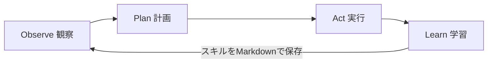
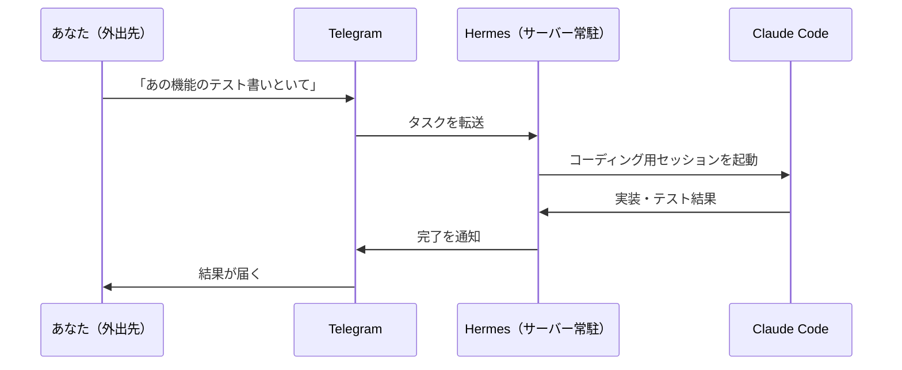

## セッションを閉じると忘れるAIに、もう戻れない

Claude Code や Cursor を使っていて、こう思ったことはないだろうか。「昨日話した前提を、また一から説明している」と。優秀なのに、会話を閉じると記憶がリセットされる。この「セッションベース」という構造は、対話型AIツールに共通の弱点だった。

2026年2月、Nous Research がこの弱点を正面から解くエージェントを公開した。Hermes Agent だ。あなたのサーバーに常駐し、再起動しても記憶を保ち、使うほど自分でスキルを増やしていく。公開から4か月足らずで17万を超えるGitHubスターを集めたと報じられている（[AI Builder Club](https://www.aibuilderclub.com/blog/hermes-nous-research-self-improving-agent) の集計）。

この記事は Hermes Agent が何者で、技術的に何がすごく、どう始めるのかを解説する。後半で Claude Code・OpenClaw との違いも整理するが、主役は Hermes だ。

## Hermes Agent とは

Hermes Agent は Nous Research が2026年2月に公開した、オープンソースの自律型AIエージェントだ。性格を一言で言えば「あなた専用のサーバー常駐AI」になる。

| 項目 | 内容 |
| --- | --- |
| 開発元 | Nous Research |
| 公開 | 2026年2月 |
| ライセンス | MIT（テレメトリなし・クラウド依存なし） |
| 動作環境 | Linux／macOS／WSL2（最小構成は月5ドルのVPS） |
| 対応LLM | Anthropic・OpenAI・Google・DeepSeek・MiniMax・OpenRouter・Ollamaのローカルモデル |
| インストール | curlコマンド1本 |

重要なのは、Hermes が「常駐プロセス（デーモン）」として動く点だ。対話しているときだけ動くのではなく、あなたが寝ている間もタスクを実行し続ける。そしてデータはすべて自分のマシンに残る。ここが後述の設計思想につながる。

Nous Research による公式の説明はこちら。
https://hermes-agent.org/about/

## すごいポイント1：3層の永続メモリ

Hermes の核心は永続メモリだ。しかも、よくあるベクトルDBによるRAGとは設計が違う。3階層で情報を保持する。

| 階層 | 実体 | 役割 |
| --- | --- | --- |
| 第1層 | `USER.md` ＋ `MEMORY.md` | プロフィール・好み・規約。毎セッション必ず読み込まれる高シグナル情報 |
| 第2層 | SQLite（FTS5全文検索）＋ LLM要約 | 過去の会話履歴をセッションをまたいで検索 |
| 第3層 | mem0や独自ベクトルストア（任意） | 外部連携が必要なときだけ使う拡張層 |

一般的なRAGは「たぶん関連するはず」という確率的な検索で文脈を引っ張ってくる。対して Hermes の第1層は、毎回のセッションに決定論的にロードされる。つまり「重要な前提は確実に毎回入る」。RAGの取りこぼしに悩んだ経験があるほど、この違いはありがたい。

技術的な内訳は AI Builder Club の解説が詳しい。
https://www.aibuilderclub.com/blog/hermes-nous-research-self-improving-agent

## すごいポイント2：使うほど賢くなる自己進化ループ

2つ目は自己進化だ。Hermes は「Observe → Plan → Act → Learn」という4段階のループで動く。



このループの Learn で何が起きるか。Hermes は完了したタスクから再利用可能なスキルを抽出し、人間が読めるMarkdownファイルとして自分のマシンに書き出す。次に似たタスクが来たら、そのスキルを動的にロードする。

効果は数字に出ている。20個以上の自作スキルを持つエージェントは、まっさらな状態のエージェントより似たタスクを40%速く完了したという（[AI Builder Club](https://www.aibuilderclub.com/blog/hermes-nous-research-self-improving-agent)）。スキルはMarkdownなので中身を人間が確認・編集でき、必要なものだけロードするためトークン消費も抑えられる。

自作スキルはこのコマンドで一覧できる。

```bash
# Hermesが経験から自動生成したスキルを一覧表示
# 使い込むほどこのリストが育っていく
hermes skills list
```

## すごいポイント3：24時間動く非同期実行

3つ目は、常駐だからこそできる非同期の自動実行だ。

Hermes は cron構文による定期実行を内蔵し（`/api/jobs` エンドポイント経由）、Telegram・Discord・Slack・Signal・メールなど16以上のメッセージング基盤とつながる。これが効くのは、外出先からスマホで指示を投げられるからだ。

公式ガイドが挙げる使い方が象徴的だ。「Telegram でタスクを受け取った Hermes が、実際のコーディング作業のために Claude Code のセッションを起動し、結果をあなたに返す。あなたが席を離れている間に、だ」（[AI Builder Club](https://www.aibuilderclub.com/blog/hermes-nous-research-self-improving-agent)）。



Claude Code が「席に座って一緒に開発する相棒」なら、Hermes は「留守を任せられる執事」に近い。

## Hermes で実際にできること

抽象的な話が続いたので、具体的な守備範囲を挙げる。

| モジュール | できること |
| --- | --- |
| 情報処理 | Web検索、論文取得、最新ニュースの収集 |
| ファイル操作 | 読み書き、コード修正、フォーマット変換 |
| ターミナル実行 | シェルコマンド、プロセス管理 |
| ブラウザ自動化 | Webスクレイピング、フォーム自動入力 |
| メッセージ連携 | Telegram・Slack・Discord等15以上 |
| 自己進化 | スキルの自動生成・自己最適化 |

初回の対話で投げる指示は、たとえばこんな粒度だ。

- 「このドキュメントの要約を書いて」
- 「ファイル名を一括変換するPythonスクリプトを作成して」
- 「AIエージェントに関する最新ニュースを検索して」

## 始め方：curl 1本から

導入はシンプルだ。前提ソフトの手動インストールは要らず、単一コマンドが依存関係ごと入れてくれる。

### Step 1: インストール

```bash
# Nous Research公式のインストールスクリプトを取得して実行
# Linux / macOS / WSL2 に対応。依存関係も自動で揃う
curl -fsSL https://hermes-agent.nousresearch.com/install.sh | bash
```

### Step 2: LLMの設定

インストール後、対話式のセットアップでモデルをつなぐ。

```bash
# 使用するLLMプロバイダとAPIキーを対話形式で設定
hermes setup
```

このプロンプトで次を順に指定する。

1. LLMプロバイダの選択（OpenRouter、DeepSeekなど）
2. APIキーの入力
3. モデルの選択（コンテキストウィンドウは64K以上を推奨）
4. 接続テストの実行

### Step 3: 動かす

主要コマンドはこれだけ把握すれば十分に使い始められる。

| コマンド | 役割 |
| --- | --- |
| `hermes` | 対話型チャットを開始 |
| `hermes model` | LLMプロバイダ・モデルの切り替え |
| `hermes gateway` | メッセージングゲートウェイを起動（Telegram連携など） |
| `hermes dashboard` | ビジュアル管理パネルを表示 |
| `hermes skills list` | 自動生成されたスキルを一覧 |
| `hermes doctor` | 診断・トラブルシューティング |

月5ドルのVPSでも動くため、手元のマシンを常時起動しておきたくない場合はクラウドに常駐させる選択もできる。

## Claude Code・OpenClaw と何が違うのか

Hermes の立ち位置は、この2つと比べると輪郭がはっきりする。

### Claude Code との違い

Claude Code は Anthropic の対話型コーディングエージェントで、生成精度と人間との協調に強みがある。ただし設計が「セッションベース」で、常駐や定期実行は本来の想定ではない。Hermes はここを埋める。

| 観点 | Claude Code | Hermes Agent |
| --- | --- | --- |
| プロジェクト横断の記憶 | 部分的（CLAUDE.mdの範囲） | 完全な永続化 |
| 非同期の定期実行 | なし | あり（24時間cron実行） |
| LLMの選択 | Claude中心 | 任意のプロバイダ |
| 自己ホスト | クラウド管理 | 可能（MITライセンス） |
| スマホからの操作 | 限定的 | 16以上のメッセージ基盤 |

両者は競合というより補完関係だ。前述のとおり、Hermes が受けたタスクを Claude Code に投げる連携すら成立する。

### OpenClaw との違い

OpenClaw は2025年11月に登場した自律エージェントフレームワークで、Moltbook（AIエージェント専用SNS）やRentAHuman（エージェントが人間を雇う）といったエコシステムを生んだことで知られる。強力な一方、セットアップが重く、CVEとして報告されたセキュリティ上の懸念もある。この重さを嫌って生まれた軽量な代替の1つが Hermes だ（[aimultiple](https://aimultiple.com/openclaw)）。

OpenClaw が「エージェント同士の経済圏を広げる」方向なら、Hermes は「あなた1人のためのプライベートな常駐AI」に振り切っている。スキルも、OpenClawが人間の作る静的なものなのに対し、Hermesは経験から自動生成する。

## 使う前に知っておく注意点

期待値は正しく持っておきたい。公式ガイドは Hermes を「成熟しつつあるが、まだ成熟しきってはいない（maturing, not mature）」と位置づけている（[AI Builder Club](https://www.aibuilderclub.com/blog/hermes-nous-research-self-improving-agent)）。

- 自動生成されたスキルは「ドラフト」として扱い、本番投入前に人間がレビューする
- 要約・監視・非同期の通知といった個人ワークフローには十分実用的
- ミッションクリティカルな自動化に丸投げするのは時期尚早

なお2026年4月には MiniMax AI との提携が発表され、特定モデルへの最適化も進んでいる（[AI.cc](https://www.ai.cc/blogs/hermes-agent-2026-self-improving-open-source-ai-agent-vs-openclaw-guide/)）。

## まとめ

- Hermes Agent は Nous Research が2026年2月に公開した、自己ホスト型・MITライセンスの自律エージェント
- すごさは3つ。決定論的にロードされる3層の永続メモリ、使うほどスキルが増える自己進化ループ、cronと16以上のメッセージ基盤による24時間の非同期実行
- Claude Code とは競合ではなく補完。セッションベースの弱点を埋め、Claude Code を呼び出す連携もできる
- OpenClaw の経済圏志向に対し、Hermes は「あなた専用の常駐AI」に振り切った設計
- まだ成熟途上。自動生成スキルはレビュー前提で、個人ワークフローから始めるのが手堅い

セッションで忘れるAIに物足りなさを感じているなら、まず `curl` 1本で Hermes を手元に入れて、`USER.md` に自分の前提を書き込むところから試すと、「記憶が残るエージェント」の手触りが一番早くわかる。

## 参考リンク

- [About Hermes Agent（Nous Research 公式）](https://hermes-agent.org/about/)
- [Hermes: Nous Research の自己改善エージェント技術解説（AI Builder Club）](https://www.aibuilderclub.com/blog/hermes-nous-research-self-improving-agent)
- [What is Hermes Agent? 2026 Deployment Guide（Tencent Cloud）](https://www.tencentcloud.com/techpedia/144042)
- [Hermes Agent 2026 vs OpenClaw（AI.cc）](https://www.ai.cc/blogs/hermes-agent-2026-self-improving-open-source-ai-agent-vs-openclaw-guide/)
- [OpenClaw Ecosystem（aimultiple）](https://aimultiple.com/openclaw)
