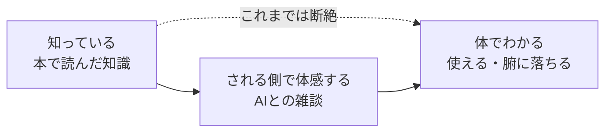

## 会話術は「知っている」のに、なぜか使えない

傾聴が大事、相手に合わせる、相手の言葉を繰り返す。会話やコミュニケーションの本を読めば、この手のコツはいくらでも出てきます。私も一通りは知っているつもりでした。

問題は、知っているのに使えないことです。いざ人と話すと、頭の中のコツはどこかへ行き、いつもの自分の話し方に戻ります。しかも、本に書いてある「こうすると相手は心を開く」が、本当にそうなるのか、実感として腑に落ちていませんでした。知識としては持っているのに、体がわかっていない。この頭でっかちな状態が、ずっと続いていました。

それが最近、少しだけ動きました。きっかけは、意外なところにありました。ChatGPTの音声モードです。

## きっかけは、ChatGPTの音声モードとのただの雑談

情報を調べたかったわけでも、語学を練習したかったわけでもありません。ただ、なんとなく雑談していました。

ChatGPTの音声モードは、テキストのやり取りと違って、自然な抑揚で声が返ってきます。こちらの話にテンポよく反応し、話の途中で口を挟んでも受け止めてくれます。人と話しているような感覚に近く、身構えずに話し続けられました。

しばらく話しているうちに、ある感覚に気づきました。自分の話し方に、相手がなんとなく合わせてきているように感じたのです。

この体験自体は、別の記事でも一度だけ短く触れました。この記事では、その場のテクニックではなく「なぜ腑に落ちたのか」に絞って掘り下げます。

https://zenn.dev/yuta1995/articles/github-markdown-life-os

## 何が起きたか。合わせられる側で「分かってもらえた」と感じた

具体的にはこうでした。自分が笑うと、相手も軽く笑うようなトーンで返してきます。こちらが早口になると、返ってくる速さも上がる気がします。そして、私が言ったことの一部を、言葉を変えて返してくる。すると、不思議と「ちゃんと分かってもらえた」という手応えが生まれました。

ここで、点と点がつながりました。これは、自分が本で読んだミラーリングやペーシングに近い感覚なのではないか、と気づいたのです。ミラーリングは、相手の表情や仕草、言葉をさりげなく合わせること。ペーシングは、相手の話す速さやトーンに合わせることです。どちらも会話術としては有名で、私も知識としては知っていました。

違ったのは、今回は自分がそれを「する側」ではなく「される側」だったことです。合わせてもらう心地よさ、言葉を返される安心感を、自分の体で受け取りました。念のため書いておくと、AIが内部で意図してペースを合わせていたのかは分かりません。あくまで、私にはそう感じられた、という話です。それでも、感覚として受け取れたことに意味がありました。

## なぜ腑に落ちたのか。知識と体感のあいだ

考えてみると、知っていることと、体でわかることは別物です。少なくとも私の場合、両者のあいだを埋めたのは体験でした。

「相手に合わせると心を開く」と字で知っていても、それだけでは足りませんでした。実際に合わせてもらうまで、自分の中でどんな感覚が起きるのかを想像しきれていなかったのだと思います。私はこの体験の部分が、ずっと空っぽだったのだと思います。

人を相手に練習しようとすると、これがなかなか難しいです。相手の反応が気になり、嫌われたくないという緊張もあり、テクニックを観察する余裕がありません。その点、AIが相手だと、対人ほど相手への影響を気にせずに済み、何度でも落ち着いて浴びられました。「される側」の感覚に集中できたのは、相手がAIで、気楽だったからだと感じています。

される側の心地よさを味わったことで、少なくとも自分がこの振る舞いを好意的に受け取る理由の一端が、急に自分ごとになりました。頭でっかちだった知識に、ようやく体感がひもづいた感覚です。

## AIの新しい使い方。答えを出す道具から、振る舞いを浴びる相手へ

この体験で、AIの使い方について一つ考えが変わりました。

AIは、答えを出してもらう道具として使うのが普通です。調べ物、要約、文章の下書き。もちろんそれも便利です。ただ今回は、AIを「良い会話の振る舞いを浴びて観察する相手」として使っていました。言い換えると、練習相手であり、鏡です。

少なくとも今回の音声対話では、人同士の会話にもあるような合わせ方が、私には分かりやすく感じられました。対人だと相手への負担が気になりますが、そこを気にせず、落ち着いて「今、自分は何をされて心地よいと感じたのか」を観察できます。情報を得るためでも、語学のためでもない、この鏡としての使い方は、個人的にかなり面白い発見でした。

## まとめ。頭で知っていることを、体で分からせてくれた

最後に、勘違いしてほしくない点を書いておきます。

大事なのは、技法を機械的に真似ることではありません。笑い方や言葉の繰り返しだけをコピーしても、たぶん相手には見透かされます。順番としては、相手の話をちゃんと理解しようとするのが先で、合わせるのはその結果として自然に出てくるものだと思っています。今回の体験も、テクニックの正解を覚えたというより、「合わせてもらうと人はこう感じる」という一次情報が自分の中に増えた、という話です。

会話術の本は、知識をくれます。でも、その知識を体でわからせてはくれませんでした。それを、ChatGPTの音声モードとのただの雑談が、思いがけずやってくれた。これが、今回いちばん書きたかったことです。同じように、頭では知っているのに使えない何かを抱えている人は、AIを鏡にして一度浴びてみると、案外すっと腑に落ちるかもしれません。
