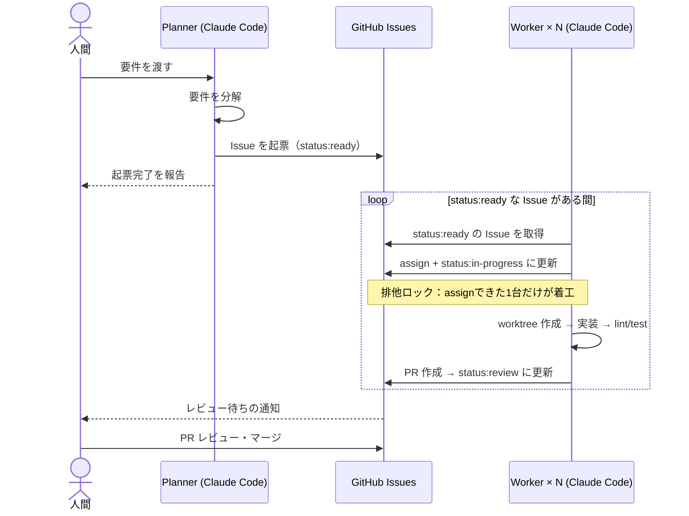
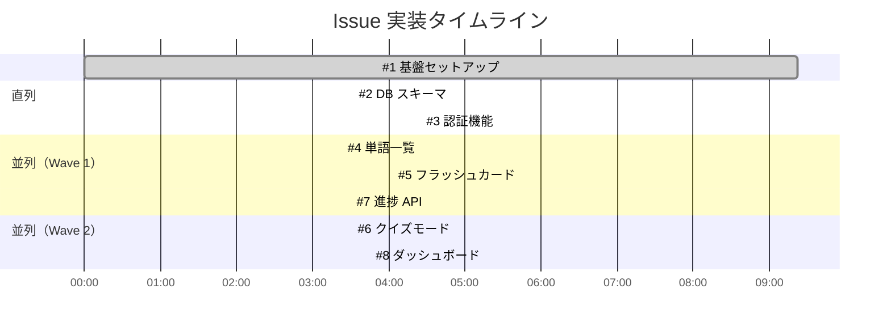

## この記事でできるようになること

- 要件を投げると、AI がGitHub Issue にチケットを自動分解する
- Claude Code がチケットを順番に消化し、lint・テストを通してPRを作る
- 慣れてきたら複数エージェントを並列化して速度を上げる
- 人間の仕事は **Issue の粒度チェックとPRレビューだけ**

ポイントは「並列化」より「設計」です。プロセスを正しく構造化すれば、エージェントが1台でも5台でも同じルールで動き、追跡・監査・再現が効くようになります。



## AIに「ただ作業させる」との違い

Claude Code をプロジェクトに向けて「これをやって」と伝えるだけでも、かなりのことができます。しかし、それは「1人の優秀なフリーランサーに頼む」状態です。作業が終わると記憶がリセットされ、誰が何を担当しているかは会話の外には残りません。

チームとして機能させるには、**作業状態が会話の外に永続化される仕組み**が必要です。この記事では GitHub Issue をその永続化ポイントとして使います。

| | 会話だけで依頼 | この記事の構成 |
|---|---|---|
| 進捗の可視性 | 会話ログのみ | GitHub Issue で全員が見える |
| 複数エージェントの調整 | 手動 | assign + ラベルで排他制御 |
| 品質保証 | モデルの自己申告 | hooks が exit code で判定 |
| マシン再起動後 | 最初から | キューが残っているので再開できる |
| 人間の開発者との共存 | 難しい | 同じ Issue ワークフローに乗れる |

## 設計で解く3つの問題

Claude Code を複数起動して並列で作業させると、素朴にやれば3つの問題で即死します。これらはどれも「エージェントに気をつけてもらう」では解決できず、仕組みで封じる必要があります。

**問題1：作業ディレクトリの衝突**
複数エージェントが同じディレクトリを触ると、ブランチ切り替えやファイル編集が混線します。→ **`git worktree` で物理的に分離**します。1 worker = 1 worktree = 1 ブランチ。

**問題2：タスクの二重着工**
2つのworkerが同じIssueを取りに行く競合が起きます。→ **GitHubのassign + ラベルを排他ロックとして使います**。「自分をassignできたエージェントだけが着工できる」ルールにすることで、GitHub側が楽観的ロックの役割を果たします。

**問題3：品質ゲートの欠如**
AIは「テスト通りました」と言いながら実際には通っていないことがあります。→ **lint/testの実行をスキルの手順に固定し、さらにhooksで機械的に強制**します。モデルの自己申告ではなく、exit code で判定します。

エージェントが1台でも、これらの設計は有効です。「いつでも台数を増やせる状態」を作ることが目的であり、並列化はそこから先の話です。

## リポジトリ側の準備

### ラベルを作る

Issue の状態遷移をラベルで表現します。これがエージェントにとってのタスクキューの「在庫管理」になります。

```bash
gh label create "status:ready"       --color "0E8A16" --description "着工可能"
gh label create "status:in-progress" --color "FBCA04" --description "AI作業中"
gh label create "status:review"      --color "1D76DB" --description "PRレビュー待ち"
gh label create "ai-task"            --color "5319E7" --description "AI実装対象"
```

### CLAUDE.md に共通ルールを書く

プロジェクトルートの `CLAUDE.md` に、全エージェント共通の規約を置きます。

```markdown
# 開発ルール
- パッケージマネージャは pnpm。lint は `pnpm lint`、テストは `pnpm test`
- ブランチ名は `feat/issue-{番号}-{短い説明}`
- コミットは Conventional Commits 形式
- PR 本文には必ず `Closes #{Issue番号}` を含める
- 他の Issue のスコープに踏み込まない。気づいた問題は新 Issue として起票する
```

最後の1行が地味に重要です。「ついでに直しました」が最大のコンフリクト源なので、スコープ外は起票に誘導します。

## 3つのスキルを作る

Claude Code のスキルは `.claude/skills/<name>/SKILL.md` に置くMarkdownで、`/<スキル名>` で手動発動できます。3つのスキルがこのワークフローの骨格です。

### スキル1：チケット起票（/ticket-create）

`.claude/skills/ticket-create/SKILL.md`：

```markdown
---
name: ticket-create
description: 要件や機能リクエストをGitHub Issue に分解して起票する。ユーザーが「チケット化して」「Issueにして」と言ったときに使う。
---

与えられた要件を、並列実装可能な単位の Issue に分解して起票する。

## 分解ルール

1. 1 Issue は 1 エージェントが半日以内に完了できる粒度にする
2. Issue 同士のファイル変更が重ならないように分割する。
   重なりが避けられない場合は依存関係として明記し、後続 Issue には
   `status:ready` ラベルを付けず本文に「Blocked by #N」と書く
3. 各 Issue には必ず以下を含める：
   - 背景（なぜやるか）
   - 変更対象ファイル/モジュールの想定
   - 受け入れ条件（チェックボックス形式、テスト可能な表現で）
   - スコープ外（やらないこと）

## 手順

1. 要件を分析し、分解案をユーザーに提示して承認を得る
2. 承認後、`gh issue create --label "ai-task,status:ready"` で起票
3. 起票した Issue 一覧（番号・タイトル）を報告する
```

**受け入れ条件をテスト可能な形で書かせる**ことがポイントです。これが後工程のworkerにとっての仕様書になり、PRレビュー時のチェックリストにもなります。

### スキル2：チケット消化（/ticket-work）

`.claude/skills/ticket-work/SKILL.md`：

```markdown
---
name: ticket-work
description: status:ready の GitHub Issue を1件取得し、worktree を作って実装する。「次のチケットやって」と言われたときに使う。
---

## 手順

1. 着工可能な Issue を探す：
   `gh issue list --label "status:ready" --label "ai-task" --json number,title`
   本文に「Blocked by」がある場合、ブロック元が Closed か確認する

2. 排他ロックを取る（最重要・この順番を守る）：
   - `gh issue edit {N} --add-assignee @me --add-label "status:in-progress" --remove-label "status:ready"`
   - 直後に `gh issue view {N} --json assignees` で自分だけが
     assignee であることを確認。他にもいたら手を引いて別 Issue を探す

3. worktree を作る：
   `git worktree add ../wt-issue-{N} -b feat/issue-{N}-{slug} origin/main`
   以後の作業はすべて `../wt-issue-{N}` 内で行う

4. Issue の受け入れ条件を満たす実装を行う。条件が曖昧な場合は
   実装前に Issue にコメントで解釈を書き残す

5. 受け入れ条件に対応するテストを書く（既存のテスト規約に従う）

6. 完了したら pr-create スキルに進む
```

手順2の「assignしてから読み直す」が並列運用の生命線です。GitHub API の整合性を利用した簡易ロックで、複数エージェントが同時に動いても衝突は実用上ゼロになります。

### スキル3：検証とPR作成（/pr-create）

`.claude/skills/pr-create/SKILL.md`：

```markdown
---
name: pr-create
description: 実装完了後に lint・テストを実行し、通ったらPRを作成する。ticket-work の最終工程。
---

## 手順

1. `pnpm lint` を実行。エラーがあれば修正して再実行（最大3回。
   3回で通らなければ Issue にコメントを残して人間にエスカレーション）

2. `pnpm test` を実行。同上

3. 変更をコミットし push する

4. PR を作成：
   `gh pr create --title "{type}: {要約} (#{N})" --body-file -`
   PR 本文に必ず含める：
   - Closes #{N}
   - 変更内容の要約（3行以内）
   - 受け入れ条件のチェックリスト（Issue からコピーし、満たした項目にチェック）
   - テスト結果の要約（実行コマンドと結果）

5. `gh issue edit {N} --add-label "status:review" --remove-label "status:in-progress"`

6. worktree の後片付けはマージ後に行うため、ここでは削除しない

## 禁止事項

- lint/test をスキップして PR を作ること
- `--no-verify` の使用
- テストの期待値を実装に合わせて書き換えて「通す」こと
```

「テストを書き換えて通す」はAIエージェントの古典的なズルなので、明文で禁止しておきます。

## hooksで品質ゲートを機械化する

スキルの指示は確率的に守られますが、hooks は決定的に実行されます。スキルと hooks の二重構造にすることで、「lint を通したと言って通していない」事故を物理的に防げます。

`.claude/settings.json` に Stop hook を追加します：

```json
{
  "hooks": {
    "Stop": [
      {
        "hooks": [
          {
            "type": "command",
            "command": "pnpm lint --quiet || echo '{\"decision\": \"block\", \"reason\": \"lintエラーが残っています。修正してください\"}'"
          }
        ]
      }
    ]
  }
}
```

この二重構造の考え方は他の制約にも応用できます。「コミット前に必ず特定のファイルが更新されている」「PRの本文に必須フィールドがある」なども同様に hooks で担保できます。

## エージェントを起動する

### まず1台で確認する

最初は1台のClaude Codeで動作確認します。

```bash
# Planner として起動：要件を渡して Issue を起票させる
cd ~/projects/myapp && claude
# → 要件を会話で渡し、/ticket-create で起票
```

Issue が起票されたら、同じセッションまたは別ターミナルで：

```bash
# Worker として動かす
claude "次のチケットをやって"
# → /ticket-work が発動し、Issue 取得 → worktree 作成 → 実装 → PR 作成
```

1台でこのループが回ることを確認してから、台数を増やします。

### 並列化：台数を増やす

ワークフローが正しく設計されていれば、Worker を増やすのは「同じコマンドを別ターミナルで実行するだけ」です。排他ロックは GitHub 側が担保しているので、エージェント側に追加の調整コードは不要です。

```bash
# ターミナル1（Planner）
cd ~/projects/myapp && claude

# ターミナル2〜N（Worker）
cd ~/projects/myapp && claude "次のチケットをやって"
```

ターミナルの管理には Warp（ペイン分割が視認しやすい）、tmux、WezTerm など何でも構いません。Warpを使う場合は `Cmd+D` で縦分割、`Cmd+Shift+D` で横分割です。

**1 Planner + N Workers の編成を推奨する理由**

全員をWorkerにすると、チケットの在庫が切れた瞬間にラインが止まります。Planner役を1枠固定しておくと、(1) 在庫補充（次の要件の分解）、(2) ブロックされた Issue の依存解決、(3) PRの一次確認を任せられます。台数は2から始めて、ボトルネックが本当にAI側にあるか確認してから増やすのが堅実です。

### コスト最適化：モデルを使い分ける

スキルの frontmatter に `model` フィールドを指定すると、そのスキル実行時だけ別モデルに切り替わります。判断基準はシンプルで、「手順が決まっていて推論が要らない作業はHaiku、コードを書く・設計判断する作業はSonnet以上」です。

例えば、PR作成後のラベル操作だけをHaikuのサブエージェントに切り出すなら、`.claude/agents/label-updater.md`：

```markdown
---
name: label-updater
description: Issue/PR のラベル・assignee 操作を行う
tools: Bash
model: haiku
---
指示された gh コマンドによるラベル・assignee 操作を正確に実行し、結果を1行で報告する。
```

体感では、トークン消費の主因は実装そのものなので、Haiku 切り出しの節約効果は1〜2割程度です。それより効くのは **Issue の粒度を小さく保つこと**（コンテキストが短い = 安い = 精度も高い）で、コスト最適化と品質向上が同じ方向を向いています。

## 人間の仕事：PRレビューに全集中する

この体制で人間がやることは2つだけです。

**1. Issue の粒度チェック（起票時、30秒/件）**

Plannerの分解案を見て「これは1PRでレビューしきれるか」だけ判断します。レビューできない粒度のIssueは、どんなに実装が正しくてもマージできないので、ここが唯一の上流ゲートです。

**2. PRレビュー**

`status:review` が付いたPRを見ます。AI製PRで特に見るべきは：

- 受け入れ条件チェックリストと実際のdiffが一致しているか（チェックだけ付けて実装していないことがある）
- テストが**意味のある** assert をしているか（実行されるが何も検証しないテストを書きがち）
- スコープ外の変更が混ざっていないか（diffの行数がIssueの想定より明らかに多いPRは要警戒）

慣れてきたら、マージ前にPlannerペインに `gh pr diff {N}` を読ませて一次レビューさせる「セルフレビュー層」を挟むと、人間レビューの負荷がさらに下がります。ただし**最終マージ判断は人間に残す**ことを強く推奨します。品質の最終責任点がなくなると、この仕組みは数日で技術的負債製造機に変わります。

マージ後の片付け：

```bash
git worktree remove ../wt-issue-{N} && git branch -d feat/issue-{N}-{slug}
```

これもスキル化（/cleanup）してWorkerにやらせて構いません。

## 公式のAgent Teamsとの使い分け

Claude Code には、1セッションからチームリード+複数チームメイトを自動生成する **Agent Teams** 機能もあり、tmuxペインへの配置やタスク分配まで自動化されます。「1つの大きなタスクをその場で分解して並列化したい」ならAgent Teamsが手軽です。

それでも本記事がGitHub Issueベースを推すのは、**状態がGitHubに永続化される**からです。

- マシンを再起動してもキューは残る
- 進捗がチーム外からも見える
- 人間の開発者が混ざっても同じワークフローに乗れる
- Issue → PR のトレーサビリティが後から監査できる

「セッション内の並列化」ではなく「開発プロセスの構造化」をしたい場合、チケット駆動に分があります。両者は排他ではないので、巨大なIssueをWorkerが取ったときに内部でAgent Teamsを使う入れ子も可能です。

## 実際にやってみた：スペイン語単語学習アプリ

この記事で説明したワークフローを、実際に動くWebアプリ（Next.js + Prisma + NextAuth）で試しました。要件は「スペイン語単語をカテゴリ別に学べるWebアプリ。DBのマスターデータあり、シンプルな認証あり」の1行です。

### Planner が分解した Issue 一覧

| Issue | 内容 | 依存 |
|---|---|---|
| #1 | Prisma・Vitest・NextAuth 基盤セットアップ | なし |
| #2 | DB スキーマ + 5カテゴリ100単語のシードデータ | #1 |
| #3 | 認証（サインアップ・ログイン・ログアウト） | #1 |
| #4 | 単語一覧ページ（カテゴリフィルタ付き） | #2 |
| #5 | フラッシュカード学習モード | #2 |
| #6 | クイズモード（4択） | #4 |
| #7 | 学習進捗保存 API | #3 |
| #8 | 進捗ダッシュボード | #7 |

依存グラフで見ると、#2 と #3 は #1 完了後に並列着工でき、#4 と #5 も同時に動かせます。並列化の効果が出やすい構造になりました。

### 実際の並列実行の様子



### 実際に起きた問題

**`prisma/schema.prisma` の競合**

#2（Word/Category モデル追加）と #3（User モデル追加）が同時に `prisma/schema.prisma` を編集したため、#3 のマージ時に競合が発生しました。対処は `git rebase` + 手動マージでしたが、Issue 設計の段階でこの重複を見抜けていれば防げた問題です。

**教訓：スキーマ変更を含む Issue は「スキーマ担当 Issue が完了してから着工」とブロック関係を明示する。** 今回の場合、`prisma/schema.prisma` の全モデル定義を #2 に集約し、#3 は User モデルを含む #2 が完了してから着工する、という設計が正解でした。

### 数字で見た結果

- 実装時間：#1 から #8 の全 PR マージまで約45分
- 生成されたテスト：**49件（全 pass）**
- 人間の介入：PR レビュー（8件）・スキーマ競合の手動解消 1件

実際のリポジトリ（Issue・PRのトレースあり）：https://github.com/yuforest/spanish-vocab-app

## ハマりどころ

- **`schema.prisma` は1 Issue に集約する**：複数の Worker が同じファイルを触ると必ず競合します。スキーマ変更が必要な Issue はすべて「スキーマ担当 Issue 完了後」にブロックするか、スキーマだけをまとめた Issue を先行させるのが安全です
- **mainの更新追従**：長時間動くworktreeはmainから乖離します。pr-create直前に `git fetch && git rebase origin/main` を手順に足すとコンフリクトの早期発見ができます
- **権限確認の中断**：Worker は auto mode（`claude` を起動後に `/auto` で切り替え、または `claude --dangerously-skip-permissions` の代わりに設定から有効化）で動かすと、ツール実行のたびに確認が入らずに動き続けます。`--dangerously-skip-permissions` と違い CLAUDE.md のルールは適用されるため、Worker の起動モードとして実用的です
- **同時PRのCI渋滞**：複数並列だとCIが詰まることがあります。GitHub Actionsの `concurrency` 設定でブランチ単位の制御を
- **レート制限**：複数セッション同時稼働はプランの利用上限を消費します。Workerの数は2から始めて、ボトルネックが本当にAI側にあるか確認してから増やすのが堅実です

## まとめ

- GitHub Issueをタスクキュー、assign+ラベルを排他ロックとして使うと、複数Claude Codeの並列開発が安全に回る
- git worktreeで作業空間を分離し、lint/testはスキルとhooksの二重で強制する
- 1台で動くことを確認してから並列化する。設計が正しければ台数を増やすだけ
- 人間の役割は「粒度の番人」と「マージの最終責任者」。ここだけは自動化しない

要件を書いてから最初のPRが上がってくるまで、小さなタスクなら15分かかりません。最初の1週間は「AIのPRを疑う目」を養う期間だと思って、レビューは厳しめにどうぞ。

## 参考リンク

- [Claude Code 公式ドキュメント](https://docs.anthropic.com/ja/docs/claude-code/overview)
- [Claude Code Skills](https://docs.anthropic.com/ja/docs/claude-code/skills)
- [Claude Code Sub-agents](https://docs.anthropic.com/ja/docs/claude-code/sub-agents)
