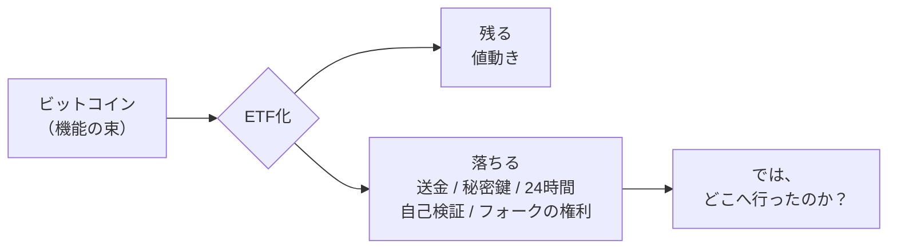
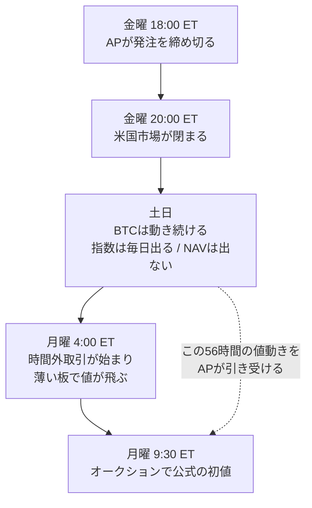
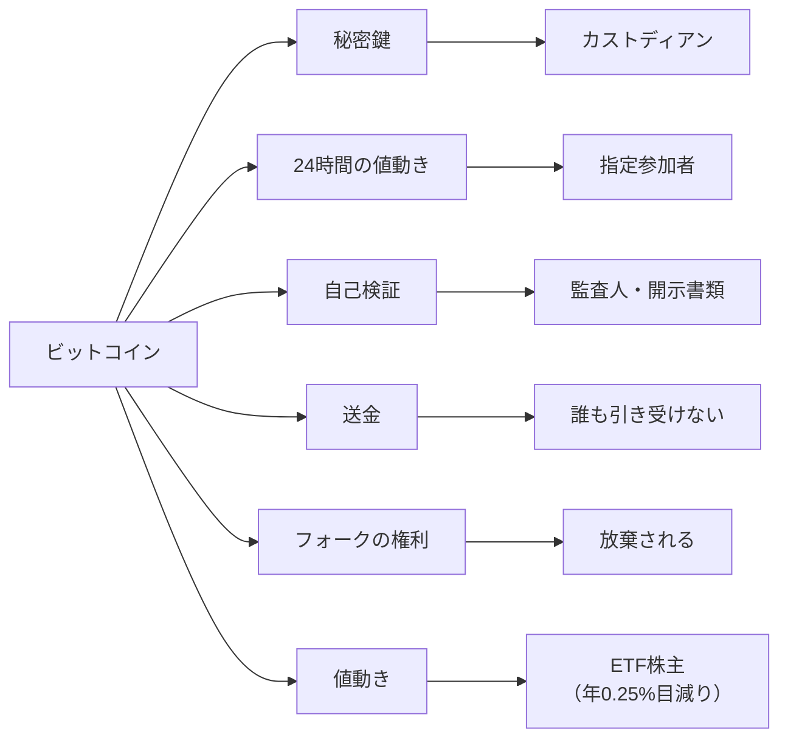

## 100万円分のBTCと、100万円分のBTC ETF

100万円分のビットコインと、100万円分のビットコインETF。口座の画面に並べたら、どちらも同じ数字が表示されます。値上がりすれば両方増えて、下がれば両方減ります。

違いは1つだけ、という説明をよく見ます。ETFのほうは送金できません。家族のウォレットにも、決済にも使えません。

ここまでは、日本語のETF解説記事ならどこでも読めます。手数料がかかること、取引時間が決まっていること、秘密鍵を自分で管理しなくていいこと。並べ方は違っても、書いてある中身はだいたい同じです。

ただ、その先が書かれていません。送金できないのは分かった。では、あなたが手放した「送金する能力」は、いまどこにあるのでしょうか。

消えてなくなったのか。それとも、誰かが代わりに持っているのか。

この記事は、その行き先を1つずつ追いかけます。追いかけると、ビットコインETFという商品の輪郭がかなりはっきりします。先に結論を書くと、**ETFはビットコインという資産から値動きだけを切り出して証券にしたもの**です。切り落とされた機能の多くは消滅しておらず、それぞれ別の誰かが引き受けています。そして最後まで誰も引き受けなかったものが、1つだけあります。

暗号資産ETFの連載の第1講にあたる記事です。ここで名前の挙がる引き受け手が、そのまま第2講以降のテーマになります。

:::message
2026年7月31日現在、日本国内では暗号資産ETFの組成も販売も認められていません。ただし政令を改正して組成可能にする方針は、政府の文書に入っています。この点は最後のセクションで扱います。
:::

なお、この記事で具体例に使うのは、純資産が約470億ドルある現物ビットコインETP、iShares Bitcoin Trust ETF（ティッカーはIBIT）です。商品の中身に関する数字と引用は、運用会社が米国証券取引委員会（SEC）に提出した目論見書と年次報告書から取りました。指数の仕様や制度の説明については、その都度の一次情報に当たっています。

## ビットコインを機能に分解する

「ビットコインを持っている」と言うとき、私たちは何を持っているのでしょうか。値上がり益への期待だけ、ではありません。

ビットコインの原論文は、冒頭でこの通貨が何をする道具なのかを宣言しています。

> A purely peer-to-peer version of electronic cash would allow online payments to be sent directly from one party to another without going through a financial institution.
> （純粋なP2P版の電子キャッシュがあれば、オンラインの支払いを金融機関を通さずに相手へ直接送れる）

同じ論文には、残高を自分で検証する方法も書かれています。ブロックヘッダだけを持っていれば、フルノードを動かさなくても支払いを検証できる、という節です。

> It is possible to verify payments without running a full network node.

つまりビットコインという資産は、値動きだけの一枚岩ではありません。いくつもの機能が束になっています。それをETFにすると、どの機能が残ってどれが落ちるのか。並べてみます。

| ビットコインの機能 | 現物のBTC | BTC ETFの株式 |
| --- | :---: | :---: |
| 値動きを受け取る | ○ | ○（ただし目減りする） |
| 任意の相手へ送金する | ○ | **×** |
| 秘密鍵を自分で持つ | ○ | **×** |
| 24時間365日いつでも売買する | ○ | **×** |
| 残高を自分で検証する | ○ | **×** |
| 好きな額に分割する | ○（1億分の1単位） | △（信託への設定・償還は40,000株単位） |
| 担保に入れて借りる | ○ | ○（証券担保ローンなど） |
| 複数の鍵で承認する（マルチシグ） | ○ | **×** |
| フォークやエアドロップの権利 | ○ | **×** |
| 第三者の許可なく取引する | ○ | × |

○が並んでいる列と、×が並んでいる列。同じ100万円でも、持っている機能の数がまるで違います。

最後の行の「第三者の許可なく」は、原論文が掲げた設計思想そのものです。金融機関のような信頼される第三者を介さずに、当事者同士が直接取引できるようにする、と書かれています。

> allowing any two willing parties to transact directly with each other without the need for a trusted third party

担保の行にも補足が要ります。ビットコインをそのままDeFiの貸借プロトコルに預けることはできません。cbBTCやWBTCといったラップトークンに変換する必要があります。cbBTCについてはMorphoが「Coinbaseが保有するBTCに1対1で裏付けられたERC20トークン」と説明しており、それを担保にUSDCを借りられます。Compoundのドキュメントも、担保として受け入れる資産にWBTCを挙げています。

一方でETFの株式は上場証券なので、証券担保ローンや信用取引の代用有価証券として使えます。担保という機能は、預ける先が変わって生き残っている数少ない例です。

https://morpho.org/blog/cbbtc-lending-markets-deployed-on-morpho

残ったのは、実質的に値動きだけです。ではETF化のときに落ちた機能は、どこへ行ったのでしょうか。1つずつ見ていきます。

## 秘密鍵を持っているのは誰か

最初に追いかけるのは秘密鍵です。ETFを買うと鍵の管理から解放されます。裏返すと、誰かが代わりに鍵を持っているということです。

IBITの目論見書には、その相手が実名で書かれています。ビットコインの保管を担当するのはCoinbase Custody Trust Company, LLC。代替のカストディアンとしてAnchorage Digital Bank N.A.も指定されています。鍵の扱いはこう説明されています。

> The Bitcoin Custodian keeps all of the private keys associated with the Trust's bitcoin held by the Bitcoin Custodian in the Vault Balance in "cold storage", which refers to a safeguarding method by which the private keys corresponding to the Trust's bitcoins are generated and stored in an offline manner using computers or devices that are not connected to the Internet, which is intended to make them more resistant to hacking.

インターネットに繋がっていない機器で鍵を生成し、オフラインで保管する。ハードウェアウォレットを金庫にしまうのと発想は同じです。さらに、鍵を暗号化して複数の断片に分けているという記述もあります。

> offline storage, or cold storage, multiple encrypted private key "shards", and other measures

先ほどの表で「マルチシグは×」と書きましたが、複数の承認で資産を動かす仕組み自体は消えていません。あなたの手元からカストディアンの内部に移っただけです。

もうひとつ、目論見書を読んでいて印象に残った記述があります。信託が取引用に持っている残高（Trading Balance）について、こう書かれています。

> the Trust does not have an identifiable claim to any particular bitcoin (and cash). Instead, the Trust's Trading Balance represents an entitlement to a pro rata share of the bitcoin (and cash) the Prime Execution Agent holds on behalf of customers who hold similar entitlements against the Prime Execution Agent.

特定のビットコインに対する請求権を持たない。他の顧客と混ざったプールに対する持分の権利を持つ、と書いてあります。取引所に預けたままのBTCが取引所の帳簿上の数字であるのと同じ構造が、信託のレイヤーでも起きています。

そしてSEC自身が、投資家向けの資料でこの点をはっきり書いています。

> Spot bitcoin and ether ETPs may provide exposure to those crypto assets without some of the direct risks to the investor of personally transacting on a crypto asset trading platform or using a crypto asset wallet and handling the public and private cryptographic keys. **Keep in mind, the spot bitcoin or ether ETP itself is subject to these risks.**

自分で鍵を扱うリスクは消えていません。ETP自身がそのリスクを負っている、というのがSECの説明です。

https://www.investor.gov/introduction-investing/general-resources/news-alerts/alerts-bulletins/investor-bulletins/ETPBulletinSeptember2024

ちなみに同じ資料には、名前についても釘を刺す一文があります。現物のビットコインETPは1940年投資会社法に基づいて登録されたETFではなく、商品を保有する信託である。名前にETFと入っていても、メディアや一般にETFと呼ばれていても、それは変わらない。この線引きが投資家保護の中身にどう効いてくるかは、この連載の第4講で詳しく扱います。

## 24時間動くぶんのズレは、指定参加者が自腹で背負っている

次は24時間です。ここがこの記事でいちばん書きたかったところで、結論を先に言うと、引き受けているのは指定参加者（ETFの株式を新しく作ったり消したりできる証券会社。以下AP）です。

ビットコインは休みません。対する米国株式市場は、平日の9時30分から16時（米国東部時間）までしか開いていません。1週間は168時間ですが、そのうち通常取引の時間は32.5時間しかありません。2026年のNYSEの営業日と休場日から計算すると、年間8,760時間のうち通常取引が行われるのは1,625時間、割合にして18.55%です。

つまり残りの8割の時間、ビットコインは動いているのにETFの値段は止まっています。

既存の記事はここで終わります。「だから土日は売買できません、注意しましょう」と。私が知りたかったのはその先でした。**止まっている8割の時間に発生した値動きは、いったいどこへ消えているのか。**

### 土日のビットコイン価格と、空白になるETFの値段

まず、ビットコインの公式な値段は土日も記録されています。

ここから先はETFの2種類の値段を区別して読む必要があるので、先に整理します。1つが基準価額（NAV）で、信託が持っているビットコインの価値を株数で割った、中身そのものの値段です。もう1つが市場価格で、取引所の板でついた値段です。この2つは連動しますが、別々に決まります。

NAVのほうから見ます。IBITの基準価額は、CME CF Bitcoin Reference Rate New York Variant、略してBRRNYという指数をもとに計算されます。この指数は、ニューヨーク時間の15時から16時までの1時間を5分ずつ12個の区間に分け、各区間の値を出して平均する、という作り方をします。区間ごとの値は出来高加重メディアン（取引量の大きい約定を重く見た中央値）で、それを12区間ぶん等しい重みで平均します。構成取引所はBitstamp、Coinbase、itBit、Kraken、Gemini、LMAX Digital、Crypto.com、Bullishの8つで、先物価格は使いません。

そして指数の仕様書には、公表頻度がこう書かれています。

> Dissemination Time: Once per day, every day of the year including weekends and holidays, between 4:00 p.m. and 4:30 p.m. New York time

土日も祝日も含めて、1年365日、毎日1回。

一方、IBITの年次報告書にあるNAVの算定規定はこうです。

> On each day other than a Saturday or a Sunday or a day on which NASDAQ is closed for regular trading (a "Business Day"), as soon as practicable after 4:00 p.m. ET, the Trust evaluates the bitcoin held by the Trust ...

土曜と日曜、そしてNASDAQが閉まっている日を除く。

**ビットコインの値段は土曜日も日曜日も公式に記録されているのに、ETF1口の値段だけが空白になります。** 材料はあるのに、料理だけが出てこない。この非対称が、ここから先の話の出発点です。

平日についても、実はNAVはリアルタイムに更新されていません。取引時間中に参考値として配信されるのはIIV（intraday indicative value）と呼ばれる指標値で、前日終値のNAVを基準にリアルタイム指数の変化を掛け合わせた合成値です。15秒ごとに更新されますが、年次報告書はこれをNAVのリアルタイム更新と見なすべきではない、と明記しています。

本物のNAVは1日1回、16時以降に計算されます。公表されるのは早くて17時30分、遅いときは20時。自分が持っている1口の中身の値段を知るのは、市場が閉じてから1時間半以上あとです。

### 締め切りは前日の18時

では、空白の時間に生じた値動きは誰が背負うのか。冒頭で名前を出したAP（指定参加者、Authorized Participant）です。

日本取引所グループの定義が簡潔です。

> 指定参加者とは、管理会社（ETFの運用会社）が公表する対象となるETFの設定・交換の条件に基づき、管理会社との間で現物株とETFのやりとりを直接行うことができる証券会社をいいます

そして、APが何をしているかも同じページに書かれています。

> 指定参加者はETFと現物株、ETFと先物市場との間で活発な裁定取引を行いますので、それによりETFの市場価格と株価指数はより連動するようになります。

https://www.jpx.co.jp/equities/products/etfs/investors/01.html

ETFの市場価格が原資産の価値に近い水準を保っていられるのは、APが割高なら作って売り、割安なら買って戻すからです。連動は自動的に保たれているのではなく、誰かが儲けを狙って動いた結果として保たれています。

ここでIBITの年次報告書に戻ります。APが株式を作るときの発注締め切りが書かれています。

> The Creation Early Order Cutoff Time is 6:00 p.m. ET on the Business Day prior to the trade date.

取引日の前営業日、18時。金曜の18時に発注したぶんの評価に使われるのは、月曜16時のNAVです。その間、ビットコインは止まりません。

そして、その差額を誰が負担するのかが同じ書類に書かれています。

> the Authorized Participant will be responsible for the dollar cost of the difference between the bitcoin price utilized in calculating the NAV on the trade date and the price realized in selling the bitcoin to raise the cash needed for the cash redemption order to the extent the price realized in selling the bitcoin is lower than the bitcoin price utilized in the NAV. To the extent the price realized is selling the bitcoin is higher than the price utilized in the NAV, the Authorized Participant shall get to keep the dollar impact of any such difference.

NAV算定に使われた価格と、実際にビットコインを売れた価格。その差がマイナスならAPが自腹で負担し、プラスならAPの取り分になる。

この一文を見つけたとき、記事の骨格が決まりました。**24時間動くという性質は消えたのではなく、APのバランスシートに移っています。** あなたが土日に価格変動へアクセスできない代わりに、その時間のリスクを引き受けて報酬を得ている人がいます。

### 窓が開くタイミング

土日にビットコインが急落すると、ETFの価格は月曜に一気に飛びます。目論見書もこれを明記しています。

> the trading price of the Shares may "gap" down to the full extent of such negative price shift when the Exchange reopens

ただし「月曜の寄り付きでいきなり窓を開ける」という説明は、実務としては正確ではありません。NASDAQでは午前4時から時間外取引が始まっています。9時25分から30分にかけて需給の偏り（気配情報）が配信され、9時30分のオークションで公式の初値が決まります。実際には月曜未明の薄い板の中で値が動きはじめ、寄り付きのオークションでそこに収束する、という順番です。

値段がまったくつかないのは、金曜20時から月曜4時までの56時間です。

なお、この空白はこれから少し狭くなります。SECは2026年4月10日にNASDAQの23時間取引を承認しました。夜間セッションが21時から翌4時に入り、取引週は日曜21時に始まります。開始は2026年12月と報じられています。それでも週末の穴自体は残ります。

## 誰も引き受けなかったもの、捨てられたもの

秘密鍵はカストディアンへ、24時間はAPへ。では最初の問いに戻ります。送金する能力は、誰が引き受けたのでしょうか。

答えは、誰も引き受けていません。

目論見書の表紙には、脚注としてこう書かれています。

> Except when aggregated in Baskets, Shares are not redeemable securities. Baskets are only redeemable by Authorized Participants.

Basket（バスケット）という大口の単位にまとめない限り、この株式は償還できる証券ではない。そしてBasketを償還できるのはAPだけである、と書いてあります。

年次報告書のほうはもっと直接的です。

> Individual investors cannot purchase or redeem Shares in direct transactions with the Trust.

個人投資家は信託と直接やり取りできません。株式を信託に返してビットコインを受け取る窓口が、そもそも存在しないのです。

窓口があるのはAPだけで、しかも単位が大きい。設定（株式を新しく作ること）と償還（株式を消してビットコインや現金に戻すこと）は、40,000株を1 Basketとして行われます。目論見書が例示している2025年5月7日時点の水準で、1 Basketは約218万ドル、ビットコインにして22.72枚です。

現物での受け渡し自体は動いています。SECは2025年7月29日に暗号資産ETPの現物設定と償還を承認しました。IBITの最新の目論見書には、現物で設定と償還ができるAPとしてJane Street Capital、Virtu Americas、JP Morgan Securities、Marex Capital Marketsの4社が実名で挙がっています。2026年第1四半期の四半期報告書を見ると、現物での設定が約60.7億ドル、現物での償還が約16.4億ドル分実行されています。

https://www.sec.gov/newsroom/press-releases/2025-101-sec-permits-kind-creations-redemptions-crypto-etps

つまりビットコインの出入口は開いています。ただし通れるのは4社の証券会社だけで、単位は40,000株。あなたが100万円分持っていようが1億円分持っていようが、その扉には近づけません。送金という機能は、卸のレイヤーにだけ残って、投資家に届く経路が切断されています。

### 捨てられる機能

もう1つ、送金とは違う消え方をする機能があります。

ビットコインを持っていると、チェーンが分岐したとき（ハードフォーク）や、保有者へのエアドロップが行われたときに、新しい資産を受け取れることがあります。目論見書ではこれをIncidental Rights（付随的権利）と呼んでいます。信託がこれをどう扱うかは、こう決められています。

> With respect to a fork, airdrop or similar event, the Sponsor will cause the Trust to **permanently and irrevocably abandon** the Incidental Rights and IR Digital Asset and no such Incidental Right or IR Digital Asset shall be taken into account for purposes of determining the NAV of the Trust.

恒久的かつ取り消し不能に放棄する。誰かに移るのでも、なんとなく消えるのでもありません。運用会社が能動的に捨てます。結果として、株主は受け取れません。

> As such, Shareholders will not receive the benefits of any Incidental Rights and any IR Digital Asset.

この扱いについて、目論見書自身が読者にアドバイスを書いています。ここが個人的にいちばん誠実だと感じた部分です。

> Investors who prefer to have a greater degree of control over events such as forks, airdrops, and similar events, and any assets made available in connection with each, should consider investing in bitcoin directly rather than purchasing Shares.
> （フォークやエアドロップのような出来事に対してより大きなコントロールを持ちたい投資家は、株式を買うのではなくビットコインに直接投資することを検討すべきである）

隠されていた話ではありません。目論見書に書いてあります。ただ、日本語のETF紹介記事でここまで踏み込んでいるものを、私はまだ見かけていません。

## 残った「値動き」も、毎日少しずつ減っている

ここまでで、落ちた機能の行き先がだいたい分かりました。最後に残った1つ、値動きを見ます。

切り出した1つだけは無傷で手に入るのか。答えは、いいえ、です。

IBITのスポンサー報酬は年率0.25%で、日割りで発生します。ここで問題になるのは、この信託が現金収入をまったく持たないことです。株式の配当も債券の利息もありません。保有しているのはビットコインだけです。すると報酬はどうやって払うのか。

> Because the Trust does not have any income, it needs to sell bitcoin to cover the Sponsor's Fee ...

ビットコインを売って払います。そして目論見書には、その帰結が正面から書かれています。

> As a result of the recurring sales of bitcoin necessary to pay the Sponsor's Fee and the Trust expenses or liabilities not assumed by the Sponsor, **the net asset value of the Trust and, correspondingly, the fractional amount of bitcoin represented by each Share will decrease over the life of the Trust. New deposits of bitcoin received in exchange for new Baskets or purchases of bitcoin utilizing cash proceeds for new Shares issued by the Trust do not reverse this trend.**

1株が表すビットコインの端数量は、信託の存続期間を通じて減っていく。新しいビットコインが預け入れられても、この傾向は反転しない。

これは「手数料がかかります」という説明が指しているものとは違います。あなたの1株の裏側にあるビットコインの枚数そのものが、毎日削られていくという話です。

目論見書には、その減り方の試算表も載っています。信託の資産を1,000万ドル、株式数を40万株、ビットコイン価格を44,000ドルで固定した場合という仮定つきの数字です。

| | 期首 | 1年後 | 2年後 | 3年後 |
| --- | ---: | ---: | ---: | ---: |
| 信託が保有するBTC | 227.27273 | 226.70455 | 226.13778 | 225.57244 |
| 1株あたりNAV | — | $24.94 | $24.88 | $24.81 |

3年で227.27枚から225.57枚へ、0.748%の減少です。しかも表の脚注には、想定外の費用が発生した場合は「1株が表すビットコインの端数量の減少を加速させる」と書かれています。

0.25%という数字は、免除されていた時期があります。NASDAQへの上場時から2025年1月10日までは、最初の50億ドル分について0.12%に引き下げられていました。ただしこの免除はすでに終わっています。2025年度の年次報告書によると、その年のスポンサー報酬は差し引き後で約1億7,456万ドル、平均加重資産およそ699億ドルに対して0.25%。2026年第1四半期の報告書には、免除された報酬はなかったと明記されています。現在は満額です。

年0.25%を高いと見るか安いと見るかは、目的次第だと思っています。自分でコールドウォレットを管理する手間と、鍵を失うリスクを金額に換算したら、0.25%は十分に安いという判断もありえます。ここで言いたいのは高い安いではなく、**切り出した値動きですら、原資産の値動きそのものではない**ということです。

### 16時という一点で切ったことの副作用

もう1つ、値動きが完全なコピーにならない理由があります。

NAVはニューヨーク時間16時の指数値で計算されますが、指数の観測窓は15時から16時の1時間です。一方でETFの終値がつくのは16時ちょうど。この2つの時刻がずれているため、運用会社自身がこう説明しています。

> Due to the timing mismatch between the fund's close and the index's observation window, an artificial premium/discount can emerge when bitcoin exhibits a strong directional price trend between 3:00 p.m. and 4:00 p.m. ET.

15時から16時にビットコインが一方向へ強く動くと、人為的なプレミアムやディスカウントが生まれる。運用の巧拙でも需給でもなく、時刻の切り方から生じる誤差です。

実際の数字を見ると、普段はよく抑えられています。運用会社の公開データでは、市場価格とNAVの乖離が±0.5%以内に収まった日は2026年第1四半期で93.44%、第2四半期で90.32%。ただし第1四半期には最大+0.99%と−0.64%、第2四半期には+0.99%と−0.71%の日がありました。年に数回は1%近くまで開きます。

この乖離データの公開自体、法律上の義務ではありません。1940年法に基づくETFなら開示が義務づけられていますが、現物ビットコインETPはその枠の外にあるため、運用会社の自主的な開示です。

## 機能はどこへ行ったのか

追いかけてきた行き先を、1枚にまとめます。

| ビットコインの機能 | ETF化でどうなるか | 引き受けた人 |
| --- | --- | --- |
| 秘密鍵を自分で持つ | **移った** | カストディアン（Coinbase Custody） |
| 24時間の値動き | **移った** | 指定参加者（前日18時に発注を締め切り、NAVとの差額を自己負担） |
| 残高を自分で検証する | **移った** | 監査人と開示書類 |
| 送金する | **消えた** | 誰も引き受けていない |
| フォーク・エアドロップの権利 | **捨てられた** | 運用会社が恒久的に放棄する |
| 値動きを受け取る | **残った**（ただし年0.25%ずつ目減り） | — |

ETFは機能を消したのではありません。配り直しました。そして配られた先の一人ひとりが、この連載の残りのテーマです。カストディアンの話は第2講、指定参加者と時間差の話は第3講、監査と検証可能性の話は第4講、集まった先で何が起きるかは第5講で扱います。

私はビットコインETFを否定したいわけではありません。鍵の管理をプロに任せ、証券口座でまとめて損益を見て、既存の金融インフラの上で相続や税務を処理できることには、はっきりした価値があります。目論見書自身も、投資家がウォレットや鍵を自分で扱う煩雑さを避けられる点を利点として挙げています。

引っかかるのは商品そのものではなく、説明のされ方のほうです。「ETFなら手軽にビットコインに投資できます」で止まる記事が多すぎます。手軽さは何かと交換に得たもので、交換に出したものが何だったかは、買う前に知っておいたほうがいいと思います。

### 日本の現状

ここまで読んで、証券口座でIBITを探した方がいるかもしれません。見つかりません。

金融庁は「金融商品取引業等に関するQ&A」の問6（2025年10月31日追加）で、こう書いています。

> いずれにしても、現状、日本国内において、暗号資産ETFの組成や販売は認められておりません。

組成だけでなく販売も認められていない、という書き方です。証券会社ごとの商品ラインナップの問題ではありません。

https://www.fsa.go.jp/news/r7/shouken/20251031/20251031_q6.pdf

組成できない技術的な理由は、暗号資産が投資信託及び投資法人に関する法律施行令の特定資産（投資信託が組み入れてよいと政令が列挙している資産）に含まれていないことです。

ただし金融庁は方針を示しています。2025年12月に公表した令和8年度税制改正の資料では、暗号資産を投資対象とするETFについて「現在は組成不可（政令改正必要）」と現状を示したうえで、「政令改正により組成可能とする」「申告分離課税20%」と書かれています。国会も動きました。暗号資産の規制を資金決済法から金融商品取引法へ移す改正法が2026年7月15日に成立し、同月中に公布されています。暗号資産に関する部分の施行は公布から1年以内です。

ただし、投信法施行令を改正して暗号資産を特定資産に加えるための政令案は、2026年7月31日時点で金融庁が募集中のパブリックコメント一覧には見当たりません。

いつ買えるようになるかは分かりません。分かるのは、**買えるようになってから慌てて仕組みを調べるより、いま調べておいたほうが楽だ**ということです。

### 3行まとめ

- ビットコインETFは、ビットコインという資産から値動きだけを切り出して証券にした商品です
- 切り落とされた機能は消えていません。秘密鍵はカストディアンへ、24時間の値動きは指定参加者へ移り、フォークの権利は放棄され、送金だけが誰にも引き受けられていません
- 残った値動きも完全なコピーではありません。1株が表すビットコインの枚数は、年0.25%のペースで減っていきます

:::message alert
この記事は特定の金融商品の売買を推奨するものではありません。数値と引用は2026年7月31日時点で確認した公開資料に基づいています。制度や商品性は変更されることがあるため、実際の投資判断にあたっては最新の目論見書と一次情報をご確認ください。
:::

次回は、この記事で「移った」と書いた最初の行き先を追いかけます。あなたが買ったETFの裏で、実際にビットコインを持っているのは誰なのか。運用会社、カストディアン、指定参加者の関係を、設定と償還の仕組みから見ていきます。
