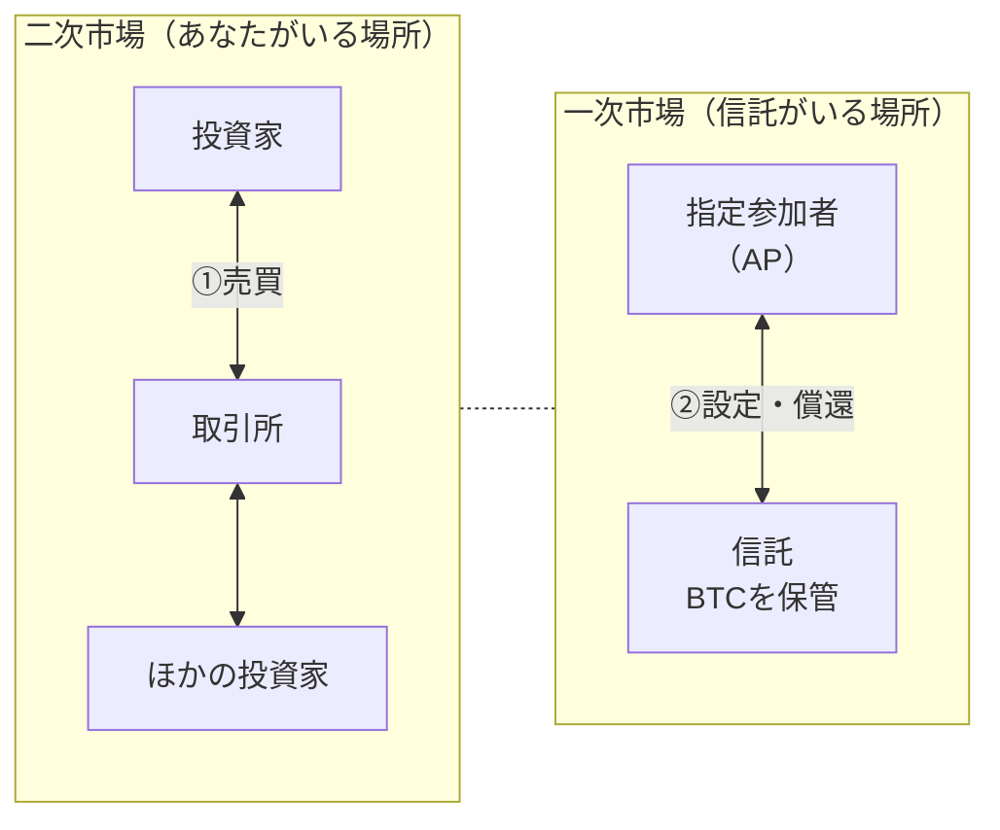
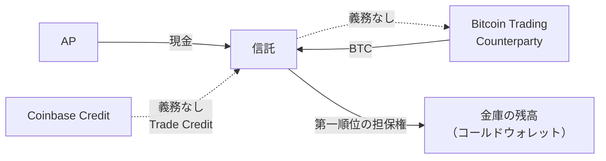

## 1株買っても、信託のBTCは1枚も動かない

前回、ビットコインETFはビットコインという資産から値動きだけを切り出した証券だと書きました。落ちた機能のうち、秘密鍵はカストディアンへ、24時間動く性質は指定参加者へ移っていました。

https://zenn.dev/yuta1995/articles/crypto-etf-01-price-only

今回は2つ目、指定参加者の側を見にいきます。ただ、その前に片付けておきたいことがあります。

もしあなたが米国の証券口座でIBITを1株買ったとしたら、その裏で何が起きるか。**信託が保有しているビットコインは、1枚も動きません。**

売ってくれた相手は運用会社ではありません。同じ時間に同じ銘柄を売りたかった、あなたと同じ投資家です。株券が投資家から投資家へ渡っただけで、信託の金庫の中身は増えても減ってもいません。

数字で見ると、この比率はかなり極端です。米国投資信託協会（ICI）の2025年版ファクトブックによると、2024年のETFの活動（売買代金と、設定・償還の金額の合計）のうち83%は二次市場、つまり投資家同士の売買でした。

IBIT単体でも同じ傾向が出ます。Nasdaqが公開している日次データから2025年8月5日から2026年8月4日までの251営業日を集計すると、売買代金の合計はおよそ6,649億ドルでした。一方、信託の側で株式が実際に作られたり消されたりした金額は、2025年度の年次報告書によると設定が約376億ドル、償還が約127億ドル。足すと約503億ドルです。ざっと13倍の開きがあります。

制度の側は、最初からそう書いています。日本取引所グループのETF解説にはこうあります。

> 募集に応じることができない個人投資家など一般の投資家は、その代替手段として東証のETF市場を通じ、募集に応じた者が売却するETFを小口で購入することになります。

https://www.jpx.co.jp/equities/products/etfs/etf-outline/02.html

「代替手段として」。株式が実際に発行され消される場所を一次市場、私たちが日々売買している場所を二次市場と呼びます。私たちの注文は、二次市場で完結しています。

では、信託のビットコインはいつ増えるのでしょうか。

## 説明図の2本目の矢印

ETFの仕組みを説明する図を思い出してください。だいたいどの図にも、矢印が2本あります。

①はあなたが引きました。証券口座で注文を出せば、その瞬間に引かれます。

②を引けるのは、指定参加者（Authorized Participant、以下AP）と呼ばれる証券会社だけです。目論見書にはこう書かれています。

> Only Authorized Participants, which are registered broker-dealers who have entered into written agreements with the Sponsor and the Trustee, can place orders to receive or redeem Baskets in exchange for cash or bitcoin.

APが信託にビットコインや現金を渡して新しい株式を作らせることを設定、株式を信託に返してビットコインや現金を受け取ることを償還といいます。前回書いた40,000株の単位（1 Basket）で行われます。

現物でやり取りできる4社（Jane Street、Virtu Americas、JP Morgan Securities、Marex Capital Markets）は前回挙げました。今回わかるのは、現金でやり取りできるAPが別に12社いることです。Goldman Sachs、JP Morgan、Citigroup、Citadel Securities、Jane Street といった名前が並びます。4社のうちMarexは現物専業なので、合わせて13社が②の矢印を引ける立場にいます。

:::details 現金でやり取りできるAP 12社（目論見書より）
ABN AMRO Clearing USA、BMO Capital Markets、BofA Securities、Citadel Securities、Citigroup Global Markets、Goldman Sachs、Jane Street Capital、Jefferies、JP Morgan Securities、Macquarie Capital (USA)、UBS Securities、Virtu Americas
:::

信託のビットコインが増えるのは、この13社の誰かが②の矢印を引いたときだけ。あなたが何株買おうと、②が引かれなければ信託は1枚も買いません。

では、②は誰が引くのでしょうか。もっと正確に言えば、**誰が引くことになっているのでしょうか。**

## 契約書に書いてあったこと

APと運用会社の間には、指定参加者契約（Authorized Participant Agreement）が結ばれています。その中身がどうなっているのかは、目論見書の「Plan of Distribution」という節に書かれています。証券をどう売り出すかを説明する節です。

この節は、まずAPに向けてかなり重い警告を出します。

> Authorized Participants, other broker-dealers and other persons are cautioned that some of their activities will result in their being deemed participants in a distribution in a manner which would render them **statutory underwriters** and subject them to the prospectus-delivery and liability provisions of the Securities Act.

Basketを買って中身の株式をばらして顧客に売れば、あなたは法定引受人（statutory underwriter）とみなされ、証券法上の目論見書交付義務と責任規定を負うことになる。そういう警告です。

その直後の段落が、この記事の核心です。

> By executing an Authorized Participant Agreement, an Authorized Participant becomes part of the group of parties **eligible** to purchase Baskets from, and put Baskets for redemption to, the Trust. **An Authorized Participant is under no obligation to create or redeem Baskets, and an Authorized Participant is under no obligation to offer to the public Shares of any Baskets it does create.**

契約を結ぶことで、APは信託からBasketを買い、信託にBasketを差し戻すことができる立場（eligible）になる。**指定参加者はBasketを設定または償還する義務を一切負わず、設定したBasketの株式を公衆に売り出す義務も一切負わない。**

義務を二重に否定しています。しかも報酬もありません。同じ節にこうあります。

> **The Authorized Participants do not receive from the Trust or the Sponsor any compensation in connection with an offering of the Shares.**

ICIのFAQも同じことを書いています。

> **APs do not receive compensation from an ETF or its sponsor and have no legal obligation to create or redeem the ETF's shares.** Rather, APs typically derive their compensation from acting as dealers in ETF shares.

https://www.ici.org/faqs/faqs_etfs

報酬は信託からもらうのではなく、ETF株のディーラーとして自分で稼ぐ、と書かれています。

つまり②の矢印は、**誰の義務でもありません。** APは信託の下請けでも供給業者でもなく、やってもいい資格を持っている人です。目論見書が選んだ語が eligible であることに、私はしばらく引っかかっていました。responsible でも required でもなく、eligible。

日本語のETF解説をいくつも読みましたが、この点に触れているものを見つけられませんでした。どれも「指定参加者は設定・交換を行うことができます」という書き方です。間違ってはいません。能力の記述としては正確です。ただ、そこで止まっているので、読者は「できる」を「やってくれる」と読んでしまいます。

## 義務のない人を動かすもの

義務がないなら、なぜ実際には矢印が引かれているのでしょうか。

答えは儲かるからです。ETFの市場価格が中身の価値（基準価額、NAV）より高くなっていれば、APは安いビットコインを渡して割高な株式を受け取り、市場で売れば差額が取れます。安くなっていれば逆をやります。こうしてAPが市場価格を中身の価値へ引き戻していきます。

この点については、立場の違う3者が同じことを書いています。国際決済銀行（BIS）の四半期レビューです。

> A key role of APs is to ensure that the ETF price ... is aligned with the NAV of ETF holdings ... **While APs are not legally obliged to play this role, they have an incentive to do so, as eliminating deviations between ETF share prices and NAV generates profits.**

https://www.bis.org/publ/qtrpdf/r_qt2103d.htm

ETFを運用している側、BlackRockがSECの会議に提出した資料にも、はっきり書かれています。

> **APs are generally not incentivized to engage in creation/redemption unless the arbitrage is (i) actionable and (ii) profitable (or at least neutral).**

そして先ほどのICIは、APが一次市場を使う動機をこう説明しています。

> APs create and redeem shares in the primary market **when doing so is a more effective way of managing their firms' aggregate exposure** than trading in the secondary market.

自社のポジション管理にとって、そのほうが都合がいいとき。ETFのためではなく、自分のために動く、と書いてあります。

### 義務がある職種と並べてみる

対比になる仕事が、同じETFの世界にあります。マーケットメイカーです。

東証は2018年7月からETFのマーケットメイク制度を運用していて、こう説明しています。

> 指定を受けたマーケットメイカーは、気配提示義務を履行することで、インセンティブ（報酬）を得ることができます。

https://www.jpx.co.jp/equities/products/etfs/market-making/index.html

義務の中身は数値で決まっています。Q&Aによれば、条件は気配提示を行う銘柄数と時間、それにスプレッドと数量の3つ。現行のVersion 2.0では、代表的な銘柄について1億円前後の注文を常時提示することが求められ、気配を出している時間の義務は80%と定められています（2026年9月末までの設定）。

報酬も明示されています。

> 気配提示義務を満たしたマーケットメイカーに対して、売買代金に応じた支払いや、アクセス料金（注文1件あたりに課される費用）の割引が行われます。

単価は0.1〜0.9ベーシスポイントで、負担するのは取引所です。投資家ではありません。

並べるとこうなります。

| | マーケットメイカー | 指定参加者（AP） |
| --- | --- | --- |
| 働く場所 | 二次市場（板） | 一次市場（設定・償還） |
| 義務 | あり（銘柄数と提示時間80%、スプレッドと数量） | **なし** |
| ETFからの報酬 | あり（売買代金の0.1〜0.9bps、アクセス料金割引） | **なし** |
| 何が動かすか | 義務と報酬 | 裁定の儲けだけ |

APの報酬欄が「なし」なのは、信託やスポンサーから受け取るものがない、という意味です。無償で働いているわけではなく、先ほどのICIのとおり、ETF株のディーラーとして自分で稼いでいます。

:::message
これは役割の対比であって、会社の対比ではありません。Jane StreetもVirtuも、マーケットメイカーとAPの両方の顔を持っています。同じ会社が、板の前では義務を負い、信託の前では負っていない、という話です。
:::

## 矢印が引かれなかったETF

義務がないと実際どうなるのか。理論の話ではなく、実例があります。

グレースケール・ビットコイン・トラスト（GBTC）です。いまは現物ビットコインETPとして上場していますが、そうなる前の10年近く、この信託には償還の仕組みがありませんでした。

止まった理由は、持たなかったのではなく持てなかったからです。2023年度の年次報告書にこうあります。

> **Effective October 28, 2014, the Trust suspended its redemption program**, in which shareholders were permitted to request the redemption of their Shares through Genesis, the sole Authorized Participant at the time **out of concern that the redemption program was in violation of Regulation M under the Exchange Act, resulting in a settlement reached with the SEC.**

証券取引所法のレギュレーションMに抵触する懸念があり、SECとの和解の結果として2014年10月28日に停止した、と書かれています。

②の矢印が制度的に存在しない状態で、何が起きたか。2022年度の年次報告書が数字を出しています。

> from May 5, 2015 to December 31, 2022, the maximum premium ... was 142% and the average premium was 37%, and **the maximum discount ... was 49%** and the average discount was 23%.

2015年5月から2022年末までの7年半で、中身の価値より最大142%高く、最大49%安く取引されました。平均でも37%のプレミアムか23%のディスカウントがついていた計算です。2022年12月30日時点の値は45%のディスカウント。100万円分の中身に対して、55万円の値段しかついていなかったことになります。

GBTCはこの状態を裁判で覆します。2023年8月、ワシントンD.C.巡回区控訴裁判所がSECの不承認命令を取り消しました。判決文の冒頭は行政法の原則から始まります。行政機関は同じような案件を同じように扱わなければならない、という原則です。ビットコイン先物のETFを承認しておきながらグレースケールの申請を却下したことについて、SECは十分な説明をしていない、という趣旨でした。

そして2024年1月10日にSECが承認し、翌11日にNYSE Arcaへ上場。同時に償還プログラムが再開されました。

> **In connection with the uplisting of the Shares, the Sponsor authorized the commencement of the Trust's redemption program** in reliance on Regulation M exemptive relief available to similarly situated commodity-based exchange traded products.

②の矢印が引けるようになったあと、乖離がどうなったか。2025年度の年次報告書の数字です。

> From January 11, 2024, the Uplisting Date, to December 31, 2025, the maximum premium ... was 1.68%, the average premium was 0.06%, **the maximum discount ... was 1.56%**, and the average discount was 0.08%.

**最大49%だったディスカウントが、最大1.56%になりました。** 平均は0.08%です。中身も、値段の付け方も、投資家層も大きくは変わっていません。変わったのは②の矢印が引けるようになったこと、ほぼそれだけです。

矢印が引けても引かれないことがある、という例も挙げておきます。2020年3月、コロナショックのさなかに債券ETFが大きくディスカウントしました。BISの分析によると、平常時は0.7ベーシスポイントだったトラッキングエラーが、一部のファンドで200ベーシスポイントを超えました。SECの調査報告書は理由をこう書いています。

> **illiquidity in the cash bond market makes it challenging for authorized participants to engage in the arbitrage transactions** that would generally operate to reduce the difference between the market price and NAV of the ETF

原資産が売買しにくくなると、裁定そのものが難しくなる。義務がないので、難しければやらないという選択肢があります。

ビットコインETFで同じことは、いまのところ起きていません。ただ、起きていない理由は義務があるからではないはずです。儲かっているからだと思っています。 差が開けば取りにくる人がいるうちは、矢印は勝手に引かれ続けます。心配するほどの話ではない、というのが正直なところです。

## 利ざやを削るもの、そして信託が自分のBTCを借りている話

儲けだけが動機なら、儲けを削れば矢印は細くなります。何が削るのか。

現金方式です。APがビットコインそのものではなく現金を渡して設定する方式で、2025年7月まで、米国の現物ビットコインETPはこれしか使えませんでした。

削り方は3つあります。

1つ目は締め切りです。前回、APの発注の締め切りが前営業日の18時（米国東部時間）だと書きました。あれは現金方式の締め切りでした。現物方式なら、締め切りは取引日の15時59分です。裁定の機会を見つけてから注文を確定するまでに、現金方式では丸一日近く空きます。その間ビットコインは動き続けます。

2つ目は、誰が売買して誰が損益を負うかのねじれです。現金方式では、信託が自分でビットコインを買いに行きます。

> On the date of the Cash Order Cutoff Time, the Trust will choose, **in its sole discretion**, to enter into a transaction with a Bitcoin Trading Counterparty or the Prime Execution Agent to buy bitcoin ...

「単独の裁量で」相手を選ぶ、と書いてあります。ところが、その執行価格と中身の価値の算定に使われた価格がずれたとき、差額を負担するのはAPです。前回、償還のときに同じ構造があると書きました。設定のときも同じです。**選ぶのは信託、払うのはAP。**

しかも取引相手のほうにも義務はありません。

> **The Bitcoin Trading Counterparties are not contractually obligated to participate in cash orders for creations or redemptions** by placing any offers to buy or sell bitcoin with the Trust.

義務のない矢印は、2本目だけではなかったことになります。

3つ目は、私が目論見書を読んでいていちばん驚いた話です。現金方式で償還が入ると、信託はビットコインを売って現金を作る必要があります。ところが信託のビットコインはコールドウォレットの中にあり、取引できる場所へ移すのに時間がかかります。

> a process which may take up to **twenty four hours**, or longer if the Bitcoin blockchain is experiencing delays in transaction confirmation

最大24時間。待っているあいだに価格が動いてしまいます。そこで信託は、取引日の価格を固定するためにビットコインを借ります。 借りたビットコインをその日のうちに売れば、その日の価格で確定できます。金庫から出てきたぶんは、翌営業日の返済に充てる。そういう段取りです。

> To avoid having to pre-fund purchases or sales of bitcoin in connection with cash creations and redemptions ..., **the Trust may borrow bitcoin or cash as Trade Credit from the Trade Credit Lender on a short-term basis.**

貸し手はCoinbase Credit, Inc.。返済期限は翌営業日の18時。無利息ですが、取引量に応じた手数料がかかります。そして担保はこうです。

> **To secure the repayment of Trade Credits, the Trust has granted a first-priority lien to the Trade Credit Lender over the assets in its Trading Balance and Vault Balance.**

Trading Balance は取引用の残高、Vault Balance は金庫の残高、つまりコールドウォレットのことです。**その金庫の中身に、第一順位の担保権が設定されています。** 返済が遅れれば、貸し手はその資産を差し押さえて処分できます（先に取引用の残高から取り、足りなければ金庫に手を付ける、という順序も定められています）。

目論見書には、信託は資産を貸したり質入れしたり再担保に出したりしない、という約束が書かれています。ただ、その一文には続きがあります。

> The Trust ... will not loan, pledge or rehypothecate the Trust's assets, nor will the Trust's assets serve as collateral for any loan or similar arrangement, **except with respect to securing the repayment of Trade Credits**.

トレードクレジットの返済を担保する場合を除いて。唯一の例外が、これでした。

しかもこの貸し手にも、貸す義務はありません。

> if the Trade Credit Lender is unable to itself borrow bitcoin to lend to the Trust as a Trade Credit, or there is a material market disruption ..., **the Trade Credit Lender is not obligated to extend Trade Credits to the Trust**.

そして目論見書は、これらを積み上げた先の結論を、リスク要因の中で書いています。

> **Alternatively, Authorized Participants could refrain from participating in creating and redeeming Baskets and could disrupt the Trust's ability to operate.**

APが設定と償還への参加を控え、信託の運営そのものを妨げうる。運用会社自身が書いている一文です。

②の矢印に義務がなく、その先の取引相手にも義務がなく、そこへ資金を出す貸し手にも義務がない。義務のない矢印が3本、連なっています。

## 2025年7月29日に変わったこと

その現金方式が、去年の夏に終わりました。

2025年7月29日、SECは暗号資産ETPについて現物での設定と償還を認めました。承認命令を読むと、理由の書き方が意外です。裁定が良くなるから、とは書いていません。

> **All Commodity-Based Trust Shares approved by the Commission before the approval of bitcoin and ether exchange-traded products could create and redeem shares on an in-kind basis.** Permitting in-kind creations and redemptions offer the Trusts an additional method of transacting with authorized participants and **may enhance tax efficiencies and minimize transaction costs.**

ビットコインとイーサリアムのETPが承認される前に承認された商品型信託は、すべて現物で設定・償還できた。脚注には2004年の金ETF、2005年の金信託、2006年の銀信託が並んでいます。そのうえで、現物を認めれば税効率が上がり取引コストが下がるかもしれない、という書き方です。

そして加速承認の理由がこれです。

> **These changes do not raise any novel regulatory issues.**

新しい規制上の論点は生じない。つまりSECの認識では、これは前進というより標準への復帰でした。20年前から金ETFが当たり前にやっていたことを、現物のビットコインETPだけが上場から1年半のあいだできなかった。その状態が解消された、という書きぶりです。

効果は数字に出ています。IBITの提出書類から現物の比率を計算すると、こうなります。

| | 設定に占める現物 | 償還に占める現物 |
| --- | --- | --- |
| 2025年度通年（現物が使えたのは8月以降） | 15.3% | 6.6% |
| 2026年1〜3月期 | **78.2%** | **24.1%** |

設定は3か月で8割近くが現物に切り替わりました。一方、償還は4分の1にとどまっています。この非対称にも理由があります。設定はAPが手持ちのビットコインを渡すだけですが、償還はビットコインを受け取ってしまう。目論見書はこう書いています。

> **there has yet to be definitive regulatory guidance on the specific details of how registered broker-dealers can comply with SEC rules with regard to transacting in or holding spot bitcoin.**

登録ブローカーディーラーが現物のビットコインを取り扱ったり保有したりする場合に、SECの規則をどう守ればいいのかについて、決定的な規制上のガイダンスがまだ出ていない。受け取ったビットコインをどう扱えばいいのかが、制度としてまだ固まっていないわけです。

### 3行まとめ

- あなたがETFを売買しても信託のビットコインは動きません。動くのは指定参加者が設定か償還を行ったときだけで、ETFの活動の83%は投資家同士の売買です
- **その設定と償還には、誰も義務を負っていません。** 目論見書は「義務を一切負わない」と二重に書き、報酬もないと書いています。動かしているのは裁定の儲けだけです
- 儲けが細れば矢印も細ります。償還の仕組みを持てなかった時代のGBTCは、最大142%のプレミアムと最大49%のディスカウントのあいだで振れました。仕組みを持ったあとは、振れ幅が最大1.68%と1.56%に収まっています

:::message alert
この記事は特定の金融商品の売買を推奨するものではありません。数値と引用は2026年8月4日時点で確認した公開資料に基づいています。IBITの売買代金はNasdaqが公開する日次データから筆者が集計した値であり、現物の比率と設定・償還の合計額は提出書類の数字をもとに筆者が計算したものです。制度や商品性は変更されることがあるため、実際の投資判断にあたっては最新の目論見書と一次情報をご確認ください。
:::

次回は、この記事で何度も出てきた「中身の価値」そのものを扱います。ビットコインは土日も動いているのに、ETFの基準価額は営業日にしか計算されません。その空白の時間に、値段はどこへ行っているのか。
