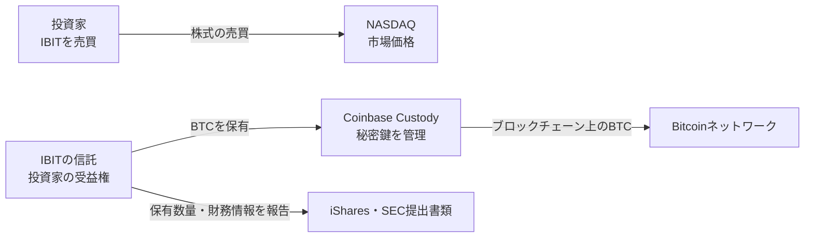

## IBITを1株買った。ビットコインはどこにある？

IBITを1株買っても、あなたのウォレットにビットコインは届きません。

秘密鍵も渡されません。送金もできません。口座に表示されるのは、NASDAQで売買できるETFの株です。

では、そのETFの裏側にあるビットコインはどこにあるのでしょうか。

「Coinbaseが持っている」とだけ答えると、少し足りません。

正確には、次の3つを分けて考える必要があります。

1. **誰の資産として記録されているか**
2. **誰が秘密鍵を管理しているか**
3. **ブロックチェーン上で、どこまで確認できるか**

この記事では、この3つを順番に追います。

## まず結論

IBITの構造は、こうなっています。

投資家が持つのは、信託が保有する資産から利益を受ける**受益権**です。ビットコインそのものの秘密鍵ではありません。

信託のビットコインは、主にCoinbase Custody Trust Companyが**カストディアン（資産を預かり、秘密鍵を管理する会社）**として保管します。2026年6月30日付の10-Qでは、Anchorage Digital Bankも追加カストディアンとして指定されていますが、現時点でビットコインを移す計画はないと記載されています。[iShares Bitcoin Trust ETFの10-Q](https://www.sec.gov/Archives/edgar/data/1980994/000143774926026004/bit20260630c_10q.htm)

「誰が所有するか」と「誰が鍵を持つか」は別です。ここを混ぜると、ETFの仕組みが急に分かりにくくなります。

## 1. 誰の資産として記録されているのか

IBITは、ビットコインを持つ信託です。BlackRock系のスポンサーが自社の資産としてビットコインを保有し、投資家に貸しているわけではありません。

投資家が持つIBITの株式は、信託の純資産に対する分割された持分です。1株を買ったからといって、特定のアドレスにある0.000何BTCを直接所有するわけではありません。信託全体の資産と負債をもとに、1株あたりの**純資産価額（NAV: Net Asset Value）**が決まります。

この関係を、銀行預金と比べると理解しやすくなります。

銀行口座に100万円あるとき、あなたが銀行の金庫にある特定の紙幣を所有しているわけではありません。銀行に対する預金債権を持っています。

IBITも似ています。ただし、投資家が持つ権利は預金債権ではなく、信託の純資産に対する受益権です。

## 2. 誰が秘密鍵を管理しているのか

ビットコインでは、アドレスに対応する秘密鍵を使って送金します。アドレスを知っているだけでは、コインを動かせません。実際に動かせるのは秘密鍵を管理する人です。

IBITの場合、その秘密鍵を管理するのがCoinbase Custodyです。

カストディアンは、単に取引所の画面に残高を表示する会社ではありません。信託の指示に従って、秘密鍵を保護し、必要なときにビットコインを移動できるようにする役割です。

ここで、Coinbaseという名前が2つの役割で登場します。**Coinbase Custodyは保管担当、Coinbase, Inc.は注文の執行や決済を補助するプライム・エグゼキューション・エージェント**です。前者が管理する保管口座（Vault Balance）とは別に、設定・償還などの処理で後者の取引口座（Trading Balance）に一時的にBTCが置かれることがあります。

そのため「IBITのBTCはすべて、いつでも同じコールドウォレットにある」と考えるのも正確ではありません。大部分の保管と、取引のための一時的な残高を分けて見る必要があります。

IBITの目論見書では、Coinbase Custodyが信託のビットコインを保管するカストディアンであること、信託のための資産として他の顧客や自社資産とは区分して管理することが説明されています。[iShares Bitcoin Trust ETFの目論見書](https://www.blackrock.com/us/individual/literature/prospectus/p-ishares-bitcoin-trust-12-31.pdf)

ここで大事なのは、**カストディアンが鍵を持つからといって、ビットコインがCoinbaseの自社資産になるわけではない**という点です。

契約上は信託のために保管され、帳簿上も他の顧客の資産と区分して扱うことが求められます。これは「自分で秘密鍵を持つ」のとは違う、制度化された第三者保管です。

## コールド保管なら、絶対に安全なのか

カストディの説明に出てくる「コールドストレージ」は、秘密鍵をインターネットに常時接続された環境から切り離して保管する方法です。

オンラインのホットウォレットより、遠隔攻撃の経路を減らせます。しかし、リスクが消えるわけではありません。

- 秘密鍵の生成・バックアップ・復旧に失敗する
- 複数人の承認手順が正しく動かない
- 内部者や攻撃者が不正に送金する
- カストディアン自体がサービスを停止する

IBITの10-Kも、Coinbaseの保険はビットコイン価格の下落を補償せず、盗難など特定の損失についても全額を補償できるとは限らないと説明しています。[2025年12月期10-K](https://www.sec.gov/Archives/edgar/data/1980994/000143774926006058/bit20251231_10k.htm)

「コールド保管」は安全対策の名前であって、安全の保証書ではありません。

## 3. ブロックチェーン上で確認できるのか

ここで、ビットコインならではの問いが出てきます。

> そのビットコインが本当に存在するなら、ブロックチェーンを見れば分かるのでは？

原理的には、その通りです。特定のアドレスがIBITのものだと公式に対応づけられていて、そのアドレスの残高を合計できるなら、ブロックチェーン上の残高を確認できます。

ただし、次の2つは別の情報です。

1. **iSharesが報告するIBITの保有数量**
2. **ブロックチェーン上のアドレス残高**

iSharesの公式ページには、IBITが保有するビットコインの数量をダウンロードできる欄があります。ページの説明では、`quantity`はETFが保有するビットコインの総量を表します。一方で、これは投資記録上の数量であり、NAV計算に使う会計記録とは異なる場合があるとも注意書きされています。[iSharesのIBIT保有銘柄ページ](https://www.ishares.com/us/products/333011/isharesBitcoin-trust-etf)

つまり、公式ページの数量は重要な開示ですが、それだけで「このアドレスにこの数量がある」とチェーン上で照合できるわけではありません。

## アドレスが分かっても、証明は完了しない

仮に、IBITのものだと確認できるアドレスに10万BTCあるとします。それでも、次のことまでは自動的に分かりません。

- そのアドレスの秘密鍵を、カストディアンが本当に管理しているか
- そのBTCが信託の資産として法的に区分されているか
- 別の借入や担保設定がないか
- 取引中の口座に移されたBTCが別に存在しないか
- 同じBTCを別の顧客の残高として二重に数えていないか

ブロックチェーンが見せてくれるのは、基本的に「そのアドレスに、いま何BTCあるか」です。

残高は見えても、所有権や契約上の義務までは書かれていません。

これは、オンチェーンのプルーフ・オブ・リザーブを考えるときの重要な限界です。

**残高の存在証明と、負債を含めた完全な財務証明は同じではありません。**

## では、何を見ればよいのか

IBITを調べるときは、1つの数字だけで判断しない方が安全です。確認する情報を3層に分けます。

| 確認したいこと | 見る資料 | 分かること |
| --- | --- | --- |
| 信託がどれだけBTCを保有しているか | iSharesの保有銘柄CSV | 開示された保有数量 |
| 誰が保管し、どんな契約か | 目論見書・10-Q・10-K | カストディアン、分別管理、リスク |
| 実際のチェーン残高 | 公式に対応づけられたアドレスとブロックエクスプローラー | そのアドレスの現在残高と移動履歴 |

この3つが一致して初めて、「開示された数量」「制度上の保管」「チェーン上の残高」が同じ方向を向きます。

逆に、どれか1つだけでは足りません。

## IBITは「ペーパーBTC」なのか

ここまで読むと、極端な2つの意見がどちらも正確ではないことが分かります。

「ETFだから、ビットコインは存在しない」は言い過ぎです。iSharesは保有数量を開示し、SEC提出書類では信託の資産とカストディの契約を説明しています。

一方で、「ブロックチェーンに残高が見えるから、投資家が直接BTCを持っている」も違います。投資家は秘密鍵を持たず、信託を通じた受益権を持っています。

より正確な表現は、こうです。

> IBITの信託がビットコインを保有し、カストディアンが秘密鍵を管理する。投資家は、その信託の純資産に対する受益権を取引所で売買している。

これは、ビットコインを自分のウォレットで持つこととは別の設計です。

## 金庫を信じる商品から、確認できる金庫へ

従来の金融商品では、投資家が確認できるのは、運用会社の帳簿や監査済みの財務諸表など、制度上開示された資料が中心でした。

ビットコインETFでは、それに加えて、公開ブロックチェーンという別の確認手段があります。

ただし、その確認手段は万能ではありません。アドレスの帰属、秘密鍵の管理、契約上の所有権、取引口座の残高。帳簿とチェーンをつなぐ部分には、依然としてカストディアンと制度への信頼が残ります。

だから、ビットコインETFは「信頼をなくした商品」ではありません。

**信頼する場所を、運用会社だけから、信託・カストディアン・監査・ブロックチェーンの組み合わせへ移した商品です。**

第3講では、週末にBTCが動いてもIBITの価格表示が止まる仕組みを見ました。今回は、そのIBITの中身がどこにあり、誰が鍵を持っているかを追いました。

次にETFを見るときは、価格チャートだけでなく、次の3つも確認できます。

- 保有数量はどこで開示されているか
- カストディアンは誰か
- その数量をチェーン上で、どこまで照合できるか

この3つを分けて見ると、「ETFの中に本当にビットコインがあるのか」という問いを、感覚ではなく構造として考えられます。

---

## 参考資料

- [iShares Bitcoin Trust ETF（公式ページ・保有銘柄）](https://www.ishares.com/us/products/333011/isharesBitcoin-trust-etf)
- [iShares Bitcoin Trust ETF Form 10-Q（2026年6月30日）](https://www.sec.gov/Archives/edgar/data/1980994/000143774926026004/bit20260630c_10q.htm)
- [iShares Bitcoin Trust ETF Form 10-K（2025年12月31日）](https://www.sec.gov/Archives/edgar/data/1980994/000143774926006058/bit20251231_10k.htm)
- [iShares Bitcoin Trust ETF Prospectus](https://www.blackrock.com/us/individual/literature/prospectus/p-ishares-bitcoin-trust-12-31.pdf)
