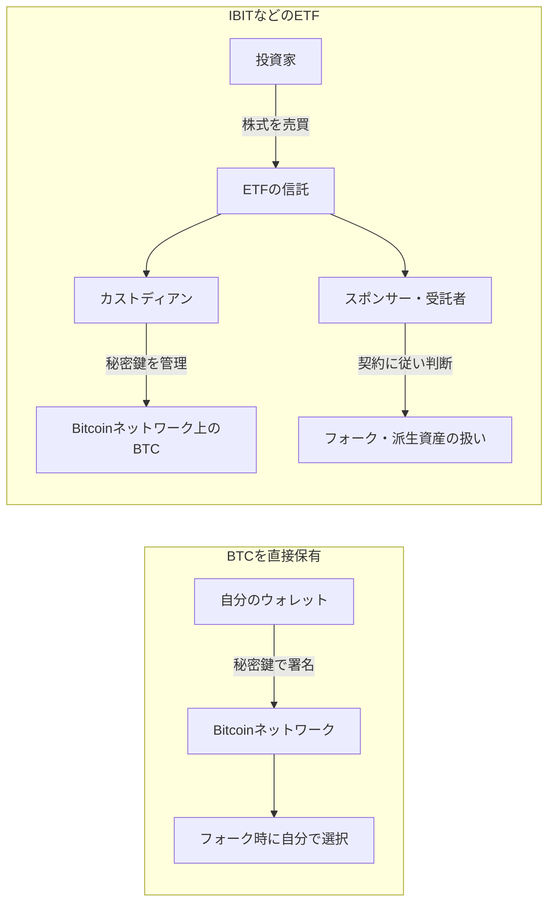
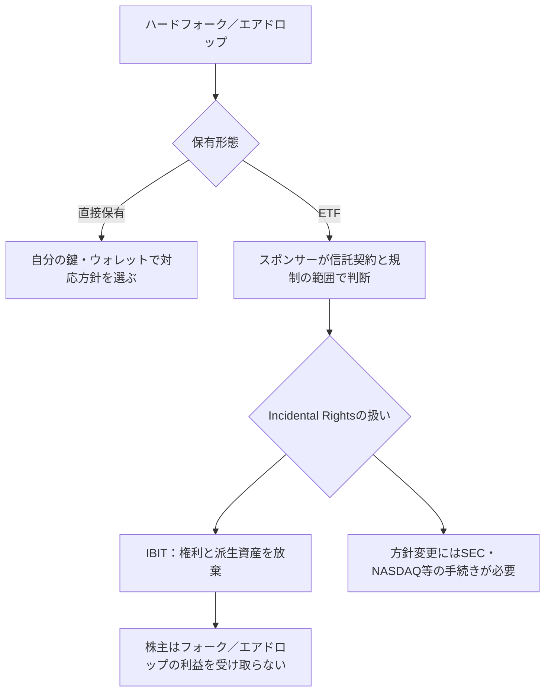
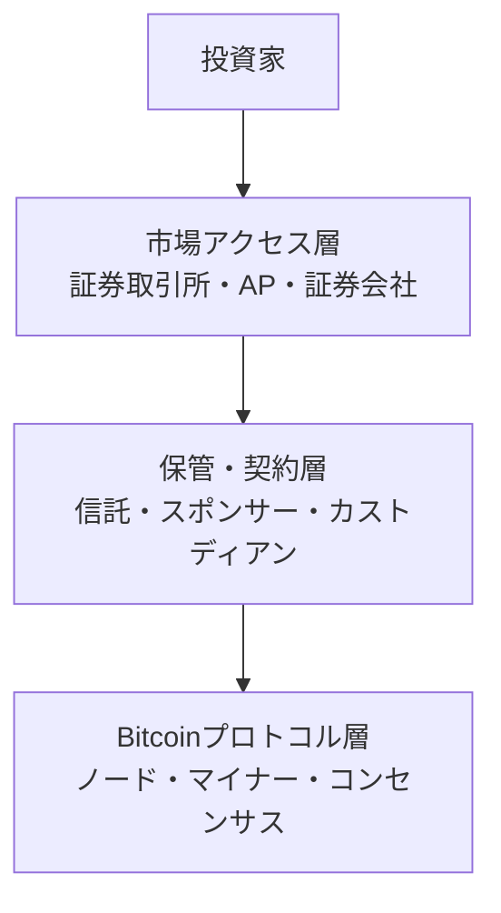

## ビットコインを、なぜもう一度「誰か」に預けるのか

ビットコインを自分のウォレットで持っていれば、銀行口座は必要ありません。

秘密鍵で署名した取引をネットワークへ送ればよく、銀行の営業時間も、銀行の承認も要りません。自分で鍵を管理する限り、資産を動かす最終的な権限は自分にあります。

それなのに、私たちはIBITのようなETFを買います。

ETFを買うと、秘密鍵は手元に来ません。ビットコインを送ることもできません。カストディアン、信託、スポンサー、取引所、証券会社を通じて、BTC価格に投資します。

これはビットコインの失敗ではなく、別の価値との交換です。

この記事では、ETFを「中央集権化」と一言で片づけません。まず、何が集中しているのかを分解します。

> ETFはBitcoinのネットワークを一社が支配する商品ではない。 
> ただし、ETFの投資家が資産を動かし、フォーク時の権利を行使する自由は、契約の中で誰かに委ねられる。

## この記事の結論

直接保有とETF保有の違いは、ビットコインの「価格」よりも、**誰を信頼し、誰が判断し、誰が鍵を持つか**に現れます。

ETFは、自己管理の負担を減らし、証券口座や規制された市場からアクセスできるようにします。その代わり、秘密鍵と派生資産に対する直接の選択権を手放します。

## 1. Bitcoinが減らそうとした「信頼」

Bitcoinの原論文は、電子マネーを「信頼できる第三者に頼らず」に送る仕組みとして説明しました。取引を公開し、Proof of Workで履歴をつなぎ、ノードが有効なブロックだけを受け入れます。[Bitcoinの原論文](https://bitcoin.org/bitcoin.pdf)

ここでいう「信頼がない」は、誰も何も信じないという意味ではありません。参加者が、特定の銀行の帳簿を信じる代わりに、公開されたルールと暗号技術を検証できる、という意味です。

Bitcoinでは、所有権を示すのはアドレスではなく、対応する秘密鍵で署名できることです。ネットワークへ送る取引は、ノードがルールに照らして検証します。Bitcoin Coreの説明でも、各フルノードが同じルールでブロックの有効性を個別に判断し、無効なブロックを拒否することでコンセンサスを維持するとされています。[Bitcoin Coreの説明](https://bitcoin.org/en/bitcoin-core/)

この設計が減らしたのは、少なくとも次のような依存です。

| 依存していたもの | Bitcoinで置き換えられたもの |
| --- | --- |
| 銀行の残高台帳 | 公開されたブロックチェーン |
| 銀行による送金承認 | 秘密鍵による署名とノードの検証 |
| 営業時間や国境 | P2Pネットワークへの接続 |
| 台帳を一社に任せること | 多数のノードが同じルールを検証すること |

ただし、ユーザーが取引所に預ければ、その瞬間に取引所への信頼が戻ります。Bitcoinのプロトコルが第三者を不要にしても、利用者が第三者保管を選べば、保管の層には第三者が存在します。

## 2. ETFで再び登場する「信頼の連鎖」

IBITの投資家が持つのは、BitcoinのUTXOそのものではなく、信託の純資産に対する受益権です。iSharesの年次報告書も、1株が信託の純資産に対する分割された受益持分だと説明しています。[iShares Bitcoin Trust ETF Form 10-K](https://www.sec.gov/Archives/edgar/data/1980994/000143774926006058/bit20251231_10k.htm)

信託のビットコインはカストディアンが秘密鍵を管理し、スポンサーや受託者が商品運営を担います。第4講で見たように、オンチェーン残高が見えても、契約上の所有権や負債まではブロックチェーンに記録されません。

ETFで信頼する相手は、一社ではありません。

1. **ETFのスポンサー**：商品方針や、フォークなどの扱いを決める
2. **受託者・信託**：資産を保有し、株式の純資産価額を計算する
3. **カストディアン**：秘密鍵を保管し、指示に従ってBTCを移動する
4. **指定参加者（AP）**：大口の設定・償還を行い、市場価格とNAVの差を縮める
5. **取引所・証券会社**：投資家が株式を売買する入口になる

これはBitcoinのルールを変更するためではなく、**一つの金融商品にアクセスするための役割分担**です。ただし投資家は秘密鍵を直接持たず、契約で定められた範囲の権利だけを持ちます。

## 3. 「集中」には3種類ある

「ETFでBTCが中央集権化する」という表現が分かりにくいのは、集中の対象が省略されているからです。少なくとも次の3種類を分ける必要があります。

### 3.1 保管の集中

ETFのBTCが少数のカストディアンに集まると、秘密鍵を操作できる主体は減ります。事故やサービス停止が起きたときの影響範囲が大きくなる、という意味で、保管リスクは集中します。

### 3.2 プロトコルの支配

Bitcoinのブロックを作るのはマイナーです。ブロックを有効と認めるのは、各ノードが実行するルールです。大きなカストディアンが大量のBTCを保管していても、それだけで無効なブロックを有効にしたり、他のノードに新ルールを強制したりはできません。

BitcoinのFAQも、変更は開発者が一方的に決めるのではなく、ユーザー、マイナー、ノード運営者がソフトウェアを自発的に採用して初めて実施されると説明しています。[Bitcoin FAQ](https://bitcoin.org/en/faq)

### 3.3 経済的な影響

ETFが大量のBTCを保有すれば、売買注文や市場流動性に影響する可能性はあります。スポンサーの方針が他の市場参加者に注目されることもあるでしょう。

これは経済的な影響力です。しかし、保有量の集中、プロトコルのルールを決める権限、価格への影響は同じものではありません。

| 問い | 主な主体 | ETF保有量の集中だけで起きるか |
| --- | --- | --- |
| 秘密鍵でBTCを動かせるか | カストディアン | 起きる（契約の範囲内） |
| どのブロックを有効と認めるか | フルノード | 起きない |
| ブロックを作る計算力を持つか | マイナー | 起きない |
| 市場価格や流動性に影響するか | 投資家・AP・運用会社 | 影響し得る |

## 4. ハードフォークが起きたら、誰がどちらを選ぶのか

ハードフォークとは、互換性のない2つ以上のチェーンに分岐し、それぞれで異なるデジタル資産が存在する状態です。

直接BTCを持っている人は、対応するウォレットやノードを選び、どのチェーンを使うかを自分で決められます。フォーク後に生まれた資産を受け取れるか、売却するか、保有し続けるかも、自分の鍵と対応ソフトウェア次第です。

ETFでは、こうした判断は商品の契約に従います。IBITの目論見書は、フォーク時にスポンサーが、どのネットワークを「Bitcoin」とみなすかを信託の目的のために判断すると説明しています。判断材料には、開発者、ユーザー、サービス、事業者、マイナーなどの受容や、マイニングパワー、コミュニティの関与が含まれます。ただし、最も価値のあるフォークを選ぶ保証はありません。[iShares Bitcoin Trust ETF目論見書](https://www.blackrock.com/us/individual/literature/prospectus/p-ishares-bitcoin-trust-12-31.pdf)

### IBITの「Incidental Rights」

フォークやエアドロップで、元のBTCの保有者に新しい資産や利益を受け取る権利が発生することがあります。IBITの目論見書は、これを **Incidental Right**、その権利で取得されるデジタル資産を **IR Digital Asset** と呼んでいます。

そして、フォーク、エアドロップなどについて、スポンサーは信託にその権利と関連する派生資産を「irrevocably abandon（取消不能の形で放棄）」させると記載しています。つまり、IBITの株主は、直接BTCを保有している人と同じようにフォークコインやエアドロップを受け取れるわけではありません。

これは「BTCが存在しない」という話ではありません。**信託の権利と、ETF株主が受け取れる経済的利益の範囲が契約で切り分けられている**という話です。

目論見書は、方針を変更して権利を売却・分配する場合には、NASDAQの上場ルール変更とSECの承認が必要になる可能性も説明しています。将来必ず分配される、という約束ではありません。

## 5. ETF投資家が手放すもの、得るもの

直接保有とETF保有は、交換条件として比べられます。

| 観点 | BTCを直接保有 | ETFを保有 |
| --- | --- | --- |
| 秘密鍵 | 自分で管理 | カストディアンが管理 |
| 送金 | 自分で実行できる | 株式を売買するだけでBTC送金はできない |
| フォーク・エアドロップ | 自分で対応方針を選べる | 商品契約とスポンサー判断に従う |
| 取引口座 | ウォレットや暗号資産取引所が必要 | 既存の証券口座を使える |
| 税務・社内管理 | 自分で記録・管理 | 伝統的な証券管理に寄せやすい |
| 取引時間 | BTC市場の稼働時間 | 取引所と証券会社の時間に依存 |
| 自己管理の負担 | 鍵の紛失・盗難に備える必要 | 鍵管理を委託できる |

ETFは、証券口座や既存の報告書を利用でき、直接ウォレットを持てない主体にも価格エクスポージャーを提供できます。

その代わりETF投資家は、ネットワーク上のコインを送ったり、フォーク時にチェーンを選んだりできません。鍵を持たないことは、紛失リスクと同時に判断権限の一部も手放すことです。

## 「中央集権化」は、どの層の話か

ここまでの話を層に分けると、ETFの意味が見えます。

ETFが大きく変えるのは、主に保管・契約層と市場アクセス層です。Bitcoinプロトコル層のノードやマイナーを、ETFの株主が直接運営するわけではありません。

逆に、保管・契約層では中央集権的な判断が増えます。カストディアンが鍵を管理し、スポンサーがフォーク資産の扱いを決め、株主はその判断を契約の範囲で受け入れます。

したがって、「ETFはBitcoinを中央集権化するのか」という問いへの答えは、層によって変わります。

- **プロトコルを中央集権化するか**：ETFの保有だけでは、そうならない
- **鍵の管理を集中させるか**：商品構造上、集中する
- **市場への入口を制度化するか**：証券市場のルールに包まれる
- **フォーク時の選択権を誰が持つか**：商品契約によって、スポンサーなどに委ねられる

## 連載のまとめ：価格ではなく、権限を見る

第1講では、ETFの株を買ってもBTCを送金できない理由を見ました。第2講では、APが株式の設定・償還を通じて市場価格とNAVの差を縮める仕組みを確認しました。第3講では、週末も動くBTCと、取引所の時間に制約されるETFの価格形成を比べました。第4講では、信託のBTC、カストディアンの秘密鍵、オンチェーン残高、契約上の所有権を分けました。

過去回：[第1講](https://zenn.dev/yuta1995/articles/crypto-etf-01-price-only)、[第2講](https://zenn.dev/yuta1995/articles/crypto-etf-02-creation-redemption)、[第3講](https://zenn.dev/yuta1995/articles/crypto-etf-03-weekend-gap)、[第4講](https://zenn.dev/yuta1995/articles/crypto-etf-04-custody-verification)。

第5講で加わった視点は、**権限の所在**です。

ETFを買うとき、確認したいのは「本当にBTCがあるか」だけではありません。

1. 誰が秘密鍵を管理するのか
2. 誰がフォーク時のネットワークを選ぶのか
3. フォークコインやエアドロップの権利は誰に帰属するのか
4. その判断に投資家は異議を唱えたり、別の選択をしたりできるのか

ETFはBitcoinを偽物に変えるのではなく、アクセス方法をウォレットから証券口座へ変換します。入口と管理のしやすさを得る一方、鍵と派生資産を自分で選ぶ自由は小さくなります。

直接保有とETFのどちらが正しいという話ではありません。得るものと預ける権限を理解して選びましょう。

暗号資産ETFでは、価格だけでなく目論見書も確認しましょう。

- カストディアンと秘密鍵の管理方法
- フォーク、エアドロップ、その他の派生資産の扱い
- スポンサーがネットワークを選ぶ際の裁量
- 株主が直接受け取れる権利と、受け取れない権利

金融商品を理解する最短ルートは、値上がり予想ではなく、**誰が何を実行できる契約なのかを読むこと**です。

---

## 参考資料

- [Bitcoin: A Peer-to-Peer Electronic Cash System](https://bitcoin.org/bitcoin.pdf)
- [Bitcoin Core](https://bitcoin.org/en/bitcoin-core/)
- [Bitcoin FAQ](https://bitcoin.org/en/faq)
- [iShares Bitcoin Trust ETF Prospectus](https://www.blackrock.com/us/individual/literature/prospectus/p-ishares-bitcoin-trust-12-31.pdf)
- [iShares Bitcoin Trust ETF Form 10-K（2025年12月31日）](https://www.sec.gov/Archives/edgar/data/1980994/000143774926006058/bit20251231_10k.htm)

確認日：2026年9月17日
