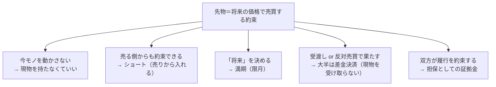

:::message
この記事は仕組みの解説であり、特定の商品や取引を勧めるものではなく、投資助言でもありません。先物・証拠金取引はレバレッジを伴い、預けた資金を超える損失が生じることがあります。商品仕様・数値は執筆時点（2026年7月）のもので、取引所や時期で変わります。実際の取引の前に、各取引所と公式資料で最新の仕様を確認してください。
:::

暗号資産の取引所を開くと、「先物」「Perpetual」「ロング」「ショート」「証拠金」といった言葉が並んでいます。現物の売買はしたことがあっても、この辺りで手が止まる人は多いはずです。

この連載では、先物と永久先物（Perpetual）を、6回に分けて一つずつ解きます。全体を貫く問いは1つ。**現物を持たずに値動きだけを取引すると、リスクは消えるのではなく、別の場所へ移る**。その「別の場所」を、証拠金・レバレッジ・満期・ファンディング（永久先物で価格を現物に寄せる定期的な支払い、第2講で扱います）と追っていきます。

第1講のゴールは、いちばん根っこにある問いに答えることです。まだ手元にないものを、どうやって今日売買するのか。

## まだ存在しない未来の価格を、今日売買する

話は暗号資産よりずっと昔にさかのぼります。1848年、シカゴに穀物の取引所（シカゴ商品取引所、CBOT）ができました。世界でも最初期の、穀物を集めて取引する場です。

https://www.cftc.gov/About/HistoryoftheCFTC/history_precftc.html

当時の穀物には、やっかいな価格変動がありました。収穫期には作物が一気に市場へ流れ込んで値崩れし、端境期（収穫と収穫のあいだの品薄な時期）には高騰する。作る側も買う側も、価格が読めません。そこで生まれた工夫が、「将来のこの時期に、この価格で売買する」とあらかじめ約束しておくことでした。CBOTは1865年に、この約束の条件（数量や受渡し時期）をそろえた標準的な契約として整えます。これが先物のはじまりです。

ここで、冒頭の問いです。まだ収穫されていない小麦を、なぜ今日売れるのでしょうか。答えは、売っているのが「小麦そのもの」ではなく「将来、決めた価格で売り渡すという約束」だからです。モノがまだ無くても、約束なら今日交わせます。

先物は暗号資産の発明ではありません。170年以上前から、価格変動に対処するために磨かれてきた金融の道具です。暗号資産は、その古い枠組みを新しい対象に当てはめているだけ、とも言えます。

## 現物は「モノ」、先物は「約束」を売買する

もう少しはっきりさせます。あなたがすでに知っている現物取引は、モノそのものの売買です。ビットコインを買えばその場でビットコインが手元に来て、売れば手放します。持っている間の値動きが、そのまま損益になります。

先物は、ここが違います。売買しているのはモノではなく、約束です。米国の商品先物取引委員会（CFTC）は、先物をこう定義しています。将来の受渡しのために商品を売買する合意で、次の4つの性質を持つ、と。

> (1) 契約の開始時に価格が決まる (2) 双方が、その決めた価格で契約を履行する義務を負う (3) 価格変動リスクを引き受ける、または移すために使われる (4) 受渡し、または反対売買（オフセット）によって果たせる

https://www.cftc.gov/LearnAndProtect/AdvisoriesAndArticles/CFTCGlossary/index.htm

一見、素っ気ない定義ですが、これがこの記事の設計図になります。この4つの性質から、取引所で見かける用語がすべて芋づる式に出てくるからです。次の節で、その導出をやってみます。

## 「約束」から、すべてが導かれる

先物が「約束の売買」だと分かると、5つの用語が1本の線でつながります。順番に引き出してみます。

**現物を持たなくていい**。約束は価格と履行義務の取り決めであって、今この瞬間にモノを動かすわけではありません（性質1・2）。だから、ビットコインを1枚も持っていなくても、値動きだけを取引の対象にできます。

**売り（ショート）から入れる**。約束は「買う側」だけでなく「売る側」からも結べます。将来この価格で売り渡す、という約束を先に交わせばいい。現物を持っていなくても「先に売る」ことができ、価格が下がれば安く買い戻して差額が利益になります。これがショートです。

**満期がある**。「将来の受渡し」を約束する以上、その「将来」がいつかを決めておく必要があります（性質1の「将来」）。これが満期（限月）です。

**多くは現物を受け取らない（差金決済）**。性質4は「受渡し、または反対売買で果たせる」と言っています。つまり満期まで持って本当にモノを受け渡す道もありますが、実際には大半のトレーダーが、満期の前に反対の取引（買っていたなら売る、売っていたなら買い戻す）をして、ポジションを閉じます。CMEは、ほとんどの参加者は満期のかなり前に反対売買で手じまいし、現物を受け取らないと説明しています。損益だけを現金でやり取りする、この決済のしかたを差金決済と呼びます。

https://www.cmegroup.com/articles/2025/cash-settlement-vs-physical-delivery.html

**証拠金が要る**。双方が「将来必ず履行する」と約束する以上、その約束を守れる裏づけが要ります。そこで、取引を始めるときに担保となるお金を預けます。これが証拠金です。CMEは、証拠金は商品の「頭金」ではなく、履行を保証するための誠意ある預け金（performance bond）だと説明しています。買った時点でモノを所有するわけではない、という点が現物と根本的に違います。

用語を1つずつ暗記するのではなく、「約束の売買」という1点から導く。こうすると、バラバラに見えた言葉が同じ絵の上に乗ります。

## 暗号資産では、どう動くのか

この枠組みは、暗号資産先物でもそのまま働いています。

たとえばCMEの仕様では、ビットコイン先物は1枚が5ビットコインぶんで、現金決済です。満期が来ても実際のビットコインは受け渡されず、CME CF Bitcoin Reference Rate（BRR）という基準価格をもとに、損益を現金で精算します。イーサ先物も同じ考え方で、1枚が50イーサ、こちらも現金決済です。

https://www.cmegroup.com/articles/faqs/frequently-asked-questions-cryptocurrency-futures.html

大事なのは、現物のビットコインを1枚も触らずに、その値動きだけを取引できているという点です。ロング（買い建て）で上昇に賭けることも、ショート（売り建て）で下落に賭けることもできる。約束を売買しているのだから、モノの受け渡しは必須ではない。第2節で引いた定義が、暗号資産でもそのまま効いています。

なお、暗号資産の取引所でよく見かける「Perpetual（永久先物）」は、ここまで説明してきた満期のある先物とは別の種類です。名前のとおり満期がないのに、なぜ「先物」と呼べるのか。この矛盾した商品は、次の第2講でじっくり扱います。

## ±10%で何が起きるか（証拠金とレバレッジ）

証拠金には、もう1つ大事な顔があります。レバレッジです。少ない元手で大きな金額の取引を動かせる代わりに、損益も同じ倍率で膨らみます。ここは煽られやすいところなので、両面をそろえて見ます。

単純化した例で比べます。数字は説明のための仮のもので、手数料や実際の証拠金率は考えていません。ビットコインの価格が±10%動いたとき、現物と証拠金取引でどう変わるかを並べます。

| | 現物（レバレッジなし） | 証拠金取引（例：10倍相当） |
| --- | --- | --- |
| 用意するお金 | 100万円ぶんを保有 | 想定元本100万円に対し証拠金10万円 |
| 価格が+10% | +10万円（元手比 +10%） | +10万円（証拠金比 +100%） |
| 価格が−10% | −10万円（元手比 −10%） | −10万円（証拠金比 −100%、証拠金が消える） |

同じ「±10%」でも、証拠金取引では元手に対する損益率が大きく膨らみます。損益率は、おおよそ「価格変動率 × レバレッジ倍率（想定元本÷証拠金）」です。上向きに膨らむのと同じだけ、下向きにも膨らみます。

しかも、下振れは証拠金の全額で止まるとは限りません。価格が証拠金の余力を超えて動けば、損失は預けた証拠金を上回りえます。CFTCは、こう明記しています。

> 損失が当初の証拠金を上回ることがある。その場合、本人が追加の資金でその損失を埋める責任を負う

https://www.cftc.gov/LearnAndProtect/AdvisoriesAndArticles/understandcontractobligations.html

レバレッジは利益を増やす魔法ではありません。値動きに対する自分の感度を上げる操作で、その感度は上にも下にも同じだけ効きます。個人的に、先物で最初に腹落ちさせておくべきなのは、利益と同じだけ損失も膨らむ、この対称的な拡大だと思います。

## リスクは消えず、別の場所へ移る（この連載の地図）

最後に、一段引いて全体を眺めます。

先物の本質は、価格変動リスクの移転です。CFTCの定義の3番目、「価格変動リスクを引き受ける、または移すために使われる」がそれです。価格が下がると困る作り手（ヘッジャー）が、将来の価格を先に固定してリスクを手放す。その反対側で、値動きから利益を狙う投機家がそのリスクを引き受ける。CMEは、ヘッジではリスクを減らしたい側から、利益を狙って引き受けようとする側へ、価格リスクが移ると説明しています。

ここに、連載を貫く問いが立ち上がります。現物を持たずに値動きだけを取引すると、リスクは消えるわけではありません。約束という形に置き換わり、証拠金や満期といった別の場所へ移っていきます。第1講で見た5つの要素は、その「移り先」の入り口です。

| 移り先 | どんなリスクが宿るか | 扱う講 |
| --- | --- | --- |
| ショート・値動きの取引 | 方向を外すと損失。とくに売りは価格に上限がないぶん損失が大きくなりうる | 第1講（本稿） |
| 証拠金 | 一定の水準（維持証拠金）を割ると追加入金（追証）が要る | 以降の講 |
| レバレッジ | 損益が同率で拡大。証拠金を超える損失もある | 以降の講 |
| 満期・ロール | 期日ごとに決済や乗り換えが要る | 以降の講 |
| ファンディング | 永久先物で、価格を現物へ寄せるための定期的な支払いが続く | 第2講以降 |

先物は「モノ」ではなく「約束」を売買している。この1点が腑に落ちると、ロング・ショート・満期・差金決済・証拠金が同じ絵の上に並び、そのどれにもリスクが形を変えて宿っていると見えてきます。

次の第2講では、その中でも暗号資産市場の主役になった「永久先物（Perpetual）」を取り上げます。満期がないのに、どうやって現物の価格を追い続けているのか。矛盾した名前の商品の中身を開けていきます。

:::message
繰り返しになりますが、この記事は仕組みの解説であり投資助言ではありません。先物・証拠金取引には、預けた資金を超える損失のリスクがあります。商品仕様・証拠金率・決済方法は取引所や時期で変わるので、実際の取引の前に各取引所の公式資料で最新の内容を確認してください。
:::
