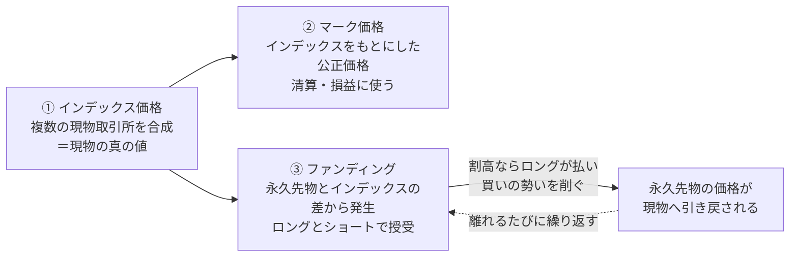

:::message
この記事は仕組みの解説であり、特定の商品や取引を勧めるものではなく、投資助言でもありません。永久先物はレバレッジを伴い、預けた資金を超える損失が生じることがあります。ファンディングの計算式・頻度・金利成分などの仕様は取引所ごとに異なり、執筆時点（2026年7月）のものです。実際の取引の前に、各取引所の公式資料で最新の仕様を確認してください。
:::

暗号資産の取引所を開くと、「BTCUSDT 無期限」「Perpetual」といった商品が並んでいます。第1講で見た通常の先物には満期がありました。ところがこの「永久先物」には、満期がありません。

満期がないのに「先物」と呼ぶ。これは、なかなかの矛盾です。しかも不思議なことに、満期がないのに、永久先物の価格は現物のビットコイン価格から大きく離れません。第1講で、通常の先物は満期があるからこそ現物価格に繋ぎ止められている、と見ました。その満期を外したら、価格は現物から漂ってしまいそうなものです。

この第2講の問いは1つです。満期という繋ぎ止めを外したのに、永久先物は何によって現物価格を追いかけ続けているのか。答えの主役は、ファンディングレートという仕組みです。ここを、順を追って丁寧に見ていきます。

## 満期という「錨」を思い出す

まず、第1講の要点を1つだけ思い出します。通常の先物には満期があり、満期が近づくと、先物価格は現物（スポット）価格へ収束していきます。

先物価格と現物価格の差を、ベーシスと呼びます。CMEは、ベーシスとは先物価格と現物価格の差であり、満期が近づくにつれてゼロへ収束していく、と説明しています。

https://www.cmegroup.com/education/courses/introduction-to-fx/importance-of-fx-futures-pricing-and-basis

簡単な数字で見ます。ある時点で現物が10万ドル、直近の先物が10万1000ドルだとすると、ベーシスは1000ドルです。もし満期時点で価格が10万5000ドルになっていれば、先物も現物も同じ10万5000ドルへ収束します。この「満期には必ず同じ値に揃う」という約束が、先物価格を現物へ引き寄せておく力になっています。この記事では、これを現物への「錨（いかり）」と呼ぶことにします。満期という錨があるから、先物は現物から遠くへ流されないのです。

## 永久先物は、その錨を切る

永久先物（Perpetual）は、この満期を取り払った先物です。Binanceの解説では、永久先物は通常の先物と違って満期日がなく、ポジションを好きなだけ長く持ち続けられる、とされています。満期がないので、期限が来るたびに次の限月へ乗り換える（ロールする）手間もありません。

https://academy.binance.com/en/articles/what-are-perpetual-futures-contracts

ここで問題が起きます。満期という錨を切ってしまうと、価格を現物へ引き寄せる力が消えるはずです。永久先物の価格は取引所の中で需給だけで動くので、放っておけば現物価格からずるずる離れていってもおかしくありません。買いが強ければ現物より高いところへ、売りが強ければ低いところへ、漂ってしまいます。

にもかかわらず、現実の永久先物は現物からそれほど離れません。つまり、満期の錨を切った代わりに、別の錨を立ててあるということです。その代役が、次に見るファンディングレートです。

## 代役の正体：ファンディングレート

ここが第2講の要なので、ゆっくり進みます。

ファンディングレートは、**永久先物のロング（買い）とショート（売り）の間で、定期的にやり取りされる支払い**です。押さえておきたい点を先に3つ挙げます。

1. 払う相手は取引所ではなく、反対側のポジションを持つトレーダーです。取引所は基本的に、この支払いから手数料を取りません。
2. 支払いの向きは、永久先物の価格が現物より高いか低いかで決まります。
3. 頻度は8時間ごとが典型ですが、1時間ごとなど、取引所によって違います。

向きを、両方向とも具体的に見ます。

**永久先物が現物より高いとき（プレミアム）**。買いが強すぎて、永久先物の価格が現物のインデックス価格（複数の現物取引所を合成した基準値。詳しくは後述します）より上に浮いている状態です。このときファンディングレートはプラスになり、**ロングがショートへ支払います**。Binanceも、ファンディングレートがプラスのときはロングがショートへ手数料を払う、と明記しています。

https://www.binance.com/en/academy/glossary/funding-fees

**永久先物が現物より低いとき（ディスカウント）**。売りが強すぎて、永久先物が現物より下に沈んでいる状態です。このときファンディングレートはマイナスになり、今度は**ショートがロングへ支払います**。

では、なぜこの支払いが価格を現物へ引き戻すのでしょうか。ここが肝心です。永久先物が現物より高い状態を考えます。このときロングは、ポジションを持っているだけで8時間ごとにショートへお金を払い続けます。つまり、割高な永久先物を買って持ち続けることに、じわじわとコストがかかります。すると、新しく買う人は慎重になり、持っている人は手じまいを考え、逆に「もらえる側」のショートは増えます。買いの勢いが削がれ、売りが増えることで、浮いていた価格は現物へ引き戻されていきます。OKXは、ファンディングは永久先物の価格を現物のインデックス価格に揃えるよう設計されている、と説明しています。

https://www.okx.com/en-us/help/iv-introduction-to-perpetual-swap-funding-fee

第1講の錨が「満期になったら必ず同じ値に揃う」という一発の力だったのに対し、ファンディングは「離れるたびに、持っているコストで少しずつ引き戻す」という、継続的な力です。矛盾した名前の「永久先物」は、満期の代わりにこの継続的な力で現物に繋ぎ止められているわけです。

なお、ファンディングは持っているときだけ発生します。支払いのタイミングの前にポジションを閉じていれば、払う必要はありません。OKXも、保有していなければ受払いは発生しないと説明しています。

## 道具①インデックス価格：現物の真の値を測る

ファンディングの向きは「永久先物が現物より高いか低いか」で決まる、と書きました。では、その「現物」は何を基準にするのでしょうか。

1つの取引所の現物価格だけを基準にすると、その取引所で一時的に価格を吊り上げるなどの操作に振り回されます。そこで使うのが、インデックス価格です。Binanceは、インデックス価格を、主要な複数の現物取引所の価格を、その出来高に応じて平均したものだと説明しています。

https://www.binance.com/en/support/faq/360033525031

インデックス価格は、いわば「現物の真の値」を測るものさしです。1か所の異常値に引っ張られにくいように、複数の現物市場から合成されています。ファンディングの計算も、次に見る清算も、この現物側のものさしを土台にします。

## 道具②マーク価格：清算に使う公正価格

もう1つ、鍵になる価格があります。マーク価格です。

永久先物では、清算（強制的なロスカット）や、含み損益の計算に、実際の取引価格（直近の約定値、ラスト価格）ではなく、マーク価格という別の価格を使います。なぜでしょうか。

もし直近の約定値で清算を判定すると、出来高の薄い一瞬に、誰かの大きな注文で価格がヒゲのように瞬間的に飛んだだけで、本来なら耐えられたはずのポジションが強制ロスカットされてしまいます。これを防ぐために、インデックス価格をもとにした、より落ち着いた「公正価格」で判定します。それがマーク価格です。Binanceは、清算価格と含み損益はマーク価格をもとに計算され、これは不必要な清算や価格操作を避けるためだと説明しています。Bybitは、マーク価格を複数の価格の中央値（メジアン）として算出し、単一の極端な値だけでは清算のラインに届かないようにしている、としています。

https://www.bybit.com/en/help-center/article/Mark-Price-Calculation-Perpetual-Expiry-Contracts

インデックス価格が「現物のものさし」なら、マーク価格は「そのものさしを使って決めた、清算や損益のための公正価格」です。取引画面に出ている値段と、清算の判定に使う値段は別物、という点が、永久先物を触るうえで大事になります。

## 3つが1本の線でつながる

ここまでの3つ、ファンディング・インデックス価格・マーク価格を、バラバラの用語として覚える必要はありません。1本のパイプラインとして見ると、すっきりします。

①インデックス価格で現物の真の値を測る。それを土台に、②マーク価格が清算や損益の公正な基準になり、③永久先物がインデックス価格から離れると、その差に応じてファンディングが発生して価格を引き戻す。この循環が、満期のない先物を現物に繋ぎ止め続けています。

ちなみに、価格を実際に引き戻す「担い手」は、ファンディングをもらう側に回ろうとするトレーダーたちです。割高でロングがファンディングを払っている局面では、現物を買って永久先物を売る、といった組み合わせでファンディングを受け取りにいく動きが、乖離を縮めます。この裁定（アービトラージ）の中身は、第3講でくわしく扱います。

## 式と数字で確かめる

仕組みが見えたところで、ファンディングの金額を具体的に計算してみます。難しくありません。

まず、1回あたりの支払い額は、とてもシンプルな掛け算です。

$$
\text{支払い額} = \text{ポジションの名目金額} \times \text{ファンディングレート}
$$

ここでいう名目金額は、証拠金ではなく、レバレッジ込みの建玉全体の金額です。ファンディングは、自分が預けた証拠金にではなく、動かしている取引全体にかかります。

たとえばファンディングレートが+0.01%で、あなたが名目10,000 USDTぶんのロングを持っているとします。レートがプラスなので、ロングであるあなたは支払う側です。

- 支払い額 ＝ 10,000 × 0.0001 ＝ **1 USDT**

これを、ファンディングのタイミング（たとえば8時間ごと）に支払います。1日3回なら3 USDT、そのレートが続けば1週間で約21 USDT。金額そのものは小さく見えますが、割高な状態が続くほど、ロングで持ち続けるコストとして積み上がっていきます。

レートがマイナスのときは、向きが逆になります。同じ名目10,000 USDTでレートが−0.01%なら、今度はショートが1 USDTを払い、ロングが1 USDTを受け取ります。プラスかマイナスかで、払う側ともらう側が入れ替わるわけです。

ファンディングレート自体も、固定ではありません。中身は、小さな固定の金利成分と、永久先物が現物からどれだけ離れているか（プレミアム）という成分でできています。Binanceは、ファンディングレートは金利とプレミアムの2つの要素からなる、と説明しています。ここが、銀行預金の利息と混同しやすいところなので、はっきりさせておきます。銀行の利息は、元本に外から利子が足されるものです。ファンディングは違います。取引所が付けてくれる利子ではなく、ロングとショートというトレーダー同士の間で、水平に移動するお金です。Binanceも、ファンディングはトレーダー間で直接支払われ、Binanceは手数料を取らないと明記しています。金利という言葉が式に出てくるので利息のように見えますが、正体はポジション間の需給に応じた定期的な受け渡しです。

https://www.binance.com/en/support/faq/360033525031

（式の細かい形や金利成分の値、ファンディングの頻度は、取引所ごとに異なります。ここでの数字は、仕組みを掴むための単純化した仮定です。実際の値は各取引所の公式資料で確認してください。）

## まとめ：錨を外した代償は、どこへ移ったか

最後に、この連載を貫く問いに戻ります。現物を持たずに値動きだけを取引すると、リスクは消えず、別の場所へ移ります。永久先物は、その典型でした。

- 通常の先物は、満期に現物へ収束することで現物に繋ぎ止められていました（満期＝錨）。
- 永久先物は、その満期を外した代わりに、ファンディングレートで価格を現物へ引き戻しています。永久先物が現物より高ければロングがショートへ、低ければショートがロングへ、定期的に支払う。この継続的な負担が、価格を現物へ寄せ続けます。
- その土台に、現物の真の値を測るインデックス価格と、清算や計算に使う公正なマーク価格があります。

満期という一発の錨を外した代わりに、リスクは「ファンディングを払い続ける負担」と「マーク価格をもとにした清算」へ移りました。満期管理がいらず、価格が現物に追随する使いやすさの裏で、持っているだけでコストが発生し、清算は取引価格ではなくマーク価格で判定される。この移り先を理解しておくことが、永久先物を触るうえでの土台になります。

なお、永久先物にはUSDT・USDC建て（linear）とコイン建て（inverse）があり、コイン建ては損益がビットコインなどで計算されるぶん、円やドルに直したときの効き方が変わります。この違いは、必要に応じて各取引所の資料で確認してください。

次の第3講では、この記事で「価格を引き戻す担い手」として名前だけ出した裁定（アービトラージ）を扱います。ファンディングやベーシスを使って、トレーダーはどこで利益を取り、その結果として価格の歪みがどう埋められるのか。錨を実際に効かせている力の中身を開けていきます。

:::message
繰り返しになりますが、この記事は仕組みの解説であり投資助言ではありません。永久先物・証拠金取引には、預けた資金を超える損失や、ファンディングの負担、マーク価格をもとにした清算などのリスクがあります。計算式・頻度・金利成分・清算の仕様は取引所や時期で変わるので、実際の取引の前に各取引所の公式資料で最新の内容を確認してください。
:::
