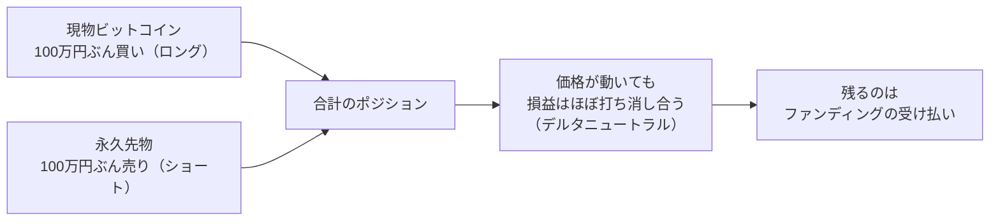

:::message alert
この記事は仕組みの解説と、公開データを使った検証の記録であり、特定の戦略や取引を勧めるものではなく、投資助言でもありません。後述するとおり、これは多くの仮定を置いた単純なバックテストで、実際の取引の記録ではありません。手数料・スリッページ・取引所リスク・清算などを十分には織り込んでいないため、実際の手取りは本試算より下振れしえます。数値はすべて筆者の集計で、前提や期間を変えれば結果は変わります。判断はご自身の責任でお願いします。
:::

「現物でビットコインを買い、同じ量だけ永久先物を売る。方向を当てなくても、ファンディングをもらい続けて年率20%。しかもほぼノーリスク」。暗号資産の界隈で、こういう誘い文句をよく見かけます。

第2講で見たように、永久先物のショートは、ファンディングがプラスのとき定期的に受け取れます。それを現物の保有と組み合わせて、値動きを気にせずファンディングだけを収穫しよう、という戦略です。キャッシュ・アンド・キャリーと呼ばれます。

ここで、素朴な疑問が2つ湧きます。方向を当てないのに利益が出るなら、その利益は誰が払っているのか。そして、それは本当にノーリスクなのか。この第3講では、Binanceの公開データ5年半ぶんを実際に取得して、この2つを確かめます。結論を先に言うと、**デルタニュートラルと、ノーリスクは、別物でした。**

## 現物買い＋永久先物売りで、方向を捨てる

まず戦略の中身です。やることは2つだけです。

- 現物のビットコインを、たとえば100万円ぶん買う（ロング）
- 同じ100万円ぶんの永久先物を売る（ショート）

この2つを同時に持ちます。図にすると、こうです。

価格が上がれば、現物のロングは得をしますが、永久先物のショートが同じだけ損をします。下がれば、その逆です。上下どちらに動いても、2つの損益がほぼ打ち消し合う。だから、価格の方向を当てる必要がありません。方向を捨てる代わりに、手元に残るのがファンディングの受け払いです。第2講で見たとおり、永久先物が現物より割高（プレミアム）ならショート側は受け取れます。その受け取りを積み上げていくのが、この戦略の狙いです。

## なぜ価格変動が相殺されるのか（デルタニュートラル）

ここで、デルタという言葉を1つだけ覚えます。**デルタとは、価格が動いたときに自分の損益がどれだけ動くか、という感応度のことです。**

いちばん単純な例が現物です。ビットコインを100万円ぶん持っていて、価格が1%上がれば1万円の得。1%下がれば1万円の損。価格の動きが、そのまま損益に伝わります。この状態を「デルタが1」と表します。デルタ1とは、価格の動きが100%そのまま自分に届く、ということです。

では、永久先物のショートはどうでしょうか。売っているので、価格が1%上がれば1万円の損、下がれば1万円の得。現物とちょうど正反対です。こちらは「デルタがマイナス1」になります。

この2つを同じ金額で同時に持つと、何が起きるか。

| 価格が1%上がると | 現物ロング（デルタ +1） | 永久先物ショート（デルタ −1） | 合計 |
| --- | --- | --- | --- |
| 損益 | ＋1万円 | −1万円 | **0円** |

プラス1とマイナス1が打ち消し合って、合計のデルタがほぼゼロになります。価格がどちらへ動いても、損益が反応しない状態です。これを**デルタニュートラル**（デルタが中立、の意味）と呼びます。

ビットコインが暴騰しようが暴落しようが、資産はほとんど動かない。方向を当てる必要がない。ここまで聞くと、たしかに安全そうに聞こえます。

ただし、ニュートラル（中立）なのは**価格の方向に対してだけ**です。ここが決定的に大事なところなので、はっきり書きます。デルタをゼロにして消したのは、「ビットコインが上がるか下がるか」という1種類のリスクだけです。それ以外のリスクは、1つも消えていません。それどころか、この戦略を組むために、**現物取引所と先物取引所の両方に資産を預け、証拠金を差し入れ、ポジションを2本同時に維持し続ける**という、新しい負担が増えています。

「デルタニュートラル」という専門用語が、いつのまにか「ノーリスク」という別の意味にすり替わる。これがこの戦略の最初の、そして最大の落とし穴です。何が消えて、何が残り、何が新しく増えたのか。それを実データで見ていきます。

では、実際にファンディングをどれだけ受け取れたのか。ここからは、Binanceの公開データで確かめます。BTCとETHの永久先物について、2021年1月から2026年7月まで、8時間ごとのファンディング実績を取得しました（1銘柄あたり約6,100回ぶん）。データはBinanceの公式API（認証不要の公開データ）から取っています。

https://developers.binance.com/docs/derivatives/usds-margined-futures/market-data/rest-api/Get-Funding-Rate-History

## 年率20%のカラクリ：表面と実現は違う

まず、ファンディングの推移を見ます。8時間ごとのレートを、分かりやすいように年率に換算して並べました。

ぱっと見て分かるのは、ファンディングが大きく上下していることです。跳ね上がっている時期を切り取って年率に直すと、とても高い数字が出ます。実際、ファンディングの30日移動平均がいちばん高かった時期を年率に換算すると、BTCで約94%、ETHでは約119%にもなりました。「年率20%」どころではありません。宣伝で見かける高い利回りは、たいていこの「調子のいい時期を切り取って年率換算した数字」です。

問題は、その数字が実際に手に入るわけではないことです。同じデータで、この戦略を5年半ずっと続けた場合の実現利回りを計算してみます。受け取ったファンディングを積み上げて（受け取ったぶんを元本に足して次も回す、複利と仮定して）、年率に直すとこうなります。

BTCで見ると、いちばん左の「調子のいい時期を年率換算した94%」に対して、5年半を通した実現年率は約11.5%。直近30日の水準を年率換算すると、わずか6.2%です。いちばん右は、その実現年率（約11.5%）から手数料を引いた後で、それでも約11.5%のまま。手数料を引いてもほとんど動きません（手数料が主犯でないことは、後で確かめます）。表面の利回りと、実際に手に入る利回りは、これだけ違います。表面年率が高いこと自体は嘘ではありませんが、それを「これからも続く利回り」と読むと、大きく外します。

なお、この約11.5%にも、まだ注意が要ります。これは、建てたポジションの大きさ（ここでは現物100万円ぶん）に対する利回りです。ところがこの戦略には、現物の100万円に加えて、永久先物のショートを支える証拠金も要ります。現物と証拠金の両方に資金を寝かせるなら、投じた資金の合計に対する利回りは、これよりさらに低くなります。逆に、証拠金を薄くしてレバレッジをかければ資金効率は上がりますが、今度は後で見る清算のリスクが増えます。「何に対する利回りか（分母は何か）」で、数字の見え方はまた変わるのです。この記事が最初に槍玉に挙げた「表面年率」の落とし穴は、実は実現年率のほうにも潜んでいます。

## 強気相場への前寄せと、ファンディングの反転

なぜ実現利回りはこんなに下がるのでしょうか。年ごとに分けて見ると、はっきりします。

利益は、強気相場だった2021年に大きく偏っています。BTCで約36%、ETHで約46%。ところが、その後は一桁から十数%に落ち着き、弱気だった2022年はBTCで約4%、ETHにいたっては1%未満まで縮んでいます（いちばん右の2026年は、7月までの途中集計なので低く見えています）。

ここで、最初の疑問に答えが出ます。この利益は、誰が払っているのか。ファンディングの原資は、レバレッジをかけてでも買いたい、というロング側に傾いた需要です。強気相場ではロングが殺到し、割高になった永久先物のプレミアムを、ショート側が受け取れます。裏を返せば、その偏りが薄れれば利回りも縮み、弱気相場でみんなが売りたがれば、ファンディングはマイナスに沈みます。

マイナスに沈むと、どうなるか。今度は立場が逆転して、ショート側が支払う側に回ります。実データでは、ファンディングがマイナスだった期間の割合は、BTCで14.3%、ETHで16.0%ありました。連続してではなく散らばってはいますが、合計すると1年のうち2か月ぶんほどは、受け取るはずのファンディングを逆に払っていた計算です。「もらい続ける」前提が崩れる時間が、これだけあるわけです。この戦略の利回りは、相場の偏りに乗った、変動する収入であって、保証された固定金利ではありません。

## 手数料・スプレッド・スリッページ・リバランス

利回りを削る要素として、まず手数料を見ます。ここは正直に書きます。

現物と先物を1回ずつ建てて、最後に1回ずつ閉じるだけなら、往復の手数料はそれほど大きくありません。テイカーの標準的な手数料（現物が片道0.10%、先物が片道0.05%ほど）で往復しても、合計0.3%程度です。5年半のあいだ持ち切ったと仮定すると、年率への影響はごくわずかでした。

グロスの線と、手数料を引いた後の線が、ほぼ重なっているのが分かります。手数料は、この戦略にとっての主犯ではありません。

ただし、油断はできません。現実には、価格が動くと現物とショートの金額がずれてくるので、それを揃え直すリバランスが要ります。回転を増やすほど、そのたびに手数料とスプレッド（買値と売値の差）、スリッページ（想定より不利な値段で約定するずれ）がかさみます。さらに、上のシミュレーションは、こうしたリバランス費用やスプレッドを含めていません。だから実際の手取りは、この試算より下振れしやすいと考えておくのが安全です。逆に、証拠金の金利や現物の貸し出しなどを足せば上振れする要素もあるので、この試算は厳密な上限でも下限でもありません。いずれにせよ、手数料そのものは小さくても、運用の手間と細かなコストは、じわじわ効いてきます。

## 本当の危険は、損益グラフに写らない

ここまで見ると、こう思うかもしれません。利回りは思ったより低いけれど、値動きは相殺されるし、損益のブレも小さいなら、やっぱり安全なのでは、と。

損益のブレを、最大ドローダウン（それまでの最高値からの、最大の落ち込み）で見てみます。

この曲線での最大ドローダウンは、BTCでわずか−0.44%、ETHでも−1.78%でした。数字だけ見れば、たしかに驚くほど小さい。けれど、注意が要ります。これは「ファンディングの受け払いだけを積み上げた曲線」の落ち込みであって、戦略ぜんたいの落ち込みではありません。ここがこの記事の山場です。**この曲線がなだらかなのは、本当に危険なことが、この損益グラフには写っていないからです。**

このシミュレーションが測っているのは、ファンディングの受け払いだけです。次のような、実際にこの戦略を痛めつけるリスクは、ファンディングの履歴には一切現れません。

| 損益グラフに写らないリスク | 何が起きるか |
| --- | --- |
| 取引所の破綻・出金停止 | 資産が引き出せず、あるいは戻らない（2022年のFTX破綻が典型）。デルタニュートラルでも資産そのものを失う |
| 清算（ロスカット） | 急騰時などに永久先物のショート脚が証拠金不足で強制決済され、片脚だけ消えてデルタニュートラルが崩れる |
| ステーブルコインのデペッグ | 証拠金や決済に使うUSDTなどが価格を割り込む・凍結される |
| 自動デレバレッジ（ADL） | 相場急変で取引所の保険基金が不足すると、利益の出ているポジションが強制的に減らされる |
| ベーシスの急変・数量ずれ | 現物と先物の価格差が急に開き、または金額のずれで、価格変動が完全には相殺されない |
| API障害・約定遅延 | 動かしたいときに動かせず、リバランスや損切りが間に合わない |

この表がぴんと来ないかもしれないので、いちばん起きやすい壊れ方を、数字で1つ辿ってみます。清算です。

100万円ぶんの現物を持ち、同じ100万円ぶんの永久先物を売ったとします。先物側の証拠金として、20万円を入れたとしましょう。ここでビットコインが20%急騰します。

- 現物：100万円 → 120万円。**20万円の含み益**
- 先物ショート：**20万円の含み損**。証拠金20万円がほぼ吹き飛ぶ

合計はゼロです。デルタニュートラルは、たしかに機能しています。ところが問題は、この2つが別々の口座にあることです。現物の20万円の含み益は、先物口座の証拠金を助けてくれません。先物口座だけを見れば、証拠金が足りずに清算されます。

清算されると、どうなるか。ショートの脚だけが消え、手元には現物ロングだけが残ります。**その瞬間、デルタニュートラルは崩れ、ただのビットコイン現物の買い持ちに変わります。** 方向を当てない戦略のはずが、気づけばフルにビットコインの値動きを浴びる状態です。そこから急落すれば、今度は現物側で損失が膨らみます。

「価格が上がっても下がっても損しない」はずの戦略が、価格が上がったことをきっかけに壊れる。これがこの戦略の急所です。ファンディングの履歴には、この事故は1ミリも記録されません。

つまり、デルタニュートラルが消してくれたのは、あくまで「価格の方向」のリスクだけです。その代わりに、リスクは取引所の信用、証拠金と清算、ステーブルコインやシステムの安定性へと、形を変えて移っています。しかも、それらは損益グラフのようになだらかには来ません。ふだんは何も起きず、起きたときは一撃で持っていく。平時のデータがきれいなことは、安全の証拠にはならないのです。

もう1つ、見落としてはいけないのが生存者バイアスです。これには2つの層があります。1つは、ネットで「年率○%を達成した」という報告が、うまくいった人のものだということ。取引所の破綻や清算で退場した人の数字は、そこには残りません。もう1つは、この検証自体のバイアスです。ここで使ったのは、2026年まで生き残ったBinanceと、BTC・ETHという生き残った銘柄のデータで、破綻した取引所や消えた銘柄は最初から入っていません。好成績のデータほど、生き残ったものだけを見ている可能性を疑う必要があります。

## まとめ：デルタニュートラルは、無リスクではない

実データで確かめたことを整理します。

- 宣伝で見る高い年率は、たいてい「調子のいい時期を年率換算した数字」です。BTCではピークで年率94%相当でしたが、5年半の実現は約11.5%、直近では6%ほどでした。表面年率と手取りは別物です。
- ファンディングの原資は、ロングに傾いた需要です。強気相場に利益が前寄せされ、弱気ではマイナスに沈みます（実データでBTCの14.3%、ETHの16.0%の期間がマイナス）。保証された利回りではありません。
- 手数料そのものは、持ち切りなら小さい。ただしリバランスやスプレッド、スリッページは回転を上げるほど効き、実際の手取りは試算より下振れします。
- そして最大の点。損益グラフのドローダウンが小さいのは、安全の証拠ではありません。取引所破綻・出金停止・清算・API障害といった本当の危険が、ファンディングの損益系列には写らないからです。

デルタニュートラルは、価格の方向を当てなくてよくする、確かに強力な考え方です。けれど、それは方向リスクを消すだけで、リスクをゼロにする魔法ではありません。方向リスクを手放した代償として、リスクは取引所と清算とシステムへ移っただけです。連載の問い、「方向リスクを消したとき、別のリスクはどこへ移るか」への、この講での答えがこれです。

次の第4講では、その移り先の1つ、清算そのものを掘り下げます。この記事では「ショートの脚が清算されてデルタニュートラルが崩れる」と書きましたが、では清算されたあと、取引所の中では何が起きているのか。証拠金を超える損失が出たとき、その穴は誰が埋めるのか。ロスカットされれば損は証拠金まで、という思い込みの先を見ていきます。

:::message
この記事の試算は、単純化した仮定に基づくバックテストです。デルタニュートラルを保つためのリバランス費用、スプレッド、スリッページ、取引所リスク、清算、税金は十分に織り込んでおらず、実際の手取りは下振れしえます。分析はBinanceの公開データ（BTCUSDT/ETHUSDTのファンディング履歴、2021年1月〜2026年7月）に基づき、手数料は執筆時点のテイカー標準値の目安を用いています。手数料率・計算頻度・上限などの仕様は取引所や時期で変わります。特定の戦略を推奨するものではありません。実際の判断は、各取引所の公式資料を確認のうえ、ご自身の責任でお願いします。
:::

（分析コードとデータ取得手順は、Binanceの公式API `GET /fapi/v1/fundingRate` を用いています。生データそのものは再配布せず、集計と図のみを掲載しています。前提を変えれば結果は変わります。）
