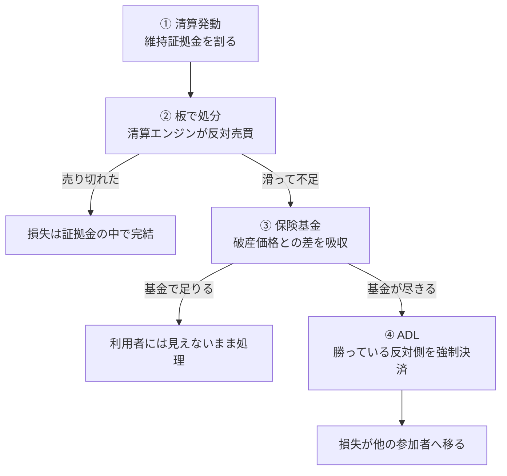

:::message alert
この記事は仕組みの解説と、公開データを使った検証の記録であり、特定の取引所や取引を勧めるものではなく、投資助言でもありません。清算・保険基金・ADLの仕様は取引所や商品ごとに異なり、変更されます。本文の数値は執筆時点（2026年7月）に公開APIから取得したスナップショットで、時間とともに変わります。実際の取引の前に、必ず各取引所の最新の公式資料をご確認ください。
:::

2025年10月10日、暗号資産市場が急落したその日、Hyperliquidという取引所で、12分ほどのあいだに34,983回の強制決済が実行されました。対象になったのは19,337のウォレット。この件を実データで解析した論文によれば、閉じられたのは**負けていた人のポジションではありません**でした。刈られたのは勝っていた側で、強制的に確定させられた利益は約21億ドルにのぼります。

さらに奇妙な数字があります。同じ論文によると、この処理で本来埋めるべきだった穴、つまり証拠金を食い潰して残ったマイナス残高（債務超過）の総額は、約2,320万ドルでした。必要額のおよそ90倍が刈られた計算になります。

なぜこんなことが起きるのか。この第4講では、清算されたあとの世界を解剖します。前回、キャッシュ・アンド・キャリーの片脚が清算されてデルタニュートラルが崩れる話をしました。今回はその先です。**清算は、自分の口座では完結しません。**

https://zenn.dev/yuta1995/articles/crypto-futures-03-funding-arbitrage

## 勝っている人の建玉が、強制的に閉じられる

先ほどの出来事は、ADL（Auto-Deleveraging、自動デレバレッジ）と呼ばれる仕組みによるものです。

自分は方向を当てている。証拠金も足りている。ルール違反もしていない。それなのに、取引所の判断でポジションを強制的に閉じられる。ADLとは、そういう仕組みです。

「勝っている人を強制決済する」というのは、直感的にはとんでもない話に聞こえます。けれど、これは設計です。なぜそんなものが必要なのか。それを理解するには、清算の入り口まで一度戻る必要があります。

この記事では、清算されたあとに何が起きるかを、4つの段階に分けて追いかけます。順番に見ていけば、最後にADLへ戻ってきます。

## 清算価格と破産価格の、500ドルのすき間

まず、清算される瞬間の話からです。

清算された経験がある人なら、こう思ったことがあるかもしれません。「まだ証拠金は残っていたはずなのに、なぜあの価格で切られたのか」。答えは、取引所が**証拠金がゼロになる手前で切っているから**です。

ここで2つの価格を区別します。

- **破産価格**：その価格まで動くと、預けた証拠金がちょうどゼロになる価格
- **清算価格**：取引所が実際に強制決済を発動する価格。破産価格の**手前**にある

数字で見ます。ビットコインを10万ドルで、10倍のロングで買ったとします。証拠金は1万ドル。維持証拠金率（建玉の想定元本に対する比率）を0.5%とすると、こうなります。


破産価格は9万ドル。10万ドルの10分の1、つまり証拠金1万ドルぶんだけ下がった位置です。ここまで来ると証拠金は消えます。一方、清算価格は9万500ドル。破産価格に、想定元本10万ドルの0.5%にあたる500ドルを上乗せした水準です。取引所は、破産価格に届く**500ドル手前**で切ります。

Binanceの公式説明では、清算の条件はこう定義されています。担保（当初証拠金＋実現損益＋含み損益）が、維持証拠金を下回ったとき。

https://www.binance.com/en/support/faq/binance-futures-liquidation-protocols-360033525271

この500ドルのすき間を、以下ずっと追いかけます。押さえておきたいのは、**このバッファが取引所のための余裕だ**ということ。引き継いだポジションを市場で処分するあいだ、取引所が損をしないために取ってあります。誰のための500ドルなのかは、ADLのところで効いてきます。

## バッファが足りなくなるとき

では、清算されたポジションはどこへ行くのでしょうか。消えるわけではありません。取引所の清算エンジンが引き継いで、**市場の板で処分します**。

ここに問題があります。500ドルのバッファは、「その値幅の中で売り切れる」という前提の上に成り立っています。ところが相場が急変すると、板が薄くなり、想定した価格では売れません。

さきほどの例（証拠金1万ドル、破産価格9万ドル、1BTC）で、実際に約定できた価格ごとに何が起きるかを並べます。


| 実際に約定できた価格 | 担保を超えた不足額 |
| --- | --- |
| 92,000ドル | なし |
| 90,000ドル | なし（ちょうど破産価格） |
| 88,000ドル | **2,000ドル** |
| 85,000ドル | **5,000ドル** |
| 80,000ドル | **10,000ドル**（証拠金と同額） |

8万ドルまで滑ると、不足額は1万ドル。預けた証拠金と同じだけの穴が、証拠金の外に空きます。

しかも、清算そのものが売り圧力になります。清算エンジンが投げた売りが価格を押し下げ、それが次の清算ラインに触れ、また売りが出る。連鎖清算と呼ばれる状態です。市場監視会社のSolidus Labsのレポートによれば、2025年10月10日には、ビットコインの板の厚みが1億ドル規模から17万ドル規模まで、98%以上消えた瞬間があったとされています。

https://www.soliduslabs.com/post/when-whales-whisper-inside-the-20-billion-crypto-meltdown

ここで、この記事の問いがはっきりします。**足りなかったぶんは、誰が払うのか。**

## 保険基金の、ほんとうの役目

多くの人が最初に思い浮かべるのが、保険基金でしょう。取引所が積んでいる基金が、その穴を埋めてくれる。おおむね合っています。ただし、名前から受ける印象とは、目的がかなり違います。

Binanceの公式説明には、こう書かれています。

> 保険基金は、トレーダーの損失を補填するために使われるものではありません。その唯一の目的は、破産価格と約定価格の差を埋めることです

https://www.binance.com/en/support/faq/introduction-to-futures-insurance-funds-360033525371

つまり保険基金は、あなたを助けるためのものではありません。**取引所の帳簿に穴が空かないようにするためのもの**です。前の節で見た「売り切れなかったぶんの不足」を吸収するのが役目で、それ以上でもそれ以下でもありません。

では、その原資はどこから来るのか。同じ公式説明によれば、主に2つです。1つは清算手数料。もう1つは、破産ポジションを引き継いで処分したときに出た利益。

2つ目が重要です。前の節で見たバッファ（清算価格と破産価格の500ドル）は、うまく売り切れれば取引所側に利益として残り、保険基金に積まれます。つまり保険基金は、**清算された人たちが少しずつ積み立てている**ものだと言えます。誰かが飛ぶたびに厚くなる基金です。

## あなたの後ろに、いくら積まれているか

その保険基金、いったいいくらあるのでしょうか。これは調べられます。認証も要りません。

Bybitのコイン別の残高を取得してみます。

```bash
curl -s "https://api.bybit.com/v5/market/insurance"
```

結果を並べたのが次の図です。以下の数値はいずれも**2026年7月27日 05:41 UTC 時点**のもので、縦軸は対数目盛であることに注意してください。


このとき、BTCの基金は約3億3,200万ドル。一方、OPは**約7,000ドル**でした。差はおよそ4万7,000倍です。BTCのポジションの後ろには3億ドル超の防衛線があり、OPのポジションの後ろには日本円で100万円ほど（1ドル150円換算）しかない、ということになります。

いちばん大きいのはUSDTのプールで、約3億8,000万ドルありました。USDT建ての無期限をやっている人にとって、後ろに積まれているのはこの財布です。

Binanceも見てみます。こちらは基金の構造そのものが銘柄によって違いました。

```bash
curl -s "https://fapi.binance.com/fapi/v1/insuranceBalance?symbol=BTCUSDT"
```

- **BTCUSDT**：8銘柄で1つの基金を共有。USDT建ての残高は約7億4,800万ドル（基金にはこのほかUSDCなども積まれています）
- **DOGEUSDT**：**169銘柄**で1つの基金を共有。USDT建ての残高は約2億700万ドル

つまり「ビットコインの保険基金」というものは単独では存在せず、BTC・ETH・BNBといった主要銘柄が1つの財布を共有しています。そしてアルトコインを取引する人は、169銘柄ぶんの事故を同じ財布で受け止めることになります。金額が少ないうえに、取り崩す原因の数は多いのです。

ついでに、今この瞬間のADLリスクも照会できます。

```bash
curl -s "https://fapi.binance.com/fapi/v1/symbolAdlRisk?symbol=BTCUSDT"
```

同じ時点で `LOW` でした。ただしこれは取引所が示す相対的な目安であり、ADLが起きないことの保証ではありません。自分が触っている銘柄について、一度確かめてみると感覚が変わると思います。

## 基金が足りないとき、損失は勝者へ渡る

さて、ここで冒頭に戻ります。

保険基金にも限りがあります。急落が大きく、清算が連鎖し、基金では引き受けきれない事態になったとき、取引所には最後の手段が残されています。それがADLです。

Binanceの公式説明では、ADLは清算プロセスの**最終段階**であり、保険基金が破産ポジションを引き受けられない場合にのみ発動するとされています。

https://www.binance.com/en/support/faq/what-is-auto-deleveraging-adl-and-how-does-it-work-360033525471

やることは単純です。破綻したポジションの反対側にいる、**利益の出ている参加者の建玉を強制的に閉じる**。

具体的に何が起きるか、これまでと同じ数字で追います。あなたはビットコインのショートを持っていて、10万ドルで売り建てたところ、価格が8万ドルまで下がったとします。含み益は1BTCあたり2万ドル。読みは当たっています。

ここで、反対側でロングを持っていた人が清算され、板でも保険基金でも処理しきれなかったとします。すると、あなたの建玉がADLの対象になります。閉じられる価格は、破綻した相手の破産価格。この例では9万ドルです。

- あなたが望んだ決済：**8万ドル**（含み益2万ドル）
- ADLで閉じられる価格：**9万ドル**（利益1万ドル）

利益が没収されるわけではありません。9万ドルまでの1万ドルは受け取れます。失うのは、**そこから先の1万ドル**です。相場が読みどおり動いているのに、ポジションはもう存在しない。その先の値幅は、二度と取れません。

もう1つの痛みがあります。ヘッジや裁定のために建てていた場合、片脚だけ消えることで**残った脚がむき出しになる**。第3講で見た、デルタニュートラルが崩れる状態です。しかもそれが、自分の判断ではなく他人の破綻をきっかけに起きます。

誰が選ばれるかにも順番があります。Binanceのランキングは、含み益の率と実効レバレッジの掛け合わせで決まります。ざっくり言えば、**うまく勝っていて、かつレバレッジを効かせている人ほど、先に刈られる**。優等生から順に指名される仕組みです。

そして、冒頭の数字に戻ります。2025年10月10日のHyperliquidでは、34,983回のADLが執行され、勝ち側から約21億ドルが刈られました。ところが、実際に埋める必要があった債務超過は約2,320万ドル。この件を解析した論文は、埋めるべき穴の額を基準にすれば**刈られたうちの98%程度は不要だった**可能性を指摘しています。同じ論文のシミュレーションでは、より賢い選び方をしても6億6,000万ドルは必要だったとされており、それでも実際の21億ドルよりはかなり小さい額です。

https://arxiv.org/html/2512.01112v2

損失は、消えたわけではありません。清算された人の口座から出発して、板を経由し、基金を経由して、最後は**勝っていた他人の口座**に届きました。それが起きた日でした。

## 4段のウォーターフォールと、取引所ごとの違い

ここまでの流れを、1枚にまとめます。



大事なのは、①から④へ進むほど、損失が**自分の外へ広がっていく**ことです。②で収まれば自分の証拠金の話で終わりますが、④まで行くと無関係な他人に届きます。

ただし、この4段の作りは取引所ごとに違います。執筆時点で公式資料から確認できた範囲で並べます。

| | 防衛線の構造 |
| --- | --- |
| Binance | 主要銘柄と多数のアルトで基金プールが分かれる。コイン建て契約は基金が小さく、USD建てよりADLされやすいと公式が明言 |
| Bybit | 公開APIはコインごとに残高を返し、その額は銘柄で数万倍の開きがある |
| Hyperliquid | 板で処分しきれないと、HLPというコミュニティの金庫がポジションごと引き受ける。清算で出た利益も取引所ではなくHLPの出資者へ渡る |

Hyperliquidの設計には、もう1つ特徴があります。ドキュメントによれば、ADLは前回のオラクル価格で執行され、債務超過を残さない形をとります。そして**建玉を持っていない利用者が損失を負わされることはない**と明記されています。残高を置いているだけの人にまで損失を割り振る方式（損失分担、socialized lossと呼ばれます）も方式としては存在するので、そこを明示的に否定しているわけです。

https://hyperliquid.gitbook.io/hyperliquid-docs/trading/liquidations

https://hyperliquid-co.gitbook.io/wiki/architecture/hypercore/dex/clearinghouse/liquidations

## 「ゼロカット」の正体

ここまで読むと、こう思うかもしれません。「でも結局、暗号資産の先物には追証がないのでは？」と。

たしかに、多くの場合はそう見えます。Binanceでは、建玉がなくマルチアセットモード（複数の通貨をまとめて証拠金に使うモード）を使っていない口座について、10分ごとに自動でマイナス残高を清算し、その不足分を保険基金が吸収する、と説明されています。実質的に、マイナスは残りません。

ただ、これを「ゼロカットだから安心」と一般化するのは危険です。同じBinanceの中でも、ポートフォリオマージン（口座全体のリスクをまとめて評価する上級者向けのモード）では扱いが違います。一定の条件を満たすあいだはマイナス残高をそのまま保持でき、そこには**1日1回、利息が課されます**。形の上では負債が残るわけです。

https://www.binance.com/en/support/faq/wallet-transfers-auto-fund-functions-and-negative-balances-in-binance-portfolio-margin-c1df531bb7c44ea2a10919a74fd84f5e

そして、より本質的な点があります。追証が来ないのは、取引所が親切だからではありません。その穴は、**清算手数料と、保険基金と、最後にはADLで刈られた他人の利益**によって埋められています。あなたがマイナスを負わずに済むという性質は、市場の誰かの負担の上に成り立っています。無料ではないのです。

## まとめ：リスクは消えず、最後は他人へ

最後に、規制された先物市場と並べてみます。

CMEの公開資料によれば、清算参加者（取引所と顧客のあいだに立つ金融機関）が破綻したときの損失処理は、①破綻した参加者の証拠金と、あらかじめ差し入れている保証基金への拠出、②**CME自身の資金**（いわゆる skin in the game）、③他の清算参加者が事前に拠出した保証基金、④上限つきの追加拠出、という順に進みます。

https://www.cmegroup.com/education/articles-and-reports/cme-clearing-financial-safeguards-waterfalls.html

暗号資産取引所の4段と見比べると、決定的な違いが1つあります。CMEが公開しているこのウォーターフォールの各層には、**一般の顧客が持っている含み益のポジションを強制的に閉じる段が含まれていません**。損失を引き受けるのは、清算機関自身と、事前に拠出したプロの参加者です。

暗号資産デリバティブでは、その位置に保険基金とADLが入ります。つまり最終的な引き受け手が、**勝っている一般の参加者**になります。これはどちらが優れているという話ではなく、設計思想の違いです。ただ、自分がどちらの市場に立っているかは、知っておく価値があります。

この連載で追いかけてきた問いに、ここで答えが出ます。現物を持たずに値動きだけを取引すると、リスクは消えるのではなく、別の場所へ移る。第1講では証拠金とレバレッジへ、第2講ではファンディングと清算価格へ、第3講では取引所とシステムへ移りました。そして本講で見たとおり、最後の移り先は**他の参加者**です。

https://zenn.dev/yuta1995/articles/crypto-futures-01-intro

https://zenn.dev/yuta1995/articles/crypto-futures-02-perpetual

要点をまとめます。

- 清算は、証拠金がゼロになる手前で発動します。その差は取引所の防衛線であって、あなたの余裕ではありません
- 板で売り切れなければ不足が出ます。市場が飛ぶほど、証拠金は損失の上限として機能しなくなります
- 保険基金はあなたの損失を埋めるものではなく、破産価格と約定価格の差を埋めるためのものです。しかも銘柄によって厚みが数万倍違います
- それでも足りなければADLで、勝っている参加者の建玉が閉じられます。しかも必要以上に刈られることがあります

次の第5講では、この連載の最後のテーマを扱います。株式のトークン化と、24時間動く「株らしきもの」の話です。市場が閉まっている時間に動く価格は、いったい何を映しているのか。ここまで見てきた仕組みが、株式の世界でどう現れるかを見ていきます。

:::message
この記事の数値は、執筆時点（2026年7月）に公開APIから取得したスナップショットです。保険基金の残高、対応銘柄、ADLの仕様、清算のルールはいずれも変更されます。本文で紹介したコマンドは認証不要で実行できるので、実際にご自身で最新の値を確認してみてください。特定の取引所や取引を推奨するものではなく、投資助言でもありません。
:::
