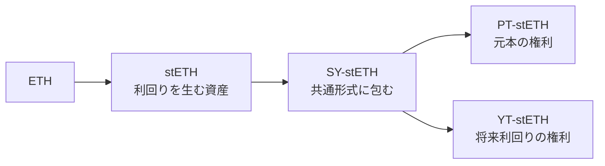

:::message
この記事は特定の暗号資産・プロトコル・投資商品の購入を勧めるものではありません。仕組みを理解するための解説であり、投資助言ではありません。暗号資産の運用には元本を失うリスクがあります。数値・仕様は執筆時点（2026年7月）のもので、必ず最新の公式情報をご自身で確認してください。
:::

DeFiを触っていると、「固定利回り 年10%」といった表示に出会うことがあります。ステーキングやレンディングの利回りは日々変動するのに、なぜ「固定」ができるのでしょうか。そして、その固定された利回りは、いったいどこから来ているのでしょうか。

先に結論を書きます。固定利回りは、無料で湧いてくるわけではありません。あなたが固定を受け取っている裏で、将来の変動リスクは「誰か」の口座に移っています。この記事では、Pendleというプロトコルの PT・YT という仕組みを題材に、その「誰か」の正体を、伝統的な金利スワップと並べながら解いていきます。

## 「年利5%」は、将来も5%とは限らない

まず、DeFiの利回りが「変動する」という当たり前の事実から始めます。

ステーキングやレンディングで表示される「年利◯%」は、その時点の需給や利用状況で決まる瞬間風速です。借り手が増えれば貸出金利は上がり、資金が流れ込めば下がります。今日5%でも、来月に3%になっているかもしれないし、8%かもしれません。

ここに、2種類の人が生まれます。「将来がどうなろうと、いま5%で確定させたい人」と、「変動したままでいい、むしろ上振れを取りにいきたい人」です。この2人は、利回りに対して正反対の願いを持っています。片方はリスクを避けたく、もう片方はリスクを取りにいきたい。

正反対の願いを持つ2人がいるなら、あいだで取引が成立します。この記事が解くのは、その取引の中身です。DeFiで「固定利回り」が商品として成り立つのは、この2人の交換があるからだ、という話をしていきます。

## 足場：伝統的な金利スワップ（固定↔変動の交換）

Pendleの話に入る前に、読者がすでに知っている足場を1つ確認します。伝統的な金融にある「金利スワップ」です。

金利スワップは、固定金利と変動金利を交換する取引です。米国CFTCの定義では、一方の当事者が「固定または変動の金利 × 想定元本」にもとづく支払いを行い、その見返りに「参照金利 × 同じ想定元本」にもとづく支払いを受け取る、と説明されています。

https://www.cftc.gov/MarketReports/SwapsReports/DataDictionary/index.htm

ポイントは2つです。1つ目は、交換しているのは金利のキャッシュフローだけで、想定元本（notional）そのものは受け渡されないこと。元本はあくまで金額を計算するための基準です。2つ目は、固定を払う人と変動を払う人が必ずペアで存在すること。片方だけでは成立しません。

この「固定と変動を交換する」という発想を、頭の片隅に置いておいてください。Pendleがやっていることは、これを暗号資産の世界で、少し違う形で再現したものだと読めます。

## 暗号資産の「利回り」を、元本と将来利回りに分ける

では、Pendleは何をしているのでしょうか。ひとことで言うと、利回りを生む資産を「元本の部分」と「将来利回りの部分」に切り分けて、別々に売買できるようにしています。

流れはこうです。たとえばETHをステーキングするとstETHになり、これは利回りを生む資産です。Pendleはまずこれを SY（Standardized Yield）という共通形式に包みます。SYは、いろいろな利回り資産をプロトコルが同じように扱えるようにするラッパー（包み紙）だと思ってください。そのうえで、SYを2つのトークンに分離します。

- **PT（Principal Token）**: 満期に元本相当を受け取る権利。Pendle公式は「PTは満期後に元本を償還できる権利を与える」と説明しています。
- **YT（Yield Token）**: 満期までに発生する利回りを、リアルタイムで受け取る権利。公式は「YTを保有すると、原資産の利回りが満期まで保有者にストリーム配当される」と説明しています。

https://docs.pendle.finance/pendle-v2/ProtocolMechanics/YieldTokenization/Minting

用語が一気に増えたので、ここで一度整理します。SYは包み紙、PTは元本、YTは将来利回りです。この3つのうち、これから主役になるのはPTとYTです。

## 不変式：PT価格 ＋ YT価格 ＝ 原資産価格

分離すると、価値はどうなるのでしょうか。ここがこの記事のいちばん大事なところです。

Pendle Academyには、こう書かれています。「PT価格 ＋ YT価格 ＝ 原資産価格」。1単位の原資産から1つのPTと1つのYTが作られ、両方を合わせれば1単位の原資産に戻せる。だから、PTとYTのドル価値の合計は、常に原資産に等しくなります。

https://docs.pendle.finance/pendle-academy/pendle-101/chapter-2-yield-tokenization-basics

$$
\text{PT価格} + \text{YT価格} = \text{原資産価格}
$$

この式は当たり前に見えて、実は重い意味を持っています。原資産という1つのケーキを、PT（元本）とYT（利回り）という2切れに分けている。合計は変わらない。ということは、片方が「固定」で得をする分は、もう片方が引き受けているはずなのです。ケーキ全体は増えも減りもしないのですから。

個人的に、この不変式を理解した瞬間に、Pendleが「金利の交換」だという見方がすっと腑に落ちました。固定利回りは、どこか外から降ってくるのではなく、このケーキの分け方から生まれています。

## PT＝固定側：割引で買い、満期に額面へ収束する

まず、固定側のPTから見ます。PTを買うと、なぜ固定利回りになるのでしょうか。

答えは、割引で買って、満期に額面へ戻るからです。PTは原資産より安い割引価格で買えます。そして満期には、原資産に対して1対1で償還されます。公式の言葉では、PTの価値は「満期に向かって原資産の価値に近づき、最終的に一致する。この値上がりが固定利回り（Fixed Yield APY）を生む」となっています。

https://docs.pendle.finance/pendle-v2/ProtocolMechanics/YieldTokenization/PT

これは、伝統的な金融の「ゼロクーポン債（利息を払わず、額面より安く売られる債券）」とまったく同じ構造です。安く買って、満期に額面で戻る。その差額が、実質的な利回りになります。

大事なのは、この確定利回りが購入した時点で決まることです。公式の用語集では「固定利回り（Fixed APY）は、PTを保有することで受け取れる確定利回りであり、これは購入時のImplied APY（後述）と数値的に等しい」と定義されています。つまりPTを買った人は、将来の利回りが上がろうが下がろうが、買った瞬間のレートで固定される。将来の変動を放棄する代わりに、確定を手に入れているわけです。

## YT＝変動側：市場予想を上回るかに賭ける

では、その放棄された「変動」を引き受けているのは誰か。YTの買い手です。

YTを持つと、原資産が生む利回りが満期までリアルタイムで入ってきます。この利回りは変動します。だからYTの買い手の損得は、「実際の利回りが、買ったときのコストを上回るか」で決まります。

ここで2つのAPYを区別します。

- **Implied APY**: 市場が織り込んでいる「これから予想される利回り」。Pendle公式によれば、これはYTとPTの価格比から計算されます。YTが市場でつけられている「価格＝レート」だと思ってください。
- **Underlying APY**: 原資産が実際に生んでいる現行の利回り（公式では直近7日間の移動平均）。

YT docsは、YTの損得をこう説明しています。「平均のUnderlying APYが、あなたが支払ったImplied APYより高くなれば、利益が出る」。

https://docs.pendle.finance/pendle-v2/ProtocolMechanics/YieldTokenization/YT

つまりYTの買い手は、「実際の利回りが、市場予想を上回る」ほうに賭けています。金利のロングポジションです。PTの買い手が手放した上振れを、そっくり引き受けているのがYT側だと分かります。

もう1つ、YTには時間の壁があります。公式は「YTの価値は満期に近づくほど0に向かい、満期には0になる」と述べています。利回りを受け取る権利は、満期が来れば消えるからです。放っておくと価値が減っていくので、YTは「持っているだけ」では不利になりやすい性質があります。

## 固定利回りは"無料で湧かない"

ここまでで、部品はそろいました。組み立て直します。

原資産という1つのケーキが、PT（元本）とYT（利回り）に分けられている。PTの買い手は割引で買い、満期の額面で確定利回りを得る。その代わり、利回りが上振れしても取り分はありません。上振れを取りにいく権利は、YTの買い手が持っている。そしてYTの買い手は、利回りが予想を下回れば損をする。

つまり、こうです。

> あなたがPTで「固定11%」を受け取って安心しているとき、その11%を超えるかもしれない上振れと、下振れのリスクは、YTを買った誰かの口座に移っている。

固定利回りは、無料で湧いてなどいません。誰かが将来の変動を手放し、誰かがその変動を引き受ける。その交換の産物として、はじめて「固定」が成立します。PT価格とYT価格の合計が原資産価格に等しい、というあの不変式が、これを数字の上で保証しています。片方の安心は、もう片方が背負ったリスクの裏返しなのです。

## 伝統的スワップと、何が同じで何が違うか

こうして見ると、Pendleはたしかに「金利スワップ」に似ています。固定を望む人（PT）と、変動を望む人（YT）が、利回りを交換している。機能としては、冒頭で確認した伝統的な金利スワップと同じ絵です。

ただし、同じなのは機能だけで、構造はかなり違います。ここは日本語の解説であまり語られない部分なので、丁寧に並べます。

| 観点 | 伝統的な金利スワップ | Pendle（PT・YT） |
| --- | --- | --- |
| 交換するもの | 金利のキャッシュフロー（想定元本は交換しない） | PT・YTという現物トークンそのものを売買する |
| 満期の元本 | 元本の受け渡しはない | PTが原資産に1対1で償還される |
| 取引の相手方 | 特定の相手との相対契約 | Pendleの流動性プール（PTとSYのプール） |
| 主なリスクの所在 | 相手方が支払えなくなる信用リスク | スマートコントラクト・原資産のデペッグ・流動性 |

とくに相手方の違いは大きいです。伝統的なスワップは、CFTCの定義でも「2者間の相対契約」です。相手が破綻すれば約束は履行されません。一方Pendleでは、取引の相手は特定の誰かではなく、PTとSYからなる流動性プールです。

https://docs.pendle.finance/pendle-academy/yield-trading-deep-dives/chapter-7-providing-liquidity-while-trading-yield

相手方の信用リスクが消える代わりに、リスクはスマートコントラクトのバグや、原資産そのものの価格・利回りの変動へと置き換わります。リスクは消えず、場所を変えるだけです。ここは後半でもう一度触れます。

## 100万円で見る、3つのシナリオ

抽象論が続いたので、仮の数字で確かめます。以下はすべて説明のための単純化した例で、実際の価格・手数料・レバレッジは考慮していません。

前提を置きます。100万円相当の利回り資産、満期は1年後、購入時点のImplied APY（市場が織り込む利回り）は10%とします。このとき、PTを固定側として買うと、割引価格で買って満期に額面へ戻るので、確定利回りは10%になります。

Pendle公式の利回り計算式（`effectiveImpliedApy = ptExchangeRate^(365/daysToExpiry) - 1`）から逆算すると、満期1年でImplied APYが10%なら、PTの割引価格は額面の約0.909（＝1÷1.10）になります。安く買って満期に額面へ戻る差が、そのまま10%の固定利回りです。

https://docs.pendle.finance/pendle-v2/ProtocolMechanics/PendleMarketAPYCalculation

この基準線（Implied APY 10%）に対して、1年後に実際の利回り（Underlying APY）がどうなったかで、PT側とYT側の明暗が分かれます。

| 1年後の実際の利回り | PTを買った人（固定側） | YTを買った人（変動側） |
| --- | --- | --- |
| 5%（予想を下回る） | 予想に関係なく +10% で確定 | 予想を下回り、損失 |
| 10%（予想どおり） | +10% で確定 | ほぼトントン |
| 15%（予想を上回る） | +10% で確定（上振れは取れない） | 予想を上回った分が利益 |

表を縦に読むと、PTの列は3行とも「+10%」で動きません。実際の利回りが5%に落ちても15%に伸びても、固定側は10%です。一方でYTの列は、実際の利回りが予想を上回るかどうかで、損にも得にもなります。

つまり、PTの動かない安心は、YTの動く損得と背中合わせです。両者を足せば、原資産そのものを持っていた場合のリターンに一致します。あの不変式が、ここでも効いています。

:::message
これは元本保証ではありません。「固定10%」はPTを満期まで保有した場合の話で、満期前に売れば価格は変動します。また、この利回りは原資産（ここでは利回り資産）建てで固定されるのであって、円やドル建てで無リスクという意味ではありません。YTの損益額も、購入価格や請求のタイミングで変わります。ここで示したのは損得の「向き」です。
:::

## 固定しても消えないリスク

「固定」と聞くと安全に感じますが、消えないリスクがいくつも残ります。固定側のPTを買った場合でも、次のような点は残ります。

- **原資産のデペッグ・毀損**: PTの固定は、あくまで原資産に対する固定です。デペッグ（ステーブルコインなどが本来連動すべき価格を割り込むこと）が起きたり、もとになるステーキング資産が問題を起こせば、満期に戻ってくる「額面」そのものが目減りします。円やドルで見て無リスクではありません。
- **スマートコントラクトのリスク**: Pendleは外部プロトコルやコントラクトと連携します。公式FAQも「第三者のコントラクトやシステムには固有のリスクがあり、そこでの流出でPendleは責任を負わない」と明記しています。Pendle自体は複数の監査を受けていますが、コード由来のリスクがゼロになるわけではありません。

https://docs.pendle.finance/pendle-v2/FAQ

- **満期前に売るときの価格変動**: PTもYTも市場で売買されるトークンなので、満期を待たずに売れば、そのときの市場価格しだいで損益が出ます。
- **YTの時間減価**: 変動側のYTは、満期に価値が0へ向かいます。値上がりを待つあいだも、時間そのものが価値を削っていきます。
- **表示利回りの読み違い**: 画面に並ぶ「◯%」の表示は、一般にインセンティブや手数料、ガス代の影響を受けます。表示された数字がそのまま手取りになるとは限りません。

リスクが消えるのではなく、相手方の信用リスクが、原資産・コード・流動性のリスクに置き換わっている。前半で書いたことが、そのままリスクの姿にも表れています。

## まとめ：利回りをバラ売りする交換

最後に、この記事の要点を短くまとめます。

- Pendleは、利回り資産を元本の権利（PT）と将来利回りの権利（YT）に分けて、別々に売買できるようにしています。
- 両者の価格の合計は、常に原資産の価格に等しくなります（PT価格 ＋ YT価格 ＝ 原資産価格）。
- PTは割引で買って満期に額面へ戻ることで固定利回りになり、YTは実際の利回りが市場予想を上回るかに賭ける変動側です。
- だから固定利回りは無料で湧くのではなく、変動を手放した人と引き受けた人の交換で成立しています。機能は金利スワップに似ていますが、相手方がプールである点など、構造は伝統的なスワップと違います。

固定利回りを見つけたら、「その固定は誰の変動と交換になっているのか」「自分はどちら側に立っているのか」を確かめる。これだけでも、数字の見え方が変わるはずです。利回りは、元本と将来利回りにバラ売りできる。その交換の全体像が見えると、DeFiの金利市場が少し立体的に見えてきます。

:::message
繰り返しになりますが、この記事は仕組みの解説であり、投資助言ではありません。実際に扱う際は、対象資産とプロトコルの最新の公式ドキュメントを確認し、リスクを理解したうえでご自身で判断してください。
:::
