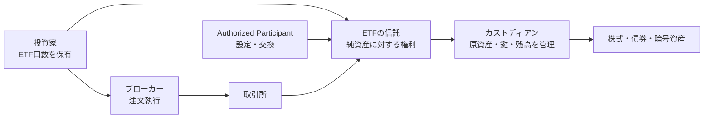

## 誰が資産を持っているのか

ETFを買ったとき、投資家のウォレットにビットコインやイーサリアムが届くわけではありません。

トークン化された社債を買ったときも、発行体のサーバーにある秘密鍵を自分で持つわけではありません。

では、その資産を動かせる人は誰なのでしょうか。

ここで登場するのが、カストディアンです。

カストディアンは、単に資産を「預かる会社」ではありません。資産を安全に保管し、取引を決済し、残高を照合し、配当や償還を処理し、事故が起きたときの復旧手順まで運用する金融インフラです。

この記事では、カストディアンを次の3つの場面で比較します。

- 株式や債券を扱う伝統金融
- 秘密鍵を管理する暗号資産
- 権利・トークン・コンプライアンスを組み合わせるトークン化金融

先に結論を言うと、**秘密鍵を持つことと、資産を法的に所有することは同じではありません**。カストディを理解するには、「誰が鍵を持つか」だけでなく、「誰の資産として記録され、誰の指示で、どの条件で動くか」を分けて考える必要があります。

## カストディアンは金庫ではなく、運用の窓口

伝統金融でのカストディアンは、顧客の有価証券や現金を保管・管理する金融機関です。米国SECの説明では、顧客資産を保管する適格カストディアンとして、銀行やブローカー・ディーラーなどが挙げられています。[SECのQualified Custodian解説](https://www.sec.gov/newsroom/speeches-statements/office-hours-gary-gensler-qualified-custodian)

カストディアンの仕事を、金庫の鍵を預かることだけだと思うと、実務の大半を見落とします。

### 1. 分別管理

分別管理（顧客資産と自社資産を分けて管理すること）を行います。口座、帳簿、内部システム上の残高を分け、誰の資産かを追跡できるようにします。

SECのカストディ・ルールも、顧客資産を適格カストディアンに保管し、顧客へ明細を送ることを投資家保護の仕組みとして説明しています。[SECのカストディ・ルール](https://www.sec.gov/files/custody_rule-secg.htm)

### 2. 決済

株式を買ったとき、売買が成立しただけでは取引は終わりません。買い手の現金と売り手の証券を交換し、約定内容を口座残高へ反映する必要があります。

カストディアンは、ブローカー、清算機関、決済システムと連携し、証券と現金の受け渡しを処理します。

### 3. コーポレートアクション

コーポレートアクション（配当・利払い・株式分割・償還など、発行体が行う資産上のイベント）も処理します。議決権行使もその一つです。

発行体から届いた情報を確認し、対象となる顧客を特定し、現金や新しい証券を配布します。必要に応じて、投資家からの選択や指示も受け付けます。

### 4. 照合と報告

カストディアンは、内部台帳の残高、取引履歴、外部の決済記録を突き合わせます。帳簿上は100万口あるのに、決済機関では99万口しか確認できない、といった不一致を見つけるためです。

このように見ると、カストディアンは「保管庫」よりも、**資産の状態を一貫させるための業務システム**に近い存在だと分かります。

## 運用会社・ブローカー・取引所とは何が違うのか

金融サービスでは、ひとつの会社が複数の役割を兼ねることがあります。だからこそ、会社名ではなく役割で見る必要があります。

| 役割 | 主な仕事 | 資産を動かす権限の例 |
| --- | --- | --- |
| 運用会社 | ファンドの投資方針や商品を管理する | 売買・運用を指示する |
| カストディアン | 顧客資産を保管し、決済・記録・報告を行う | 指示に基づいて受け渡しを実行する |
| ブローカー | 市場で注文を執行する | 売買注文を市場へ送る |
| 取引所 | 売り注文と買い注文をマッチングする | 取引の場を提供する |
| 受託者・トラスティ | 信託財産を受益者のために管理する | 信託契約に基づき監督・承認する |

例えばETFでは、運用会社がファンドを設計し、カストディアンが資産を保管し、ブローカーやAuthorized Participant（設定・交換を行う参加者）が市場取引や口数の調整を担います。

同じ企業グループ内に複数の役割が存在する場合でも、契約、帳簿、承認権限は別々に設計されます。

## 暗号資産では「鍵を管理する」ことが中心になる

暗号資産のカストディでは、株券の保管庫の代わりに、秘密鍵の管理が中心になります。

ブロックチェーン上の残高を移動するには、秘密鍵を使った署名が必要です。したがって、カストディアンが秘密鍵や署名権限を管理するということは、資産を移転できる能力を管理することでもあります。

米国通貨監督庁（OCC）も、暗号資産の保管では秘密鍵の紛失・漏えい・不正利用が主要なリスクになると説明しています。[OCCの暗号資産セーフキーピング資料](https://www.occ.treas.gov/news-issuances/news-releases/2025/nr-ia-2025-68a.pdf)

### ホットウォレットとコールドウォレット

- **ホットウォレット**：オンラインで接続され、入出金や取引に使いやすい
- **コールドウォレット**：ネットワークから切り離して、長期保管に使う

コールド保管にすればすべてのリスクが消えるわけではありません。鍵の生成、バックアップ、復旧、複数人の承認、障害時の切り替えも必要です。

### MPCやマルチシグは何を解決するのか

秘密鍵を1人の担当者や1台の端末に置くと、紛失や内部不正に弱くなります。そこで、署名を複数の参加者に分散したり、鍵を複数の断片に分けて単独では使えないようにしたりします。

ただし、MPC（複数当事者計算）やマルチシグは、権限設計の方法です。それだけで、誰の資産か、どの取引が法的に許可されているか、障害時に誰が判断するかが決まるわけではありません。

## ETFでは、投資家・信託・カストディアンを分ける

ETFを買った投資家が保有するのは、ETFの受益証券（ファンドの純資産に対する持分）です。原資産を直接動かす秘密鍵ではありません。

構造を単純化すると、次のようになります。



ここで「カストディアンが保管している」と言うとき、少なくとも次の3つを分けます。

1. カストディアンが管理する口座やウォレットに残高がある
2. その残高が契約上、ファンドの資産として分別されている
3. 投資家がファンドを通じた権利を持っている

ブロックチェーン上のアドレスを見つけても、投資家がその秘密鍵を直接持つわけではありません。逆に、アドレスが見えないからといって、直ちに資産が存在しないとも言えません。帳簿、契約、オンチェーン残高を組み合わせて確認する必要があります。

## トークン化金融では、5つの層を分ける

トークン化された社債やファンド持分では、カストディアンの仕事がさらに分解されます。

```text
法律上の権利
    ↓
トークンコントラクト
    ↓
Identity / Compliance
    ↓
ウォレット・署名権限
    ↓
決済・会計・監査
```

例えばERC-3643は、ERC-20互換のトークンにIdentity RegistryやComplianceを組み合わせ、保有資格と移転条件を確認します。[ERC-3643仕様](https://eips.ethereum.org/EIPS/eip-3643)

このとき、カストディアンが担当するのは主にウォレットや署名権限、取引承認、残高管理です。一方で、次の問題は別の役割に残ります。

- トークンが表す法的な権利を誰が定義するか
- KYCやAMLを誰が実施するか
- IdentityのClaimを誰が発行するか
- Complianceのルールを誰が設定するか
- 償還や契約変更を誰が承認するか

つまり、トークン化金融においてカストディアンは重要ですが、発行体、コンプライアンス事業者、管理者、決済機関の仕事をすべて代替するわけではありません。

## 「鍵を持つ人」と「所有者」は同じではない

カストディを理解するうえで、最も重要な区別です。

例えば、カストディアンのウォレットに100BTCがあるとします。この事実だけでは、次のことは分かりません。

- その100BTCがカストディアン自身の資産か、顧客資産か
- 顧客ごとに分別管理されているか
- 借入や担保設定がないか
- どの顧客の指示で移動できるか
- カストディアン破綻時に、誰が返還を請求できるか

ブロックチェーンが証明するのは、基本的には「そのアドレスに、いま何単位あるか」です。所有権、契約上の請求権、顧客資産の分別管理は、契約・帳簿・監査・法制度と組み合わせて確認します。

だから、プルーフ・オブ・リザーブ（保有残高を示す証明）の数字だけでカストディ全体が安全だと判断することはできません。残高の存在証明と、負債・権利・運用統制を含む財務上の証明は別です。

## カストディアンに残る責任

カストディアンを使えば、投資家や発行体がすべてのリスクから解放されるわけではありません。

### 鍵と権限の管理

誰がどの操作を承認できるか、緊急時に誰が止められるか、鍵を失ったときどう復旧するかを設計します。

### 残高と帳簿の照合

オンチェーン残高、内部台帳、取引所・清算機関の記録を継続的に突き合わせます。

### 事故時の復旧

秘密鍵の漏えい、誤送金、システム障害、担当者の不在、カストディアン自身の破綻。それぞれに対応手順が必要です。

### 透明性と報告

顧客へ残高・取引履歴・手数料・保管先を説明し、監査や規制当局の確認に耐えられる記録を残します。

この責任は、暗号資産になったから突然発生したものではありません。金融資産を第三者のために管理する限り、形式が株券でもトークンでも、同じ問題が現れます。

## カストディアンを調べるときの質問

カストディサービスやETF、トークン化商品を見るときは、次の順番で確認すると整理しやすくなります。

1. **何を保管しているのか**：証券、現金、トークン、秘密鍵、署名権限
2. **誰の資産として記録されるのか**：自社資産か、顧客資産か、信託財産か
3. **誰が移転を承認できるのか**：単独署名か、マルチシグか、MPCか、複数承認か
4. **帳簿と外部記録をどう照合するのか**：取引所、清算機関、ブロックチェーンとの突合
5. **事故時にどう復旧するのか**：鍵紛失、誤送金、破綻、サービス停止への対応
6. **投資家が何を直接所有するのか**：資産そのものか、信託の受益権か、契約上の請求権か

この6つを分けると、「有名な会社が保管しているから安心」という評価から一歩進み、仕組みとしてカストディを比較できます。

## まとめ。カストディアンは金融の状態を守る

カストディアンは、資産を金庫にしまうだけの会社ではありません。

- 伝統金融では、分別管理、決済、コーポレートアクション、照合、報告を担う
- 暗号資産では、秘密鍵や署名権限を管理し、移転を承認する
- ETFでは、信託の原資産を管理し、投資家の受益権と帳簿を支える
- トークン化金融では、鍵・残高・Identity・Compliance・法的権利の境界を運用する

そして、カストディアンが鍵を持っていることは、カストディアンがその資産を自分のものとして所有していることを意味しません。

カストディを理解するとは、「誰が持っているか」を一つの答えで済ませないことです。

**誰の資産として記録され、誰が動かせて、どの条件で決済され、事故時に誰が返還するのか。**

この問いに答える仕組み全体が、カストディという金融インフラです。
