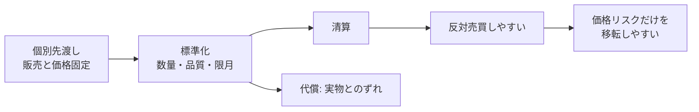

「金融をエンジニアリングで理解する」シリーズの第1回である。

デリバティブと聞くと、複雑な投機商品を想像するかもしれない。しかし、出発点はもっと素朴だ。

**デリバティブは、すでに存在するリスクを契約で別のキャッシュフローへ変換し、別の主体へ移す仕組みである。**

リスクをゼロから作ることが本質ではない。農家の売上、食品会社の原料費、輸出企業の為替、借入企業の金利には、契約を結ぶ前から不確実性がある。デリバティブは、その不確実性の持ち主と形を組み替える。

ただし、リスクが消えるわけではない。価格リスクを移せば、相手方、証拠金、流動性、法務、運用といった別のリスクが現れる。本記事では、この両面をソフトウェア設計のように分解する。

:::message
本記事は金融商品の仕組みを理解するためのものであり、個別商品の取引や投資判断を勧めるものではない。数値例はすべて説明用に単純化している。
:::

## デリバティブを使う前から、農家は価格に賭けている

収穫まで3か月ある農家を考える。作物はまだ売っていない。先物もオプションも使っていない。それでも、農家の将来売上はすでに価格に左右される。

```text
将来売上 = 収穫量 × 収穫時の現物価格
```

価格が下がれば売上は減る。つまり農家は、取引を始める前から価格下落リスクを持っている。CFTCも、作付けをした農家は経済的には作物をロングしていると説明している。

https://www.cftc.gov/LearnAndProtect/AdvisoriesAndArticles/economicpurpose.html

一方、3か月後に同じ作物を原料として買う食品会社は、価格上昇に弱い。

| 主体 | 3か月後の取引 | 価格3万円 | 価格5万円 | 困る方向 |
| --- | --- | ---: | ---: | --- |
| 農家 | 100単位を販売 | 売上300万円 | 売上500万円 | 下落 |
| 食品会社 | 100単位を購入 | 原料費300万円 | 原料費500万円 | 上昇 |

これは教育用の仮定だ。同じ価格変動に対して、現実の事業には逆向きの要件が自然に生まれることが分かる。

「何もしない」は中立ではない。

ソフトウェアで言えば、明示的な設定を省略してもデフォルト値が適用されるのと似ている。現物の事業を持つ時点で、価格変動に対するデフォルトのポジションが設定されている。

## 将来の価格を、今日の契約に変える

農家が避けたいのは、価格そのものではない。収穫時まで販売価格が確定しないことだ。そこで、将来の売買条件を今日決める先渡し契約が使われる。

たとえば、農家と買い手が「3か月後に100単位を、1単位4万円で売買する」と約束する。満期の市場価格が3万円でも5万円でも、契約上の価格は変わらない。

この契約によって、将来の市場価格は、今日確定した契約キャッシュフローへ変換される。

ただし、個別の先渡しには扱いにくさがある。数量、品質、場所、期日が相手ごとに異なるため、途中で別の相手へ移しにくい。反対向きの契約を追加しても、元の契約は消えず、履行すべき契約が二つ残る。

そこで先物では、数量、品質、限月、受渡場所などを標準化し、清算機関を介して反対売買しやすくした。標準化は、商品そのものの販売と、価格リスクの移転を分離するための設計だ。

https://www.cftc.gov/About/CFTCReports/acag8.html



ここには明確なトレードオフがある。

- 個別契約は実際の要件に合わせやすいが、流動性が低くなりやすい
- 標準契約は流動性を集めやすいが、実際の数量や品質とずれる

このずれがベーシスリスクである。標準化は複雑さを消すのではなく、個別適合性の一部を手放して交換可能性を得る設計だ。

## 同じ要件が、為替と金利でも繰り返された

農産物で生じた要件は、為替や金利でも現れる。

たとえば、3か月後にドルの売上を受け取る日本企業は、その時点のドル円レートで円換算額が変わる。為替フォワードを使えば、将来の交換レートを今日決められる。

変動金利で借りる企業も同じだ。将来の支払額は参照金利に応じて変わる。固定金利を払い、変動金利を受け取る金利スワップを重ねると、借入の変動部分を相殺し、固定金利相当の支払へ変換できる。

```text
変動金利の借入:      基準金利 + 1%
スワップで支払う:    固定3%
スワップで受け取る:  基準金利
--------------------------------
合成した支払:        固定4%
```

これは参照金利や支払日が一致するという単純化した例だ。実務では日数計算、リセット日、スプレッド、担保なども確認する必要がある。

1981年には、世界銀行とIBMの通貨スワップが、異なる通貨の調達需要を組み替えた代表例となった。これをすべてのスワップの単一起源と見るのは正確ではない。重要なのは固有名詞ではなく、各主体が調達しやすい市場と、実際に欲しい通貨・金利特性が一致しない時に、契約で変換層を追加した点である。

https://projects.worldbank.org/en/about/unit/treasury/about

デリバティブが金融を複雑にしたという見方だけでは、設計理由を取り逃がす。価格、為替、金利が変動する環境で、事業キャッシュフローを管理可能にする要請が先にあった。

## 先物・オプション・スワップは、同じinterfaceの異なる実装である

商品名を一つずつ暗記すると、デリバティブは急に難しくなる。そこで、すべてを次の4項目で読む。

1. 何を参照するか
2. どの条件で動くか
3. 誰に権利があり、誰に義務があるか
4. いつ、どのキャッシュフローが発生するか

| 商品 | 参照対象 | 発火条件 | 権利と義務 | 主なキャッシュフロー |
| --- | --- | --- | --- | --- |
| 先物 | 商品、為替、金利など | 日次値洗い、満期、反対売買 | 原則として双方に義務 | 証拠金、日次損益、最終差額または現物 |
| オプション | 原資産、先物など | 買い手の行使、満期判定 | 買い手に権利、売り手に条件付き義務 | 契約時のプレミアム、行使時の差額または現物 |
| スワップ | 固定・変動金利、通貨、指数など | 複数の観測日と支払日 | 双方に支払義務 | 想定元本に基づく複数期の支払 |

概念的には、次のようなインターフェースとして表せる。

```ts
interface DerivativeContract {
  reference: Reference;
  trigger: Trigger;
  rightsAndObligations: readonly ContractTerm[];
  cashFlows(marketState: MarketState): readonly CashFlow[];
}
```

これは法的契約や価格計算ライブラリではない。商品間の設計差を読むための概念モデルだ。

先物は、双方を将来の価格へ拘束する。オプションは、買い手がプレミアムを払い、実行するかを選べる。スワップは、単発の満期ではなく、複数期の支払ストリームを交換する。

同じinterfaceを実装していても、権限と状態遷移が違う。

ここが、次回以降の重要な土台になる。オプションが先物より複雑に見えるのは、単に数式が増えるからではない。買い手の権利と売り手の義務が非対称であり、「行使するか」という条件分岐が追加されるからだ。

## リスクは消えず、持ち主と形が変わる

ヘッジの基本は、元の事業と逆向きのキャッシュフローを重ねることだ。

```text
現物業務のキャッシュフロー
+ デリバティブのキャッシュフロー
= 望む合成キャッシュフロー
```

農家が4万円で売り先物を持つ場合を単純化してみる。

| 満期価格 | 現物売上 | 先物損益 | 合成額 |
| ---: | ---: | ---: | ---: |
| 3万円 | 300万円 | +100万円 | 約400万円 |
| 5万円 | 500万円 | -100万円 | 約400万円 |

価格下落リスクが消えたように見える。しかし正確には、価格が動いた時の損益を受け取る主体が変わった。

反対側は、必ずしも一人の「投機家」ではない。逆向きのリスクを持つ別の事業者、マーケットメーカー、ディーラー、ファンドなどが参加し、それぞれが別の市場で再ヘッジすることもある。取引所や清算機関を通じ、市場全体でリスクが再配分される。

したがって、ヘッジと投機を善悪で分けると仕組みを誤解する。リスクを減らしたい主体だけでは市場は成立しない。そのリスクを対価と引き換えに持つ主体と、売買可能性を提供する主体が必要になる。

## 移した後に、別のリスクが生まれる

デリバティブで対象リスクを移すと、契約を実装・維持するためのリスクが現れる。

| リスク | 代表的な失敗モード |
| --- | --- |
| 相手方信用 | 契約が自分に有利な時に相手が不履行となる |
| 資金流動性 | 短期間で追加の現金や担保が必要になる |
| 市場流動性 | 必要な時に反対売買や再ヘッジができない |
| ベーシス | ヘッジ手段と実際の対象価格が同じように動かない |
| 法務・運用 | 条項、権限、確認、決済、システムに不備がある |
| モデル・評価 | 契約の現在価値や担保額で認識がずれる |

分かりやすいのが、先物の証拠金だ。先物は日々値洗いされ、損失側には追加証拠金が必要になることがある。

```text
Day 0: 農家が売り先物を持ち、初期証拠金を差し入れる
Day 1: 先物価格が上昇し、先物口座に評価損が出る
Day 2: 作物の見込価値は上昇しているが、販売前なので現金化できない
Result: ヘッジは経済的に効いていても、追加資金が足りない
```

価値と現金のタイミングがずれる。これは、最終的な損益だけを見ていると見落とす失敗モードだ。

清算機関は取引の間に入り、証拠金や日次値洗いによって相手方信用リスクを管理する。しかし、信用リスクを管理する代わりに、担保と流動性の要件が増える。

https://www.bis.org/publ/qtrpdf/r_qt1812h.htm

これは金融特有の話ではない。分散システムでも、直接通信をキューや仲介サービスへ置き換えると結合は弱まるが、仲介層の可用性、容量、再送、監視が新しい要件になる。

リスク管理とは、危険を無にする作業ではない。どの失敗モードを、誰が、どのインフラで引き受けるかを決める作業である。

## 金融商品をエンジニアリングで読む9つの質問

未知の金融商品を見た時は、利回りや価格予想より先に、次の順序で分解するとよい。

1. **当事者**: 誰が、契約前からどのリスクを持っているか
2. **目的**: 全固定、上限・下限、通貨や金利の変換のどれを求めるか
3. **入力**: 参照価格、数量、想定元本、通貨、観測時刻は何か
4. **条件**: 満期、任意行使、複数リセット、早期終了はどう決まるか
5. **権限**: 誰に権利があり、誰に義務があるか
6. **出力**: プレミアム、差額、現物、定期支払の何がいつ動くか
7. **相手側**: 誰が何の対価でリスクを持ち、どう再ヘッジするか
8. **失敗モード**: 市場、信用、流動性、法務、運用のどこで壊れるか
9. **インフラ**: 取引所、清算、証拠金、担保が何を軽減し、何を要求するか

この9問は、公的機関のチェックリストをそのまま転載したものではない。本記事で使う教育用のフレームワークだ。

デリバティブの本質は、未来を当てることではない。

未来の不確実性を、権利、義務、条件、キャッシュフローへ分解し、扱える主体へ再配分することにある。そして、その契約がどこで壊れるかまで含めて設計を読む必要がある。

次回は、このフレームワークを使って「オプションとは何か」を読む。先物との決定的な違いは、未来の価格ではなく、**実行する権利と履行する義務が非対称に設計されていること**にある。

### 参考資料

- [CFTC: Economic Purpose of Futures Markets and How They Work](https://www.cftc.gov/LearnAndProtect/AdvisoriesAndArticles/economicpurpose.html)
- [CFTC: Agricultural Risk Management Report](https://www.cftc.gov/About/CFTCReports/acag8.html)
- [BIS: Macroeconomic and monetary policy issues raised by derivatives](https://www.bis.org/publ/ecsc04.htm)
- [World Bank Treasury: About](https://projects.worldbank.org/en/about/unit/treasury/about)
- [BIS: The valuation of US Dollar interest rate swaps](https://www.bis.org/publ/econ35.htm)
- [OCC: Characteristics and Risks of Standardized Options](https://www.theocc.com/getmedia/a151a9ae-d784-4a15-bdeb-23a029f50b70/riskstoc.pdf)
- [BIS: Clearing risks in OTC derivatives markets](https://www.bis.org/publ/qtrpdf/r_qt1812h.htm)
- [CFTC: Proposed swap risk disclosures](https://www.cftc.gov/LawRegulation/FederalRegister/ProposedRules/2010-31588.html)
