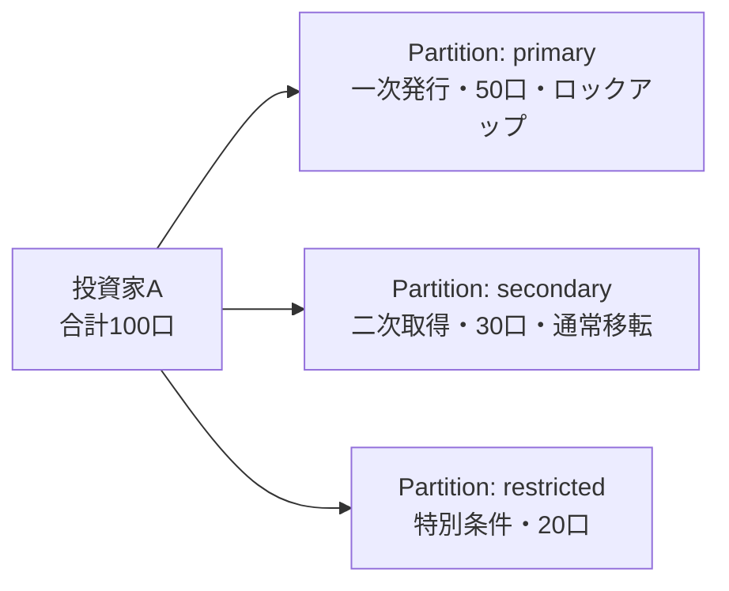

## 残高はあるのに、なぜ送れないのか

ウォレットに100トークンあるとします。

友人のアドレスを入力し、`transfer`を呼び出しました。しかし、トランザクションは失敗しました。

残高は足りています。ガス代もあります。アドレスも間違っていません。

それでも送れない。

これは、社債やファンド持分のような**証券トークン**では、残高だけでは移転の可否を判断できないからです。

- 送信者と受取人は本人確認済みか
- 受取人はその証券を買える地域・資格の人か
- そのトークンはロックアップ期間中ではないか
- 1人あたりの保有上限を超えないか
- その移転に必要な認証データが添付されているか

証券トークンの`transfer`は、「残高を減らして相手を増やす処理」ではありません。

**この組み合わせの移転が、今この時点で許可されているかを判定する処理**です。

この記事では、この問題を解くために提案されたERC-1400を、実装の細部よりも設計思想から読み解きます。

先に結論を言うと、ERC-1400は1つの完成したトークンコントラクトではありません。証券トークンに必要な機能を、複数のERCに分けて定義した**標準群**です。

## ERC-20のtransferは何を前提にしているのか

まず、比較対象のERC-20を確認します。

ERC-20は、Ethereum上の代替可能トークン（同じ種類のトークン同士を区別しないトークン）の標準インターフェースです。ウォレットや取引所が、異なるトークンでも同じ方法で残高を読み、送受信できるようにします。[ERC-20の仕様](https://eips.ethereum.org/EIPS/eip-20)

典型的な送信は、次のような形です。

```solidity
transfer(address to, uint256 amount)
```

この関数に渡すのは、受取人と数量です。

もちろん実装によっては凍結やブラックリストなどの追加条件を持つこともあります。しかし、ERC-20の標準インターフェース自体が表現する中心的な情報は、残高と数量です。

これは、ポイントやゲーム内通貨のような用途では自然です。100ポイント持っていれば、誰に100ポイント送れるかを判定すればよいからです。

ところが、株式や社債のような証券は、トークンの数字だけでは権利を表しきれません。

例えば、本人確認、投資家資格、居住地域、ロックアップ、保有上限、議決権などが移転条件になります。

このため、証券トークンでは「失敗するかもしれない`transfer`をいきなり実行する」のではなく、**なぜ失敗するかを先に問い合わせるインターフェース**も必要になります。

## ERC-1400は1つの規格ではなく、標準群である

ERC-1400の正式なタイトルは、Security Token Standardsです。原典は、Ethereum上の証券トークンを扱うための標準インターフェースのライブラリ、つまり標準群として説明しています。[ERC-1400原典](https://github.com/SecurityTokenStandard/EIP-Spec/blob/master/eip/eip-1400.md)

構成要素の役割をまとめると、次の通りです。

| 規格 | 解決する問い |
| --- | --- |
| ERC-1594 | この発行・償還・移転は可能か。できないなら理由は何か |
| ERC-1410 | 同じ保有残高の中にある異なる条件の部分をどう分けるか |
| ERC-1643 | 目論見書や法的文書をどう関連付け、更新を知らせるか |
| ERC-1644 | 法的手続きや鍵紛失などで、管理者が強制移転できるか |

「証券トークンにはKYCが必要」という1機能ではなく、発行から償還までのライフサイクル、残高に付随する権利、文書、管理者操作を分けて整理しています。

なお、ERC-1400原典のステータスは**Draft**です。開発中の段階であり、Finalの完成済み仕様とは違います。[EIPのステータス定義](https://github.com/ethereum/EIPs/blob/master/index.html)

したがって、この記事でいう「ERC-1400」は、広く知られた設計群の名前として扱います。すべての実装が、4つの構成要素を同じ形で備えているとは限りません。

## ERC-1594。移転できるかを、移転前に聞く

ERC-1594は、ERC-1400の中で最初に読むと全体像がつかみやすい部分です。中心にあるのは、証券トークンの発行・償還・移転可否を扱うインターフェースです。

### `canTransfer`が返すのは、成功か失敗かだけではない

通常のERC-20では、残高を見れば移転できそうかをある程度判断できます。

しかし証券トークンでは、残高不足だけでなく、本人確認、地域、ロックアップ、投資家数上限などの理由で失敗します。

そこでERC-1594は、`canTransfer`や`canTransferByPartition`のような、移転を事前確認するための関数を定義します。結果は真偽値だけでなく、エラーの種類を表すコードも返す設計です。[ERC-1400原典のERC-1594に関する説明](https://github.com/SecurityTokenStandard/EIP-Spec/blob/master/eip/eip-1400.md#erc-1594-core-security-token-standard)

ここでのポイントは、**移転を実行する関数と、移転できるか問い合わせる関数を分けている**ことです。

アプリケーションは、事前確認で失敗理由を表示し、成功したときだけ移転トランザクションを送れます。いきなりガスを消費して失敗するより、ユーザーにも分かりやすい設計です。

発行体が投資家に割り当てたときにトークンが生まれ、償還や買い戻しで消えるというライフサイクルも、ERC-1594が扱う範囲です。発行・償還を標準イベントとして追跡できるため、業務システムと連携しやすくなります。

また、`transferWithData`のように、移転時へ署名付き証明などの追加データを渡す形も定義します。ただし、KYCを実施する事業者や、渡された証明の検証方法は別途設計する必要があります。

## ERC-1410。残高を「条件ごとの箱」に分ける

次は、ERC-1400の中でも特に証券らしい機能です。

同じ銘柄を100口持っていても、100口すべてが同じ条件とは限りません。

例えば、次のようなケースを考えます。

- 一次発行で取得した50口は、取得から1年間売却できない
- 二次市場で購入した30口は、すぐに売却できる
- 残り20口は、特定の投資家区分にだけ移転できる

合計残高は100口です。しかし、移転ルールは異なります。これを1つの数字だけで管理すると、どの口数にどの制限が付くのか分からなくなります。

ERC-1410は、この問題を**パーティション**という考え方で扱います。[ERC-1410仕様](https://github.com/SecurityTokenStandard/EIP-Spec/blob/master/eip/eip-1410.md)



`balanceOf`は従来どおり合計残高を返します。一方で、`balanceOfByPartition`は特定パーティションの残高を返し、`partitionsOf`はその投資家がどのパーティションを持つかを返します。

移転時には、どのパーティションから何口を移すかを指定できます。パーティションには、ロックアップの期限、取得経路、投資家区分、権利の違いなどのメタデータを関連付けられます。

NFTのように1口ずつ別物にするのでも、ERC-20のように全口を同じものにするのでもありません。**同じ銘柄の中に、条件の異なるまとまりを持たせる**ため、「部分的に代替可能」と表現されます。

## ERC-1643。証券に付属する文書を見つけられるようにする

金融商品には、トークンの残高だけでなく、目論見書、契約条件、リスク説明、権利内容などの文書が付属します。

しかし、これらの文書をどこに置いたかが発行体ごとに違うと、ウォレットやカストディアン（資産を保管・管理する事業者）は、投資家に必要な情報を提示しにくくなります。

ERC-1643は、証券トークンのコントラクトに文書を関連付けるためのインターフェースです。[ERC-1643の原典リポジトリ](https://github.com/SecurityTokenStandard/EIP-Spec/blob/master/eip/eip-1643.md)

概念的には、次のような情報を管理します。

- 文書を識別する名前
- 文書のURI（保管場所への参照）
- 文書のハッシュ（内容が変更されていないか確認する値）
- 文書が登録・更新された時刻

ハッシュがあると、URIから取得したファイルが登録済みのものと同じか確認できます。文書の追加・更新・削除をイベントで通知できる点も重要です。

ただし、文書の中身をブロックチェーンに保存したり、投資家の既読・同意まで記録したりする仕組みではありません。URIの管理や投資家への提示は別途必要です。

## ERC-1644。なぜ管理者による強制移転が必要なのか

「ブロックチェーン上の資産なのだから、誰にも動かせない方がよい」と考えたくなります。

暗号資産の一部では、それが重要な性質です。しかし、証券では法的・運用上、管理者が介入しなければならない場面があります。

- 裁判所の命令に従う
- 不正な移転を取り消す
- 秘密鍵を失った投資家の保有分を新しいアドレスへ移す
- 相続や組織再編に伴って保有者を変更する

ERC-1644は、発行体や発行体から委任されたコントローラーが、一定の条件でトークンを強制移転するためのインターフェースです。[ERC-1644の原典](https://github.com/SecurityTokenStandard/EIP-Spec/blob/master/eip/eip-1644.md)

重要なのは、強制移転を「こっそり残高を書き換える処理」にしないことです。コントローラーによる移転であることを示すイベントを発行し、コントラクトがコントローラー操作に対応していることを外部から確認できるようにします。

一方、この機能は強力な管理権限でもあります。マルチシグ、権限分離、承認ログ、法的な発動条件などを、コントラクトの外側も含めて設計する必要があります。

## ERC-1400が扱う範囲と、扱わない範囲

投資家Aが100口をBへ送るなら、ERC-1410でパーティションを選び、ERC-1594で移転可否を確認します。条件を満たした移転はイベントとして追跡できます。

ただし、ERC-1400がKYCや法的判断を実施するわけではありません。規格は結果を判定へ組み込む境界を定め、本人確認事業者やカストディアンは別途必要です。

## ERC-1400とERC-3643はどう違うのか

ERC-1400とERC-3643は、どちらも証券トークンの文脈で語られます。しかし、同じ種類のものとして比較すると混乱します。

ERC-1400は、ERC-1594、ERC-1410、ERC-1643、ERC-1644などを束ねた**標準群**です。発行・償還、パーティション、文書、コントローラー操作という機能単位で、証券トークンのインターフェースを整理しています。

一方、ERC-3643は、オンチェーンIDと自動検証を組み合わせた、より実装アーキテクチャに近い標準です。Token、Identity Registry、Compliance、Trusted Issuers Registryなどの構成要素を定義しています。[ERC-3643仕様](https://eips.ethereum.org/EIPS/eip-3643)

したがって、まずは次のように分けて考えるとよいでしょう。

| 観点 | ERC-1400 | ERC-3643 |
| --- | --- | --- |
| 位置づけ | 複数インターフェースの標準群 | ID・適格性・Complianceを含む実装寄りの構成 |
| 中心テーマ | 証券トークンのライフサイクルと機能分解 | 誰がどの条件で移転できるかの自動検証 |
| 代表的な要素 | 発行・償還、パーティション、文書、強制移転 | Identity Registry、Trusted Issuers、Compliance |
| ステータスの注意 | 原典はDraft | Ethereum EIPs上はFinalのERCとして掲載 |

どちらが常に優れているという話ではありません。ERC-1400は機能を理解する地図、ERC-3643はIDとコンプライアンス判定を含む運用モデル、と考えると整理しやすくなります。

## 規格を導入しても、金融商品の責任は消えない

ERC-1400を使えば、証券トークンの移転条件をコードで表現しやすくなります。しかし、トークンが表す権利、KYC・AML（マネーロンダリング対策）、法的な保有者名簿、鍵紛失への対応まで自動的に決まるわけではありません。

ERC-20が「トークンをどう送るか」を共通化したなら、ERC-1400は「条件付きの金融資産をどう発行し、移転し、説明し、必要なら訂正するか」を分解したものです。

## まとめ。証券トークンのtransferは条件付きの実行である

最初の問いに戻ります。

残高があるのに、なぜ`transfer`できないのでしょうか。

証券トークンでは、残高は移転に必要な条件の1つにすぎないからです。相手の適格性、地域、ロックアップ、保有上限、付随する権利、必要な証明などを、移転のたびに確認する必要があります。

ERC-1400は、この問題を1つの巨大な規格で解決しようとはしませんでした。

- **ERC-1594**：発行・償還・移転可否と失敗理由
- **ERC-1410**：条件の異なる残高をパーティションで分ける
- **ERC-1643**：法的文書や説明資料を関連付ける
- **ERC-1644**：法的・運用上必要なコントローラー操作を表現する

つまり、ERC-1400を読むときのアハ体験は、証券トークンが「ERC-20にKYC関数を1つ足したもの」ではないと分かることです。

それは、所有権・移転制限・文書・管理権限を含む、金融商品のライフサイクルをソフトウェアとして分解する試みです。

そして、この記事の冒頭で起きた失敗は、バグではありません。

**「送れる残高」と「法的に移転できる権利」は、同じものではない。**

この差を、スマートコントラクトのインターフェースとして表そうとしたのがERC-1400です。
