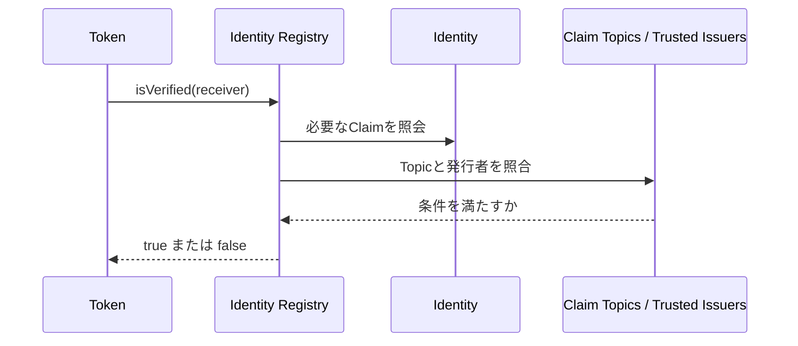
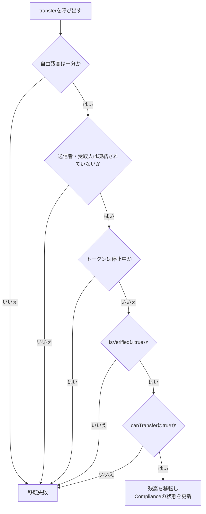

## 残高があるのに、送れないトークン

ERC-20のトークンを送るとき、最初に思い浮かぶ条件は「送信者の残高が足りているか」です。

```solidity
token.transfer(receiver, amount)
```

送信者が`amount`以上を持っていれば、通常は受取人のアドレスへ残高が移ります。ERC-20は、ウォレットや取引所などが同じ方法でトークンを扱えるように、転送や残高照会の共通インターフェースを定めた規格です。[ERC-20の仕様](https://eips.ethereum.org/EIPS/eip-20)

しかし、トークンが社債やファンド持分のような金融商品を表す場合は、残高だけでは足りません。

- 受取人はKYC（顧客確認）を済ませているか
- 受取人の居住国は発行条件の対象か
- 送信者と受取人のどちらかが凍結されていないか
- その投資家の保有上限を超えないか
- トークンが一時停止されていないか

違反すれば、残高が十分でも移転を拒否します。

ERC-3643は、この「残高以外の条件」を移転処理に組み込む規格です。正式名称はT-REX（Token for Regulated EXchanges）。EthereumのEIPでは、ERC-20互換のインターフェースを土台に、オンチェーンのIdentity（資格情報）とCompliance（コンプライアンス判定）を組み合わせる標準として説明されています。[ERC-3643の仕様](https://eips.ethereum.org/EIPS/eip-3643)

ERC-3643のEIPは、Ethereumの仕様ページ上でFinalのStandards Track ERCとして掲載されています。ただし、これはインターフェース仕様の完成度を示すもので、個別のトークン発行が法令に適合することを保証するものではありません。

## ERC-3643は「KYC済みウォレットの一覧」ではない

一番簡単な実装は、KYCに合格したウォレットアドレスをホワイトリストに登録することです。しかし、ひとりの投資家が複数のウォレットを持てる場合、アドレスの一覧だけでは同じ人をまとめて管理できません。

ERC-3643では、ウォレットとは別にIdentity（オンチェーンで参照する資格情報の入れ物）を置きます。ウォレットとIdentityを紐づけ、KYC通過や居住国などのClaim（第三者が署名した資格情報）を保持します。

個人情報をそのまま公開するのではなく、移転時に資格情報と署名を検証します。保存方法は、Identity実装、KYC事業者、発行体が設計します。

ERC-3643の仕様が要求するのは、Identityシステムと組み合わせることです。ERC-3643公式ドキュメントではONCHAINIDがIdentityシステムの実装例として説明されていますが、**ERC-3643という標準と、ONCHAINIDという個別の実装・エコシステムは同じものではありません**。[ERC-3643公式ドキュメント](https://docs.erc3643.org/erc-3643)

## 3つのRegistryで「何を」「誰が」証明するかを決める

Registry（登録簿）は、照合条件を管理するスマートコントラクトです。役割を先に分けます。

### Claim Topics Registry：必要な資格の種類

Claim Topicは、Claimの種類を表す識別子です。たとえば「KYC済み」「居住国確認済み」といった、必要な証明のカテゴリを登録します。

Claim Topics Registryは、対象トークンを保有するIdentityが、どのClaim Topicを持つべきかを管理します。登録するのは投資家のデータではなく、「このトークンが要求する証明の種類」です。

### Trusted Issuers Registry：証明を発行できる主体

同じ「KYC済み」というClaimでも、誰が発行したかによって扱いが変わります。Trusted Issuers Registryは、トークンごとに信頼するClaim Issuerと、発行を許すClaim Topicを登録します。

たとえば、KYCは事業者A、居住国の証明は事業者Bだけに許可する構成です。

### Identity Registry：ウォレットとIdentityを結びつける

Identity Registryは、受取人のウォレットとIdentity、居住国コードを管理します。`isVerified(address)`が呼ばれると、必要なClaim Topicと、信頼済み発行者の署名を確認します。[Identity Registryの公式説明](https://docs.erc3643.org/erc-3643/smart-contracts-library/onchain-identities/identity-registry)



この分解によって、「KYC済みか」と「このトークンの移転ルールを満たすか」を別々に扱えます。

## `isVerified`と`canTransfer`は別の判定をする

ERC-3643の移転で混乱しやすいのが、`isVerified`と`canTransfer`の違いです。

### `isVerified`：受取人は保有資格を持つか

`isVerified`は、Identity Registryが行う投資家の資格確認です。

- 受取人のウォレットが登録されているか
- ウォレットにIdentityが紐づいているか
- 必要なClaim TopicをIdentityが持っているか
- Claimの発行者が信頼済みか
- Claimの署名が有効か

これらを確認し、受取人がトークンを保有できる投資家なら`true`を返します。これは「受取人の資格」の判定であり、今回の金額や送信者との組み合わせまでをすべて判断するものではありません。

### `canTransfer`：この移転はルール上許されるか

`canTransfer(from, to, amount)`は、Complianceコントラクトが行うトークン固有の移転判定です。[ERC-3643のComplianceインターフェース](https://eips.ethereum.org/EIPS/eip-3643#compliance-interface)

たとえば、次のルールを設定できます。

- 1人あたりの保有上限
- 国ごとの保有者数の上限
- トークン全体の保有者数の上限
- 特定の投資家グループ間だけに許可された移転
- 取引後も維持しなければならない割合

つまり、`isVerified`は「この人は参加資格があるか」、`canTransfer`は「この取引を実行してよいか」を見る関数です。

たとえば、受取人がKYC済みでも、すでに保有上限まで買っていれば`isVerified`は成功し、`canTransfer`は失敗する可能性があります。

## 移転処理では何が起きるのか

ERC-3643の`transfer`は、ERC-20と同じ名前でも、残高を減らして増やすだけの処理ではありません。ERC-3643の仕様では、少なくとも次の条件が必要です。[ERC-3643の移転条件](https://eips.ethereum.org/EIPS/eip-3643#main-functions)

1. 送信者の自由残高（凍結されていない残高）が十分にある
2. 送信者のウォレットが凍結されていない
3. 受取人のウォレットが凍結されていない
4. トークンが一時停止されていない
5. 受取人の`isVerified`が`true`である
6. `canTransfer`が`true`を返す



失敗理由は「残高不足」だけではありません。ウォレット、受取人の資格、トークン全体のルールを同じ移転処理で確認します。

## 凍結・停止・復旧。金融商品には管理機能も必要になる

自由な送金を前提にしたトークンと、規制対象の金融商品を表すトークンでは、異常時の操作も違います。ERC-3643は、次の管理機能を標準インターフェースに含めます。

### `freeze`：ウォレットまたは一部残高を凍結する

ウォレット全体を凍結する`setAddressFrozen`と、残高の一部だけを凍結する`freezePartialTokens`があります。

後者は、口座全体を止めずに、係争中の数量などだけを切り分ける機能です。凍結された数量は自由残高から除かれるため、その分は送れません。

### `pause`：トークン全体の移転を止める

`pause`は、個別のウォレットではなくトークン全体を一時停止します。重大な障害や、発行条件を見直す間に移転を止めるための緊急ブレーキです。

### `recoveryAddress`：秘密鍵を失った投資家を救済する

ブロックチェーンでは、秘密鍵を失うと通常は自分で資産を動かせません。ERC-3643では、Identityを確認したうえで、失われたウォレットから新しいウォレットへトークンを移す`recoveryAddress`を用意します。復旧履歴をイベントとして残すことも仕様に含まれています。

ただし、誰が申請を受け付け、どの本人確認を行い、誰が承認するかは、発行体やカストディ事業者の運用設計です。

## `mint`、`burn`、`forcedTransfer`は誰が実行するのか

ERC-3643には、通常の投資家間の移転だけでなく、トークンのライフサイクルを管理する機能があります。

- `mint`：新しいトークンを発行する
- `burn`：トークンを償還などに合わせて焼却する
- `forcedTransfer`：管理主体が、指定されたウォレット間で強制移転する

たとえば、ファンドの新規申込で`mint`、償還で`burn`を行います。規制上の手続きや裁判所命令で`forcedTransfer`が必要になることもあります。

これらの操作は、投資家が自由に呼べるものではありません。ERC-3643ではOwnerとAgentという役割を分けます。Owner（発行体側の所有者）はAgentを追加・削除し、AgentはトークンやIdentity Registryの運用操作を担当します。[Agent Roleの仕様](https://eips.ethereum.org/EIPS/eip-3643#agent-role-interface)

Agentは、単なる管理者アカウントに限りません。EIPでは、条件に応じて自動で発行・焼却・凍結を行うスマートコントラクトなども想定しています。ただし、Agentにどの権限を与えるかは、鍵管理や職務分離を含めた発行体の統制問題です。

## ERC-3643を使っても、法律に自動適合するわけではない

ここまで読むと、ERC-3643を採用すれば規制対応が完成するように見えるかもしれません。これは正確ではありません。

ERC-3643が提供するのは、資格情報と移転ルールをオンチェーンで検証し、条件に反する処理をスマートコントラクトで拒否するための技術層です。

次の責任は残ります。

- そのトークンが法律上どの権利を表すかを定義する
- どの法域の、どの規制を適用するか判断する
- KYCやAMLを実施し、Claimを発行する主体を選ぶ
- 誤ったClaimや期限切れのClaimを失効させる
- 鍵、カストディ、Agent権限を安全に管理する
- 投資家への開示、会計、監査、償還を運用する

スマートコントラクトが移転を許可しても、それだけで法的な所有権が移転したことになるとは限りません。規格の採用と法的・業務的な適合性は別に検討します。

## ERC-1400との違いは「標準群」と「実装寄りの構成」

ERC-1400とERC-3643を比べるとき、「どちらが証券トークンの正解か」と考えるより、標準の切り口を分けると理解しやすくなります。

ERC-1400は、ERC-1594やERC-1410など複数の仕様を組み合わせるセキュリティトークン標準群です。発行・償還、パーティション、文書、強制移転などの機能をインターフェースとして分解します。

一方、ERC-3643は、ERC-20互換のトークンにIdentity Registry、Trusted Issuers Registry、Claim Topics Registry、Complianceを組み合わせ、移転時の検証フローを具体的に示します。

したがって、この記事での整理は次の範囲に留めます。

| 観点 | ERC-1400 | ERC-3643 |
| --- | --- | --- |
| 位置づけ | 証券トークンに必要な機能を分けた標準群 | IdentityとComplianceを含む許可型トークンの構成 |
| 中心の問い | 発行・償還・文書・パーティションをどう表すか | 誰が保有でき、今回の移転を許可できるか |
| 移転制限 | インターフェースや拡張で表現 | `isVerified`と`canTransfer`を中心に判定 |

両者は競合製品というより、規格が切り取る問題の範囲が異なります。

## まとめ。ERC-3643は「条件付きで移転できるERC-20」

ERC-3643のアハ体験は、`transfer`が単なる残高の付け替えではなくなることです。

- Identityは、ウォレットとは別に投資家の資格情報を表す
- Claimは、信頼された発行者が署名した資格情報である
- Claim Topics Registryは、必要な資格の種類を決める
- Trusted Issuers Registryは、証明を発行できる主体を決める
- Identity Registryは、ウォレットとIdentityを結びつけて`isVerified`を返す
- Complianceは、保有上限や国別制限などを`canTransfer`で判定する
- freeze、pause、recovery、mint、burn、forcedTransferは、金融商品の運用に必要な管理機能である

だから、残高があるのに送れないことがあります。本人の資格、発行者の信頼性、トークンのルール、ウォレットの状態を確認した結果です。

ただし、ERC-3643は法律やKYC業務そのものではありません。法律上の権利、本人確認、鍵管理、発行体の責任を、移転時に検証・強制できるソフトウェアの境界へ落とし込むための規格です。

トークン化金融を見るときは、「ブロックチェーン上に残高があるか」だけでなく、「その残高を誰が、どの条件で、どの手続きによって動かせるのか」を確認する必要があります。ERC-3643は、その条件をコードの中に見える形で置くための一つの設計です。
