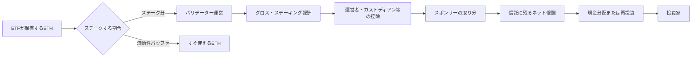

## ETHが年4%増えるなら、ETFも4%増える？

ETHをステーキングすると、ネットワークへの参加報酬が発生することがあります。EthereumのProof of Stakeでは、ETHを預けてバリデーター（取引を確認する役割）を動かすと、ブロック提案や検証への貢献に応じてETHが支払われます。

では、ステーキングに対応したEthereum ETFを買えば、年4%の報酬をそのまま受け取れるのでしょうか。

答えは、**そのままではない**です。

ETFの中でステークされるETHは全量ではありません。報酬が発生しても、バリデーター運営者やカストディアンへの手数料、スポンサーの取り分、ファンドの経費が差し引かれます。さらに、報酬を現金で分配する商品と、ファンド内で再投資する商品があります。

Bitcoin ETFが「値動きへのアクセス」を証券に切り出した商品だとすれば、Ethereumのステーキング対応商品は、**値動きに加えて、プロトコルの利回りをどこまで証券へ運べるか**を試す商品です。

## この記事の結論

ETF投資家が受け取る利回りは、Ethereumネットワークが生むグロス報酬ではありません。



概算するなら、まず次の式で考えられます。

```text
実質利回り ≒ ステーク比率 × グロス報酬率
             × (1 − 報酬からの控除率) − 年間経費率
```

ただし、商品によって控除の定義や分配方法が違います。この式は比較の入口であり、保証利回りではありません。

### 100 ETHで計算してみる

100 ETHを持っていて、その80%だけをステークし、ステーク分の報酬率が年4%、報酬から10%が差し引かれ、年間経費が0.25%だとします。

```text
100 ETH × 80% × 4% = 3.20 ETH（グロス報酬）
3.20 ETH × (1 − 10%) − 0.25 ETH = 2.63 ETH
```

投資家に残るのは、100 ETHに対して年2.63 ETH、つまり約2.63%です。「4%」はステークしたETHに対する数字で、ETF全体の実質利回りではありません。

## 1. ステーキングは「利息」ではない

Ethereum公式資料では、ステーキングを「ETHを預けてバリデーターを有効化する行為」と説明しています。バリデーターはブロックを提案し、他のバリデーターの処理を確認し、正しいチェーンの先頭を証明します。[Ethereum公式ステーキング資料](https://ethereum.org/en/staking/)

ソロ・ステーキングには通常32 ETHが必要です。オフラインになると報酬を逃し、二重署名などの不正が証明されるとスラッシングによってETHを失います。ステーキングをやめるときも、ネットワークの退出キューを通るため、売りたい瞬間に必ず現金化できるわけではありません。

ここでいう報酬は、銀行預金の固定金利ではありません。ネットワークの参加者数、バリデーターの稼働状況、手数料やMEVなどで変動します。Ethereum公式も、報酬とペナルティがプロトコルの状態や行動に応じて変わる仕組みとして説明しています。

## 2. なぜ、持っているETHを全部ステークしないのか

ETF株を売りたい人が増えたとき、信託はETHを払い出すか、売却して現金を用意します。ところが、ステークしたETHはすぐに動かせません。バリデーターを退出させ、アンステークの待ち時間を経て、カストディ口座へ戻す必要があります。

そこで商品は、すべてのETHをステークせず、一定量を流動性バッファとして残します。

2026年6月30日付のiShares Staked Ethereum Trust ETFの10-Qでは、保有ETHの250,585 ETH、ポジションの86.9%が第三者カウンターパーティーにステークされていました。残りは、解約や設定に備えるETHとして機能します。[iShares Staked Ethereum Trust ETF Form 10-Q](https://www.sec.gov/Archives/edgar/data/2099103/000143774926027003/iset20260630c_10q.htm)

86.9%という数字は高く見えますが、100%ではありません。利回りを最大化するより、ETF株の設定・償還を止めないことが優先されるからです。

Grayscaleも、設定・償還を行う市場（プライマリーマーケット）の流動性を保つため、全資産をステークしないと説明しています。ステーク比率が高いほど報酬の余地は増えますが、売却時の待ち時間と流動性リスクも増えます。[Grayscale staking FAQ（SEC提出資料）](https://www.sec.gov/Archives/edgar/data/1725210/000119312525238451/staking_faqs_10.8.2025.htm)

## 3. 4%の報酬から、誰が差し引くのか

「Ethereumの報酬率が4%」という数字を見たら、まず分母を確認します。全ETHに対する4%なのか、ステークされたETHだけに対する4%なのかで、ETF投資家の受け取り額は変わります。

ETFの報酬は、次の順番で分解できます。

1. **グロス報酬**：Ethereumプロトコルがバリデーターに支払う報酬
2. **ステーキング事業者の控除**：ノード運用、監視、障害対応などの対価
3. **カストディアンの手数料**：保管会社が受け取る分
4. **スポンサーのStaking Fee**：ステーキングを組成・管理する対価
5. **信託報酬**：ETFの運営、管理、上場維持などの費用
6. **投資家への分配または再投資**：最終的に残ったもの

### iSharesの例

iSharesの2026年4月付目論見書補足では、スポンサーのStaking PortionとPrime Execution Agent（取引執行を担う業者）の取り分（ステーキング事業者へ支払う額を含む）の合計が、グロスのStaking Consideration（ステーキングで受け取る報酬）の10%を構成すると説明されています。[iShares Staked Ethereum Trust ETF目論見書補足](https://www.sec.gov/Archives/edgar/data/2099103/000143774926012417/iset20260410_424b3.htm)

さらに、同商品の10-Qには、2026年6月30日時点のステーキング収入1,194,785ドルと、スポンサーのステーキング部分を含む費用467,379ドルが記載されています。これは特定期間の会計数値であり、年率を直接示すものではありません。

### Grayscale ETHEの例

Grayscale Ethereum Staking ETF（ETHE）は、2026年3月31日時点のファクトシートで、資産の71%がステークされ、管理報酬は2.50%と開示しています。報酬は株主への分配を目指しますが、実際にはスポンサー、カストディアン、ステーキング事業者への控除後のネット報酬です。[Grayscale ETHEファクトシート](https://www.sec.gov/Archives/edgar/data/1725210/000172521026000003/ethe_fact_sheet_4.23.26.htm)

Grayscaleの2026年6月30日付10-Qも、ステーキング報酬からスポンサーのStaking Fee、カストディアンやプロバイダーの費用、スポンサー報酬を差し引いた金額を株主へ分配すると説明しています。分配のタイミングと金額は、信託契約とスポンサーの方針に従います。[Grayscale ETHE Form 10-Q](https://www.sec.gov/Archives/edgar/data/1725210/000172521026000016/ethe-20260630.htm)

同じ「ステーキング対応」でも、控除の設計、分配頻度、現金化のタイミングは商品ごとに異なります。

## 4. 商品ごとに「4%」の意味が違う

確認日時点で開示されていた数字を並べると、次のようになります。日付が違うため、横並びの順位ではなく、**どの数字が利回りを小さくするのか**を見るための表です。

| 商品 | 確認時点 | ステーク比率 | 報酬の扱い | 主な控除・経費 |
| --- | --- | ---: | --- | --- |
| iShares Staked Ethereum Trust ETF | 2026/6/30 | 86.9% | Staking Considerationを信託収入として計上 | グロス報酬の10%（スポンサー等の取り分を含む）、信託経費 |
| Grayscale ETHE | 2026/3/31 | 71% | ネット報酬を現金分配する方針 | 管理報酬2.50%、スポンサー・カストディアン・事業者控除 |

21Sharesの10-Qでは、TETHのスポンサー報酬を0.21%、ステーキング報酬の25%をStaking Feeと記載しています。スポンサー報酬は一定期間免除されているため、表示されている経費率だけで恒久的な条件だと判断してはいけません。[21Shares Form 10-Q](https://www.sec.gov/Archives/edgar/data/1992508/000121390026089297/ea0299652-10q_21shares.htm)

### 仮の計算例

仮に、グロス報酬率が4%、ステーク比率が80%、報酬控除率が10%、年間経費率が0.25%なら、

```text
0.80 × 4.0% × (1 − 0.10) − 0.25% = 2.63%
```

になります。4%というプロトコル側の数字が、投資家の手元では2.63%になる例です。

ただし、実際の開示では「ステーク比率の分母」「控除に信託報酬が含まれるか」「報酬をいつ現金化するか」が商品ごとに違います。数字を式へ入れる前に、定義を揃える必要があります。

## 5. 流動性と利回りはトレードオフ

ステーキングETFでは、利回りを上げるほど良いとは限りません。

### アンステーク待ち

解約が集中したとき、ステーク済みETHをすぐに売却できなければ、信託は手元の流動性バッファで対応します。バッファが足りなければ、償還処理や現金化に時間がかかる可能性があります。

Ethereumの退出キューはネットワーク全体の状態に左右されます。ETFだけが優先的に列を飛ばすことはできません。これは「報酬を得るために預けたETHを、必要な瞬間に戻せない」という、普通のETFにはない制約です。

### スラッシングと障害

バリデーターが二重署名などの重大な違反をすると、スラッシングで預けたETHの一部を失う可能性があります。単なるサーバー停止でも、報酬を逃し、少額のペナルティを受けます。

ETFでは、投資家が自分でバリデーターを運用するわけではありません。実行業者やカストディアンを信頼する代わりに、障害対応や鍵管理を委託します。事業者が少数に集中すれば、同じ障害が多くのETFへ波及する可能性もあります。

## 6. 直接ステーキング、LST、ETFの違い

| 方法 | 鍵・運用 | 報酬 | 流動性 | 主な追加リスク |
| --- | --- | --- | --- | --- |
| ソロ・ステーキング | 自分で鍵とノードを管理 | プロトコル報酬を直接受け取る | 退出キュー | オフライン、スラッシング、運用ミス |
| LST（リキッド・ステーキング） | プロトコルや事業者へ委託し、受取トークンを保有 | トークン価格や残高に反映 | トークンを市場で売買 | スマートコントラクト、デペッグ、事業者 |
| ステーキングETF | 信託・カストディアン・事業者が運用 | 分配またはファンド内再投資 | 証券市場で売買。ただしETHの退出待ちの影響を受ける | 商品契約、手数料、カストディ、規制 |

Ethereum公式も、ホーム・ステーキングから委任、流動性ステーキング、中央集権取引所まで、プロトコルとの間に入るソフトウェア、事業者、カストディアンが増えるほど、利便性と引き換えに信頼の前提が増えると整理しています。[Ethereum公式の比較](https://ethereum.org/en/staking/)

ETFは、税務や証券口座で扱いやすい形にできます。一方で、米国の暗号資産商品は「ETF」と呼ばれていても、1940年投資会社法上の投資信託とは異なるコモディティ・トラストやETPの場合があります。法的な保護や開示は商品ごとに確認が必要です。

## 7. ETFが切り出したのは「利回り」なのか

Bitcoin ETFでは、秘密鍵を持たずに価格エクスポージャーを得ることが主な価値でした。Ethereumのステーキング対応ETFは、そこへ「保有中にETHが増える」というプロトコル機能を追加しようとしています。

ただし、ETFが切り出したのは利回りそのものではありません。

ETFが切り出したのは、

- ETHを自分で32枚以上用意してバリデーターを動かす手間
- ノードの監視、鍵のバックアップ、障害対応
- 証券口座で売買し、社内規程や報告書に載せるしやすさ

です。

その代わり、

- 全量をステークしないため、報酬の上限が下がる
- 運営者・カストディアン・スポンサーの控除がある
- アンステーク待ちとスラッシングの影響を受ける
- 報酬の分配方法とタイミングを自分で選べない

という条件を受け入れます。

## 3行まとめ

1. Ethereumのステーキング報酬は、固定金利ではなく、ネットワークと運用状況で変動する。
2. ETF投資家の実質利回りは、ステーク比率、事業者控除、信託報酬、流動性設計の後に残る数字である。
3. 「利回りまでETFにできるか」の答えは、できるが、プロトコル報酬をそのままではなく、契約と手数料で包んだ形である。

次にステーキング対応ETFを見るときは、年率の大きさだけでなく、次の項目を目論見書と10-Qで確認してください。

- 何%のETHが実際にステークされているか
- グロス報酬から誰が何%を受け取るか
- 信託報酬とStaking Feeが二重にかかっていないか
- アンステーク待ちの流動性をどう確保しているか
- 報酬が現金分配か、基準価額への再投資か

値動きだけを証券へ写すのか、それともプロトコルの収益まで写すのか。Ethereum ETFは、その境界を考えるための金融商品です。

---

## 参考資料

- [Ethereum公式ステーキング資料](https://ethereum.org/en/staking/)
- [iShares Staked Ethereum Trust ETF Form 10-Q（2026年6月30日）](https://www.sec.gov/Archives/edgar/data/2099103/000143774926027003/iset20260630c_10q.htm)
- [iShares Staked Ethereum Trust ETF目論見書補足（2026年4月）](https://www.sec.gov/Archives/edgar/data/2099103/000143774926012417/iset20260410_424b3.htm)
- [Grayscale ETHE Form 10-Q（2026年6月30日）](https://www.sec.gov/Archives/edgar/data/1725210/000172521026000016/ethe-20260630.htm)
- [Grayscale ETHEファクトシート（2026年3月31日時点）](https://www.sec.gov/Archives/edgar/data/1725210/000172521026000003/ethe_fact_sheet_4.23.26.htm)
- [21Shares Form 10-Q（2026年6月30日）](https://www.sec.gov/Archives/edgar/data/1992508/000121390026089297/ea0299652-10q_21shares.htm)

確認日：2026年9月17日
