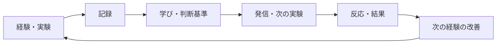

## 記録は増えるのに、次の判断は変わらない

日記、メモ、AIとの会話ログ、投稿の下書き。記録の量は毎月増えていきます。それなのに、同じ失敗を避けるための判断基準や、次に試したい実験は、あまり増えていない気がしていました。

理由を考えているうちに、順番が逆だったと気づきます。発信を増やす前に、発信の材料になる一次体験と、そこから引き出した判断基準を貯めるほうが先でした。

もう一つ、時代の側の変化もあります。AIで文章もコードも大量に、しかも安く量産できるようになりました。出力の量そのものは、以前より差になりにくいと感じています。希少になったのは、上質でユニークなインプット、つまり自分にしかない一次体験のほうだと考えています。ここが今回一番伝えたいことです。アウトプットが溢れる時代に効いてくるのは、経験をどう資産に変えるかという運用のほうです。

そこで、経験を記録で終わらせずに次の判断へ戻す個人用のリポジトリを、GitHub上のMarkdownを中心に作り始めました。呼び方として「Life OS」という名前を付けています。まだ運用初期のv0.1で、効果が実証された仕組みではありません。この記事は完成品の披露ではなく、構築の記録です。

## Life OSとは何か。保管ではなく、次に戻すループ

Life OSと聞くと人生を最適化する万能システムを想像しますが、そういうものではありません。ここでは、経験を次の判断と実験へ戻す循環を持った個人用リポジトリ、という意味で使っています。「経験を資産に変える仕組み」と言い換えたほうが実態に近いです。

多くのノート術やセカンドブレインは、知識の保管と検索に軸足があります。Life OSで作りたいのは保管ではなく循環です。経験を入り口にして、そこから学びや判断基準を引き出し、次の実験や発信へ流し、その反応をまた次の経験へ戻します。



この循環で増やしたい資産は、一次情報、再利用できる知識、判断基準、技能と成果物、顧客理解、発信の種、次の実験です。どれも、記録を眺めているだけでは自動的には増えません。経験を意図的に変換する工程が要ります。

## なぜ日記アプリでも投稿自動化でもないのか

既存のツールを否定したいわけではありません。日記もメモ管理も投稿ツールも、それぞれ得意なことがあり、運用次第では判断基準や実験も扱えます。ただ、自分がこれまで使ってきた範囲では、経験から次の実験までを一続きにするには少し足りない部分がありました。何が足りなかったのかを整理すると、こうなります。

| 仕組み | 自分の従来の主な使い方 | Life OSで足したいもの |
| --- | --- | --- |
| 日記 | その日の記録 | 再利用できる判断基準と次の実験 |
| メモ管理 | 情報の保存・検索 | 一次体験との根拠リンク |
| 投稿自動化 | 発信量 | 発信する価値のある一次情報 |
| タスク管理 | 完了した行動 | 行動から増えた資産 |

右端の列が、今回わざわざ仕組みを作ってでも足したかった部分です。日記やメモの代わりではなく、それらの出力を入力として受け取り、経験から次の実験へつなぐ層を上に重ねるイメージで考えています。

## 最小構成はGitHubとMarkdownとAIで十分だった

作り始めるとき、Webアプリや専用のデータベースから入る選択肢もありました。今回はそうせず、データの正本はMarkdownのファイルとディレクトリに置き、そこへGitとAIを補助として組み合わせています。主要なディレクトリはこの6つです。

```text
life-os/
├── experience-engine/  # 一次体験・実験・レビュー
├── asset-library/      # 学び・判断基準・発信の種
├── content-os/         # 媒体別の下書き・公開・分析
├── sales-os/           # 顧客課題・オファー・販売実験
├── shared/             # スキーマ・プロンプト・スクリプト
└── docs/               # 設計・原則・ロードマップ
```

技術の選び方には理由があります。理由は5つです。1つ目は、Markdownは人もAIも読み書きしやすいこと。2つ目は、YAMLのfront matterでID、状態、関連ファイルを機械的に検証できること。3つ目は、Gitで変更履歴と自分によるレビューを残せること。4つ目は、AI（Codexなどのコーディングエージェント）に事実と解釈の分離や相互リンクを手伝ってもらえること。5つ目は、スクリプトはPythonの標準ライブラリだけで、新規ファイルの作成とfront matterの検証に絞ったことです。

Web UIや外部DBを最初に作らなかったのは意図的です。運用の形が固まる前にアプリを作ると、間違った構造をコードで固定化してしまいます。まずMarkdownで運用を回し、本当に必要になった部分だけ後からツール化するほうが安全だと考えています。

## 実例。3つの経験を同じルールで次の行動に変える

抽象的な話が続いたので、実際の変換を見せます。例が1件だけだと、たまたまその題材が変換しやすかっただけに見えます。そこで、ジャンルの違う3つの経験を同じ変換ルールにかけます。以下の表はいずれも体験そのものの事実ではなく、記録から後付けで抽出した仮説と判断基準です。比較実験で確かめたわけではありません。

### 例1。車中泊の困りごとを、判断基準と比較実験に変える

題材は、軽自動車を借りて車中泊を試したときのメモです。元の記録は、感想の羅列に近いものでした。

- 車中泊自体は良かった
- 結露に困った
- 遮光用品を準備できず、黒いビニールで応急対応した
- 長時間の下道運転は思ったより大変だった

このままだと、ただの日記です。ここから、次に使える形へ変換します。

| 種類 | 抽出した資産 |
| --- | --- |
| 仮説 | レンタカーと所有車では、適した装備が異なる可能性がある |
| 判断基準 | レンタカーでは加工不要で着脱できる装備を優先する |
| 判断基準 | 下道移動は節約額だけでなく時間と疲労も含めて判断する |
| 発信の種 | 黒いビニールで応急対応して感じた不便と未検証点 |
| 次の実験 | 着脱式の遮光方法を同じ条件で比較する |

ここで意識したのは、黒いビニールをおすすめ商品に仕立てないことです。あれは応急対応で、遮光性能も測っていません。うまくいった話に整えるより、応急だった、性能は未計測、という不確実性ごと資産に含めるほうが、次の実験の精度は上がると考えています。

### 例2。古家DIYの経験を、自分に残る資産の話に変える

もう一つは、古い家のDIY会に参加したときの記録です。既存の床の上へ板材を重ねる「増し張り」と、端部の納めを初めて経験しました。

この体験には、少しややこしい点があります。直したのは他人の物件なので、その物件の持分は自分には残りません。それでも、技能や知識、人とのつながり、DIYへの心理的なハードルの低下は、自分に残ると感じました。同じルールにかけると、こうなります。

| 種類 | 抽出した資産 |
| --- | --- |
| 仮説 | 他人物件のDIYでも、技能や関係性、DIYへの心理的ハードルの低下が自分に残る可能性がある |
| 仮説 | 物件の取得と運営には、DIY技能だけでなくコミュニケーションも要りそうだ |
| 判断基準 | 他人の物件で学ぶ活動と、自分の所有へ進む活動を分けて持つ |
| 手順 | DIY会では工法名・材料・目的・失敗時の影響を確認する |
| 次の実験 | 自分が物件を買えていない障害を90分で分解する |

見せたいのは、「勉強になった」で感想を終わらせなかったことです。手に入る資産と手に入らない資産を分け、購入へ進めていない障害を調べる次の行動まで作りました。「物件を買えば金持ちになれる」や「自分ならうまくやれる」といった、確かめていない結論には寄せていません。

### 例3。会話AIとの雑談を、対人で試す手順に変える

最後は短い例です。ChatGPTの音声モードで雑談したとき、印象に残ったのは知識量より会話の合わせ方でした。自分が笑うと笑い、話す速さを合わせ、こちらの発言の一部を返してくるように感じました。少なくとも自分は、言葉を繰り返して受け取られると、分かってもらえたように感じました。

これを `Listen → Match → Add`（まず聞く、合わせる、少し足す）という会話の手順に整理しました。次の実験は、この手順を実際の対人会話で意識して試すことです。まだ試してはいません。ここは断定も避けています。AIが内部で意図してペースを合わせたとは言い切れず、あくまで自分にはそう感じられた、という話です。反復や笑いを機械的に真似るのではなく、相手の話を理解するほうが先だと考えています。

### 3つを並べて分かること

車中泊は具体的な困りごとから、道具や移動方法の比較実験が生まれました。古家DIYは経験の意味づけから、技能と所有をめぐる実験が生まれました。会話AIの雑談は、日常の小さな気づきから対人で試す手順が生まれました。ジャンルはばらばらでも、通した変換ルールは同じです。3件とも同じ変換ルールで次の実験や手順まで整理できたので、少なくとも違うジャンルにも同じ型を当てられる手応えはありました。ただ、再現性や効果そのものは、これからの運用で確かめる段階です。Life OSが特定ジャンルの記録帳ではなく、違う経験を同じルールで次の行動へつなぐ仕組みだと示したかった部分です。

## AIに何をさせ、何をさせないか

変換の工程では、AIに手伝ってもらう部分があります。ただし任せる範囲は明確に線を引いています。させることと、させないことを分けています。

させることは、粗いメモを整理して記録の形に整えること、事実と本人の解釈と一般知識と仮説を分けること、関連するログを検索して相互リンクすること、学びや判断基準や次の実験の候補を提案すること、IDや日付や参照先の整合を検証することです。

個人的に一番効くと思っているのは、この整理と取捨選択の部分です。雑多に書き殴ったメモを放り込むと、AIが後で使えそうな部分と、そうでない部分を仕分けし、資産の候補として拾い上げてくれます。自分ひとりで全部を分類し直すのは続きません。手を動かして経験を溜めることに集中し、それを資産の形に整える作業をAIに任せられると、経験が資産に変わるまでの距離が縮まると感じています。もちろん、何を残すかの最終判断は自分がします。

一方で、させないことも同じくらい大事です。

- 不明な出来事を勝手に補完する
- 体験を成功物語へ脚色する
- 収益化の可能性を売上の保証へ言い換える
- 医療・安全・法律を体験談だけで断定する
- 本人の最終判断を代わりに下す

この線引きは、リポジトリ内の `AGENTS.md` にAI向けの運用規約として書いています。AIは一次体験を作る主体ではなく、あくまで整理と接続の補助として使う、というのが今のところの方針です。

## 続ける仕組み。週次レビューで見る3つの問い

作るより続けるほうが難しいです。仕組みが形骸化しないために、週に一度のレビューで見る指標を、活動量ではなく3つの問いに絞りました。

1. 経験は資産へ変換されたか
2. 資産は発信や事業機会へ接続されたか
3. 次の実験は前回より改善されたか

記録した件数やコミット数を数えても、経験が資産に変わったかは分かりません。だから件数ではなく、変換されたか、接続されたか、改善されたかを見ます。

正直なところ、この週次レビューはまだ十分に回せていません。今は検証項目という位置づけです。将来的には、定期実行のエージェントにレビューのリマインドや下書き生成を任せることも考えていますが、そこはまだ手を付けていません。続ける仕組みそのものが、これから検証する対象です。

## まだ分からないこと、設計上の弱点

v0.1なので、弱点も隠さず書いておきます。今の構成には、少なくとも次の不安があります。

- テンプレートの項目が多すぎないか
- 資産ファイルが増えたとき検索しやすいか
- 同じ内容の重複をどこまで防げるか
- 記録の手間に見合う価値が出るか
- 発信の種が実際の発信や反応へつながるか
- センシティブなログや非公開情報をどう分離するか
- AIを使うことで、自分らしい言葉が均一化しないか

最初から正解の構造を作れたとは思っていません。むしろ、数件入れてみて、使われなかった項目を後から削る前提で組んでいます。プライベートな記録も含むため、リポジトリ自体は非公開にしています。この記事では、公開できる経験だけを選んで設計を説明しました。

次に検証することも決めています。記録を10件ほどまで増やし、週次レビューを4回行い、使われなかったfront matterの項目を削り、発信の種を1件だけ公開して反応を記録し、変換にかかる時間を測る。この結果は運用編として続編で報告するつもりです。

## まとめ

言いたかったことは、ほぼ一点に絞れます。AIでアウトプットが量産できる時代の希少資源は、上質でユニークなインプットです。そして、そのインプットを資産に変える運用モデルの一つが、ここで作り始めたLife OSです。

- Life OSは完成品ではなく、経験を次の判断へ戻すための個人用のループ
- 大げさな基盤は要らず、今はGitHubとMarkdownで十分
- この記事自体が、Life OSから生まれた最初の発信の一つ
- 効果が本当に出るかは、きれいなディレクトリ構成ではなく、数か月後に自分の判断と実験が少し良くなっているかで決まる

まずはこのv0.1を使ってみます。同じように個人の経験をGitやMarkdownで管理している方がいたら、何を資産として残しているのか聞いてみたいです。
