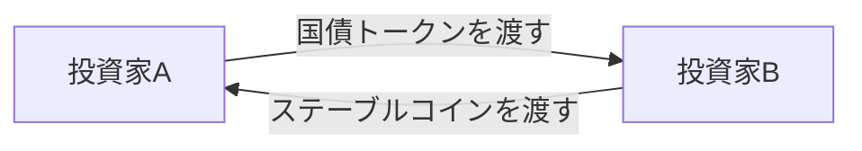

## 世界のRWA最大カテゴリは、実は「国債」

現実資産のトークン化（RWA）と聞くと、暗号資産の派生のように思うかもしれない。だが、いま世界でもっとも大きく伸びているトークン化資産は、意外にも国債だ。

海外のRWA市場は、ステーブルコインを除く発行・流通残高ベースで300億ドル超まで拡大し、そのうち最大のカテゴリがトークン化米国債で、2026年春時点で約150億ドル規模を占める。ここでいうトークン化米国債の多くは、米国債そのもののデジタル証券化ではなく、米国債やMMF・現金・レポで運用するファンド持分のトークン化だ。BlackRockが運用するBUIDL、Franklin Templetonの商品、Ondo Financeのトークン化商品などが主要な事例になっている。ただし、この種の数字は基準日・指標・集計範囲（何を国債に含めるか、ステーブルコインを含むか）で大きく変わるので、目安として見てほしい。日本のST市場が不動産を中心に立ち上がったのとは、対照的な構図になっている。

その日本でも、いよいよ国債がオンチェーンに乗ろうとしている。2026年、国債のトークン化が本格的に動き出す。この記事では、なぜ今なのか、そしてなぜこれは「個人が国債を小口で買う」話ではないのかを、市場と構造の視点で見ていく。実装の細部やコードには踏み込まない。

## そもそも国債STとは、誰のための商品か

まず前提を1つだけ、しかも大事な前提を。ブロックチェーン上で発行・移転される国債を、ここでは便宜上「国債ST」と呼ぶ（DCCのWGでは Tokenized JGB＝TJGB という呼称が使われている。厳密には法律上のセキュリティトークンと広義のトークン化資産は区別されるが、本記事では読みやすさを優先する）。その本命は機関投資家向けの担保・決済・資金調達のインフラであって、個人の資産形成商品ではない。

ここが不動産STと決定的に違う。不動産STが「大型物件を個人が小口で持つ」リテールの話だったのに対し、国債STは「機関が国債を使ってお金を回す」ホールセールの話だ。同じセキュリティトークンでも、読者に見せる景色がまるで違う。「国債もトークンで買えるようになる」と受け取ると、狙いを見誤る。

## なぜ今、日本で国債トークン化か

2026年が節目である理由は、固有名詞で追うと分かりやすい。

2026年5月8日、Progmatが主催するデジタルアセット共創コンソーシアム（DCC）が、「トークン化国債・オンチェーンレポ ワーキング・グループ」を設置し、共同検討を開始した。参加するのは、三菱UFJ銀行・みずほ銀行・三井住友銀行というメガバンク3行に加え、BlackRock Japan、大和証券、楽天証券、東京海上ホールディングスなど、合計39の組織にのぼる（[あたらしい経済](https://www.neweconomy.jp/posts/572117)）。

このWGは、約3週間ごとに検討会を重ね、2026年10月に税制を含む法的論点を整理した報告書を公表し、2026年内に商用化の判断を行うことを目標としている（[フィデックス](https://www.fidx.co.jp/)）。つまり、2026年は日本の国債トークン化にとって「やるかどうかを決める年」だ。まだ商用化前である点は、正確に押さえておきたい。

メガバンク・大手証券・グローバル運用会社が同じテーブルに着いている、という事実自体が重要だ。これは一社が実験する話ではなく、金融の基幹インフラを業界で作り替えにいく座組みになっている。

## 本命は「オンチェーンレポ」

国債STの価値を理解する鍵は、レポにある。ここが差別化の核だ。

レポ（現先取引）とは、国債などを担保に短期の資金を調達したり運用したりする、機関投資家にとっての基幹取引だ。金融市場の裏側で、日々巨額の資金がこの仕組みで回っている。派手さはないが、金融の心臓部に近い配管だと思えばいい。

この配管をオンチェーンに載せると、何が変わるのか。ここは正確を期したい。日本国債の決済は、すでに日銀ネット（BOJ-NET）のRTGSでDVP（証券と資金の同時受け渡し）が実現しており、決済もおおむねT+1だ。「これまで同時決済ができなかった」わけではない。

では新規性はどこにあるのか。DCCが掲げるのは、トークン化国債と、同じくトークン化した資金（ステーブルコイン等）を、同一チェーン上でプログラムどおりにアトミックに交換する仕組みだ。ポイントを分けて捉えると誤解しない。

- DVP（同時受け渡し）：担保と資金の受け渡しを一体化し、片方だけ決済されて相手が飛ぶ元本リスク（プリンシパルリスク）を抑える。この考え方自体は既存インフラにもある
- アトミック性と共通基盤：既存のDVPは日銀ネット・振替制度・清算機関といった専用網に分かれているが、オンチェーンなら担保も資金も同じ台帳の上で一括に処理でき、プログラムで自動化できる
- 24時間365日：日銀ネットは営業時間に縛られる。オンチェーンなら時間の制約を外せる
- 担保効率：決済が速く、担保の状態がリアルタイムに把握できるほど、同じ国債を機動的に使い回せる

つまり「同時決済を初めて可能にする」話ではない。「既にあるDVPを、資金トークンと同じ基盤に載せ、プログラム可能で24時間動くものに拡張する」話だ。T+0（即時）・アトミック性・24時間化は別々の性質で、まとめて語ると混乱するので分けて見るのがいい。

この2つの受け渡しが、オンチェーンでは1つの取引としてアトミックに成立する。片方だけ決済されて相手が飛ぶ元本リスクを抑えられる、という発想自体は既存のDVPと同じで、それを資金トークンと同じ基盤の上で実現するのが新しい（ただし基盤・スマートコントラクト・資金トークン発行者などのリスクは別途残る）。

要するに、国債STの本質は「投資商品」ではなく、「金融の配管（決済・担保インフラ）のアップグレード」にある。ここを掴むと、なぜメガバンクが本気なのかが腑に落ちる。

## リテールの不動産ST、機関の国債ST

日本のST市場は、この2つを並べると全体像が見えてくる。

| 観点 | 不動産ST | 国債ST |
| --- | --- | --- |
| 主な担い手 | 個人（リテール） | 機関投資家（ホールセール） |
| 目的 | 資産形成・小口投資 | 担保・レポ・決済インフラ |
| 裏付け | 単一物件が多い | 国債 |
| 値動き | 現状は穏やか | ほぼ金利で決まる |
| 日本の段階 | 既に市場規模が拡大 | 2026年に商用化判断 |

不動産STが「個人に新しい投資の選択肢を作る」ものだとすれば、国債STは「機関の取引インフラを速く・安全にする」ものだ。前者は投資家の裾野を広げ、後者は市場の配管を替える。方向がまったく違う。だからこそ、この2つが揃って初めて、日本のトークン化金融の全体像が見えてくる。

個人的に面白いと感じるのは、この非対称さだ。不動産STが「小口の資産形成」なのに対し、国債STが扱うのは「機関投資家の資金調達・担保管理」だ。株式が金融の主役のように見えて、世界では債券市場の規模は株式市場を上回り、国債はその中心的な存在だ。機関同士の国債取引やレポの規模は大きく、そこがオンチェーンに乗るインパクトは、数あるSTのなかで最も大きいのではないか、と見ている。派手さでは不動産や株式に譲るかもしれないが、金融の背骨が動く、という意味では国債が本命だと思う。

## 「国債はゼロから」ではない ― 社債STという地続きの現在地

国債STが絵空事に聞こえないのは、その手前の債券トークン化が、すでに動いているからだ。

BOOSTRYが手がけるブロックチェーン「ibet for Fin」の上では、社債STの発行・管理が現に行われている。2026年2月には、SBI証券がグループ初のST社債「SBI START債」を扱うなど、社債STの実例が積み上がってきた（[SBIホールディングス](https://www.sbigroup.co.jp/news/pr/2026/0220_16126.html)）。

社債STで培われた「債券をトークンにして発行・管理する」経験は、そのまま国債STの土台になる。社債から国債へ、というのは、機関向け債券トークン化の自然な延長線上にある。国債は発行体が国であり、既存市場でも主要な担保資産として広く使われている。もっとも、トークン化した商品が現物国債と同等の流動性や担保適格性をただちに備えるわけではなく、そこは商品構造と参加者の広がり次第だ。市場規模を踏まえれば、実用化された場合の潜在的な影響は社債STより大きくなり得る。

## 世界の鏡像:なぜトークン化米国債が最大なのか

視野を海外に広げると、日本との違いが浮かぶ。前述のとおり、海外RWAの最大カテゴリはトークン化米国債だ。なぜこれほど伸びたのか。

理由は3つある。利回りを生む安全資産であること。DeFiの世界で担保として使えること。そして、企業や機関のキャッシュ管理（余剰資金の短期運用）に向くこと。BlackRockのBUIDLは複数のチェーンに展開し、この分野の代表格になっている。

海外は、金利のある安全資産をオンチェーンに載せ、担保やキャッシュ運用の道具として使う方向で伸びた。日本は、まずリテールの不動産から入り、これから機関の国債に向かう。同じトークン化でも、どの資産から、誰のために始めるかが、これほど違う。市場の事情の違いが、そのまま出発点の違いになっている。

## 懐疑と課題

期待だけで語っても仕方がない。国債STにも、正面から向き合うべき論点がある。

1つ目は、そもそもブロックチェーンである必要があるのか、という疑問だ。前述のとおりDVP自体は既存の日銀ネットにもあり、レポも決済も日々大規模に回っている。だから期待される便益は「同時決済を初めて可能にすること」ではなく、処理の自動化、台帳照合の削減、稼働時間の拡大、担保の可視化といった改善だ。効果は小さくないが、即時グロス決済がネッティング効果を失わせる面もあり、単純に優れているとは言い切れない。それが従来インフラの置き換えや併存に値するかは、まさに2026年に判断される。今は「効きそうだが、商用化を決める前」の段階だと正直に捉えるべきだ。

2つ目は、制度との整合だ。国債には既存の振替制度という決済インフラがあり、トークン化がそれとどう並び立つのか、法的な整理が要る。二重発行や二重移転をどう防ぐか、原資産を誰が保管するか、といった論点も避けて通れない。DCCの報告書が税制を含む法的論点を扱うのは、このためだ。なお、周辺では暗号資産やステーブルコインの制度改正も進んでいるが、国債トークン化の法的論点とは領域が異なるので、区別して整理する必要がある。

3つ目は、基盤の標準化と相互運用性だ。国内には複数のST基盤があり、どの上で発行し、どうつなぐかが問われる。レポの資金側にステーブルコインが必要になる点も含め、決済通貨・基盤・国債が噛み合って初めて機能する。ピースは揃いつつあるが、組み上げはこれからだ。

## まとめ:これは「投資」ではなく「金融の配管」の話

- 世界のRWA最大カテゴリはトークン化米国債。日本は不動産から始まったが、2026年に国債が動き出す
- 国債STの本命は、個人の投資機会ではなく、機関の担保・決済・レポの効率化。読むべきは「配管」の話だ
- 2026年5月にDCCが39組織で「トークン化国債・オンチェーンレポWG」を設置。10月に報告書、年内に商用化を判断する
- 核はオンチェーンレポ。同時決済（DVP）自体は既存の日銀ネットにもある。新しいのは、国債と資金トークンを同じ基盤でアトミックに、24時間・プログラム可能な形で回すこと
- まだ商用化前。制度との整合、標準化、相互運用性が、これからの宿題として残る

国債STは、個人の資産形成を語る不動産STとは、まるで別の顔をしている。片方はリテールの投資、もう片方は機関金融の配管。この2つが揃うことで、日本のトークン化金融は「投資商品」と「決済インフラ」の両輪になる。2026年は、その後者が動き出すかどうかの、判断の年だ。

## 参考リンク

- [プログマら「トークン化国債」WG設置、日本国債のトークン化とT+0レポ取引を検討（あたらしい経済）](https://www.neweconomy.jp/posts/572117)
- [2026年内に商用化判断へ 国債トークン化の全体像（フィデックス）](https://www.fidx.co.jp/)
- [Progmatが描く日本国債のオンチェーン化、24時間365日レポ取引（Iolite）](https://iolite.net/news/coinpost-707258)
- [SBI初のST社債「SBI START債」（SBIホールディングス）](https://www.sbigroup.co.jp/news/pr/2026/0220_16126.html)
- [国内セキュリティ・トークン市場総括レポート 2025年度（NOMURA）](https://www.nomuraholdings.com/jp/news/nr/bstr20260402.html)
