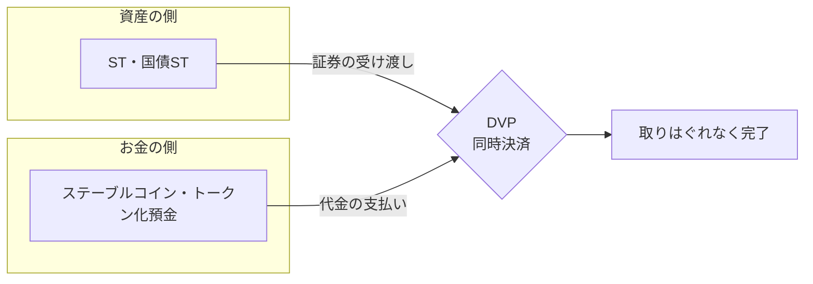

## トークン化のニュースが多すぎて、地図がない

日本円ステーブルコイン、不動産のセキュリティトークン、国債のトークン化、トークン化預金、そして暗号資産を金融商品取引法へ移す動き。2026年に入って、この手のニュースが一気に増えました。

一つひとつは解説記事もあり、読めば分かります。困るのはその先です。これらがどう関係するのか、なぜ同じ時期にまとめて動いているのかが見えてきません。私自身、連載でこれらを1本ずつ書いてきて、点は増えるのに全体像が描けない感覚がありました。

そこでこの記事では、個別の深掘りをいったん脇に置き、1枚の地図に全部を配置してみます。網羅を目指す地図ではなく、まず現在地を確かめるための見取り図です。細かい条文には踏み込みません。深掘りが必要な部分は、連載の各記事へのリンクをその場に置いていきます。

## 地図の描き方。「何をトークン化するか」と「どの法律か」の2軸

地図には軸が要ります。ここでは2本引きます。1本目は「何をトークン化するか」、2本目は「どの法律が規律するか」です。

2本目の軸を先に説明します。トークンが「支払いのためのお金」なのか「投資の対象」なのかで、向き合うルールが大きく変わるからです。投資の対象になる証券や資産をトークンにしたものは、金融商品取引法（金商法）で規律されます。投資家保護、つまり情報開示や不公正取引の規制がかかる世界です。

支払いのためのお金の側には、実は複数のルールがあります。ステーブルコインのように発行体が出すものは資金決済法の電子決済手段として扱われますが、銀行が出すトークン化預金は資金決済法ではなく、預金・為替という既存の枠組みに乗ります。この記事では細かく分けず、まとめて「支払い・お金のルール」と呼びます。

この2軸で並べると、こうなります。

| トークン化するもの | 支払い・お金のルール | 投資商品のルール（金商法） |
| --- | --- | --- |
| お金 | ステーブルコイン（資金決済法）、トークン化預金（預金・為替の枠組み） | ― |
| 証券・資産 | ― | 不動産ST、国債ST、社債ST、RWA |
| 暗号資産 | もともとここ（決済手段として） | 投資・取引の規制がこちらへ移りつつある |

この表が、この記事の地図です。左の列は一つの法律ではなく、支払い・お金を規律するルールの総称だと思ってください。以降は、各マスを1つずつ歩いていきます。

## お金をトークン化する。ステーブルコインとトークン化預金

まずお金の側、地図の上段です。ここは支払い・お金を規律するルールの領域ですが、同じお金の側でも乗るルールは一つではありません。

日本円ステーブルコインは、法定通貨建てで額面どおりに償還される設計のものが、資金決済法上の電子決済手段として規律されます。支払いや送金の道具なので、投資商品ではなく決済手段の側に置かれます。同じ円建てステーブルコインでも、発行体が資金移動業者なのか信託なのかで作りが変わります。この発行スキームの違いは設計に効くので、別の記事で掘り下げました。

https://zenn.dev/yuta1995/articles/japan-yen-stablecoin-issuance-scheme

もう一つ、同じお金の側に「トークン化預金」があります。銀行が預金をそのままトークンにするもので、DCJPYの名前で知られます。ステーブルコインと似て見えますが、発行主体が銀行で、資金決済法の電子決済手段ではなく、銀行の預金・為替という既存の枠組みで扱われる点が異なります。同じお金の側でも、乗るルールが違うわけです。日本ではここが第3の柱になりそうで、別の記事で詳しく扱いました。

https://zenn.dev/yuta1995/articles/japan-tokenized-deposit-dcjpy

お金の側で覚えておきたいのは、ここは「価値を動かす」ための層だということです。次に見る証券・資産の側が「価値を持つ」層で、この2つが後でつながります。

## 証券・資産をトークン化する。不動産ST・国債ST・RWA

地図の中段、証券や資産の側に移ります。ここは金商法の領域です。

セキュリティトークン（ST）は、その裏付けとなる権利が金商法上の有価証券に当たるため、2020年5月施行の改正金商法で既に規制対象になっています。暗号資産とは違い、STは最初から投資商品として扱われてきました。日本ではこのトークン化が、まず不動産から広がりました。市場は1兆円規模に近づいており、三菱UFJ系のProgmatなどが主導しています。

https://zenn.dev/yuta1995/articles/japan-real-estate-security-token-market

不動産の次に見えているのが国債です。世界を見ると、RWA（現実資産のトークン化）で最大のカテゴリは実は国債でした。日本での本命は、トークン化国債を使った「オンチェーンレポ」だと考えています。これは値上がりを狙う投資というより、金融機関どうしの資金のやりとりを効率化する配管の話です。

https://zenn.dev/yuta1995/articles/japan-jgb-security-token

不動産STがリテール寄り、国債STが機関寄りと役割は違いますが、どちらも「投資性のある資産を金商法の枠の中でトークンにする」という点では同じマスにいます。社債STも地続きで、この列は今後さらに埋まっていきます。

## 暗号資産という第3の領域。決済手段から投資商品へ

地図の下段、暗号資産です。ここが一番おもしろい動き方をします。

暗号資産は当初、決済手段として資金決済法の下に置かれました。地図でいえば左下です。ところが実態は、支払いよりも投資対象としての売買が広がりました。そこで、投資・取引に関する規制を金商法へ移し、暗号資産の特性に応じて規律し直す方向が示されています。地図の上では、左下から右へ動いている点だと見ると分かりやすいです。

ここで誤解を避けたい点があります。これは暗号資産を株式のような有価証券そのものにするのではなく、投資・取引のルールを金商法型に整える動きです。インサイダー取引規制や約20%の分離課税といった話も出ていますが、税制は別の立法で決まり、施行の条件もつきます。まだ移行中で、確定として語る段階ではありません。

https://zenn.dev/yuta1995/articles/japan-crypto-fiea-migration

この領域はプレイヤーの動きも激しく、SBIのように交換業者を取得して事業を垂直統合する動きも、この地図の上で起きている再編として読めます。

https://zenn.dev/yuta1995/articles/sbi-crypto-vertical-integration-bitbank

## 地図が動く場所。オンチェーンDVPでお金と資産が出会う

ここまでで、お金の側（上段）と証券・資産の側（中段）を別々に見てきました。この2つが出会う場所があります。決済です。

証券の受け渡しと代金の支払いを同時に行い、片方だけ渡して代金を取りはぐれる事故を防ぐ仕組みを、DVP（Delivery versus Payment、証券と資金の同時決済）と呼びます。従来は証券システムと資金システムが別々に動いていました。ところが、資産の側（ST）と、お金の側（ステーブルコインやトークン化預金）が両方オンチェーンにあり、両者を連携させて片方だけが実行されない仕組みを作れれば、受け渡しと支払いを一つの流れにまとめやすくなります。

国債STの本命とされるオンチェーンレポが成り立つのも、この同時決済があるからです。ここが、地図が静止画ではなく動き出す場所です。上段と中段は別々のニュースに見えて、決済でつながります。

## この地図で連載を読み直す

最後に、この地図をどう使うかです。バラバラだったニュースは、次のように読み直せます。

- 制度の起点から知りたいなら、暗号資産の金商法移行から
- 具体的な資産で見たいなら、不動産STか国債STから
- お金の側を知りたいなら、円ステーブルコインの発行スキームか、銀行が出すトークン化預金から
- 株式がなぜ進まないのかが気になるなら、株式トークンの壁から
- プレイヤーの動きを追いたいなら、SBIの垂直統合から

https://zenn.dev/yuta1995/articles/japan-stock-tokenization-barrier

地図にはまだ空白もあります。乱立する基盤の相互運用性は、この地図の解像度では見えない部分です。

個人的な見立てを一つ書いておきます。名称が何であれ、投資性のあるトークンには金商法の傘が広がり、支払い・お金のためのトークンは決済側のルール（資金決済法や銀行の枠組み）で整理される、という棲み分けが進むと考えています。ただし、あるトークンがどちらに入るかは、名前ではなく、それが表章する権利や販売の構造で個別に決まります。一般的なNFTや電子マネーのように、この地図の傘へ一律には入らないものもあります。まずはこの1枚を手元に置いて、次のニュースがどのマスの話なのかを確かめてみてください。
