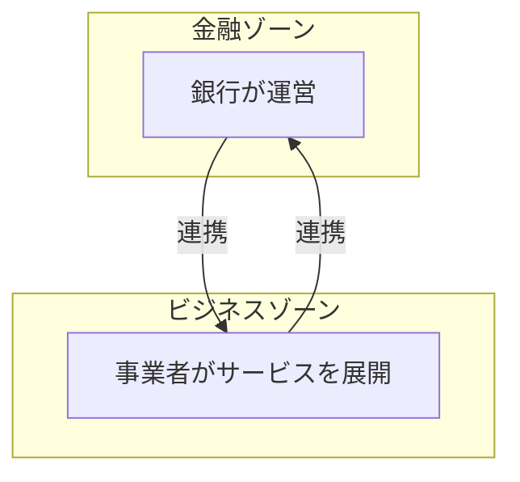

## 円のデジタル通貨は「ステーブルコイン」だけではない

2026年、日本円建てのデジタル通貨のニュースが増えました。多くはステーブルコインの話です。ところが、円建てのデジタル通貨はステーブルコインだけではありません。もう一つ、銀行が出す「トークン化預金」という選択肢があります。日本におけるその具体例の一つが、ディーカレットDCPのDCJPYです。

同じ円建てなので混同しやすいのですが、この2つは発行する主体も、乗っている法律の枠組みも違います。私は連載で円ステーブルコインを扱ったときに、この「銀行が出す側」を別枠として整理したいと思っていました。

この記事では、トークン化預金とは何か、ステーブルコインと何が違うのか、そして実際にどこで使われ始めているのかを整理します。細かい法律論には踏み込みません。

## トークン化預金とは何か。ステーブルコインとの違い

トークン化預金は、銀行の預金そのものをブロックチェーン上のトークンにしたものです。あなたが銀行に預けている預金が、送金や決済をプログラムで扱える形になった、とイメージすると近いです。

ステーブルコインとの違いを、発行の起点から並べてみます。

| 観点 | トークン化預金（DCJPY） | 円ステーブルコイン |
| --- | --- | --- |
| 発行主体 | 銀行（預金をトークン化） | 資金移動業者や信託など |
| 価値の裏付け | 銀行預金 | 発行体が持つ準備資産 |
| 法の枠組み | 銀行の預金・為替の枠組みに乗る | 資金決済法の電子決済手段 |
| 主な使い所 | 法人の決済や証券決済 | 送金や支払い全般 |
| 想定利用者 | まず法人、のちに個人 | 個人や事業者 |

円ステーブルコインの発行スキーム（資金移動業者発行型と信託型）は別の記事で詳しく書いたので、そちらとあわせて読むと違いがはっきりします。

https://zenn.dev/yuta1995/articles/japan-yen-stablecoin-issuance-scheme

大づかみに言えば、ステーブルコインは「支払いのためのデジタルなお金」、トークン化預金は「預金がそのままデジタルになったお金」です。競合というより、別のレイヤーにいると捉えるほうが実態に合います。

## DCJPYの仕組み。金融ゾーンとビジネスゾーンの2層

DCJPYは、ディーカレットDCPが運営するトークン化預金のプラットフォーム「DCP」の上で発行されます。特徴は、役割の違う2つのゾーンに分かれていることです。

金融ゾーンは銀行が運営し、ビジネスゾーンではさまざまな事業者がサービスを組み立てます。この2つを物理的に分けた2つのブロックチェーンで構成しているのが特徴です。お金の根っこは銀行が握り、使い方の自由度は事業者側に持たせる、という分担だと理解しています。

## なぜ銀行がやるのか。預金のまま動かせる強み

わざわざ銀行がデジタル通貨を出す理由は、預金のまま動かせることにあります。

預金という形を保ったままトークンにできると、銀行が長年積み上げてきた仕組みにそのまま乗れます。与信、振込、本人確認、既存の決済ネットワークとのつながりです。ここが、ゼロから準備資産を用意して発行するステーブルコインとの大きな違いだと考えています。

もう一つは、プログラムで動かせる点です。条件を満たしたら自動で支払う、複数の取引をまとめて同時に決済する、といった処理を組み込めます。企業の資金管理や、次に見る証券の決済と相性が良いのはこのためです。

## 証券決済という使い所。実発行を伴う国内初のST DVP検証（2026年）

トークン化預金が一番輝く場所は、証券の決済だと見ています。

証券の受け渡しと代金の支払いを同時に行い、片方だけ渡して取りはぐれる事故を防ぐ仕組みを、DVP（Delivery versus Payment、証券と資金の同時決済）と呼びます。証券の側（セキュリティトークン）と、お金の側（トークン化預金）が両方ブロックチェーン上にあると、この受け渡しと支払いを一つの流れで完結できます。

これは構想だけの話ではありません。2026年3月に、DCJPYを使ったセキュリティトークンのDVP決済の検証が実施され、4月に完了が発表されました。発表によれば、これはセキュリティトークンとデジタル通貨を実際に発行したうえでのDVP決済の検証として、国内初のものです。対象はディーカレットDCPが発行したデジタル社債で、大和証券からSBI証券への売却と、その逆方向の取引が検証されました。SBI証券、大和証券、SBI新生銀行、BOOSTRY、ディーカレットDCP、大阪デジタルエクスチェンジ（ODX）が関わっています。

決済の配管としてのDVPそのものは、国債STのオンチェーンレポとも直結する大きなテーマなので、別の記事で掘り下げます。

https://zenn.dev/yuta1995/articles/japan-jgb-security-token

ここで押さえたいのは、トークン化預金が「証券決済のお金の側」として、すでに実証の段階まで来ているという事実です。

## リテールへ広がるか。ゆうちょ銀行の参入

ここまでは法人や証券の世界の話でした。個人にも広がるのでしょうか。

発行を検討・準備する銀行にも広がりが見え始めています。国内ではGMOあおぞらネット銀行が発行の先行例です。加えてゆうちょ銀行が2026年度中に、個人と法人の両方へ向けたトークン化預金の提供を準備していると発表しています。実現すれば、GMOあおぞらネット銀行に続く2例目となる見込みです。ゆうちょ銀行のリーチを考えると、トークン化預金が一般の利用者の目に触れる機会は増えそうです。

ただし、ここは慎重に見ています。現時点では提供の準備や実証の段階であり、誰もが日常の支払いで使う商用サービスとして広く回っているわけではありません。実証と本番を混同しないようにしたいところです。

## 全体地図の中でのトークン化預金の位置

連載で描いてきた全体地図に、トークン化預金を置いてみます。

https://zenn.dev/yuta1995/articles/japan-tokenization-map

トークン化預金は、地図の「お金をトークン化する」側にいます。ただし、同じお金の側でも、支払い全般に効くステーブルコインとは役割が分かれます。個人の送金や支払いはステーブルコイン、法人の決済や証券決済はトークン化預金、というように用途で棲み分けが進むのではないか、というのが今の私の見立てです。どちらか一方が勝つ、という話ではなさそうです。

次に読むなら、お金の側をもう一段知りたい人は円ステーブルコインの記事へ、証券の側とお金がどう出会うかを知りたい人は、この後に書くDVPの記事へ進んでもらえればつながります。トークン化預金は地味に見えて、証券決済という堅いユースケースで実用化に向けた検証が進んでいる、というのがこの記事で一番伝えたかったことです。
