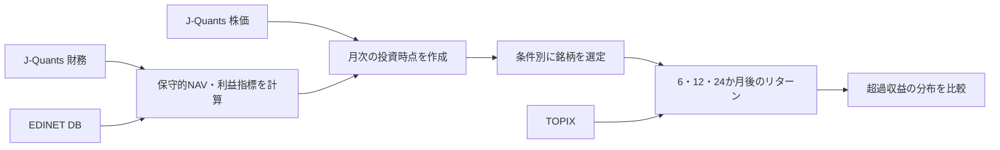

:::message
この記事は個人の検証記録であり、投資助言ではありません。特定の銘柄を推奨するものでもありません。投資判断はご自身の責任でお願いします。
:::

## 「いかにも割安な株」は、本当に儲かるのか

PERが低く、自己資本比率が高く、現金や土地をたくさん持っている会社。こういう株は、いかにも割安に見えます。私もずっとそう思っていました。

困るのはその先です。その中から自分が選んだ1社が上がったとして、それが手法の実力なのか、ただの偶然なのかが分かりません。世の中には「この条件で勝てました」というバックテスト記事がたくさんありますが、読んでも本当なのかを判断できませんでした。

そこで、日本株のほぼ全銘柄を対象に、自分で検証してみることにしました。結論を先に書きます。もっともらしい割安条件をいくつも試しましたが、どれもTOPIXには勝てませんでした。ただし、大きく負ける側の観測は減って見えました。

負けた話をわざわざ書くのは、その過程で分かったことのほうが、勝ち負けより価値があると思ったからです。

## 個別銘柄を当てるのではなく、分布が動く条件を探す

検証の方針は、UKIさんの「【AI活用版】成功する投資：トレーディングのサイエンス」から借りました。

https://note.com/uki_profit/n/nc6c65ef65e83

この記事から採用した考え方は次のとおりです。

- 投資の結果は、当たり外れではなく確率分布として捉える
- 目指すのは「期待値がプラスで、バラツキが小さい」システム
- 統計的に有意と言うには、1000回を超えるような多数回の試行が要る
- 感情を排除して、機械的に判断する

ひとつ断っておくと、元記事が主題にしているのは短期売買です。今回はその考え方だけを借りて、中長期の資産バリュー投資に応用しました。対象も時間軸も違うので、元記事の結論をそのまま持ち込んだわけではありません。

そして先に白状しておくと、この記事の検証は「1000回を超える多数回の試行」という基準を満たしていません。そこは後半で正直に書きます。

やりたかったのは、銘柄探しではなく**条件探し**です。どの条件を満たす株を機械的に買い続けると、リターンの分布そのものが右へ動くのか。それを見にいきました。

## 仮説A: PER・ROE・自己資本比率で足りるのか

最初は、誰でも思いつく条件から始めました。

```text
PER ≤ 10倍
ROE ≥ 10%
自己資本比率 ≥ 50%
```

安くて、稼げていて、財務が固い。いかにも良さそうです。

ところが、この条件で機械的に選んだ株のリターンを分布で見ると、大幅に上昇した株と大幅に下落した株が混在していました。該当する銘柄数も少なく、一貫した超過収益は確認できませんでした。

ここが最初の発見でした。**「いかにも良さそうな条件」と「実際に期待値を改善する条件」は、別物です。** 直感が当てにならないと分かったので、条件のほうを疑うことにしました。

## 「割安」の定義に違和感を持った

疑ってみると、PERという指標そのものに引っかかりました。PERは利益に対する株価の倍率なので、会社が抱えている現金や有価証券、土地を評価に入れていません。

たとえば、こんな会社を考えます。

- 時価総額 100億円
- 現預金 80億円
- 投資有価証券 40億円
- 負債 20億円

現預金と有価証券で120億円あり、そこから負債20億円を引くと、純額でちょうど100億円になります。時価総額と同じだけの金融資産を持っている計算です。極端に言えば、この会社を丸ごと100億円で買うと、100億円の金融資産が付いてきて、事業そのものはおまけになります。この会社と、資産をほとんど持たない会社を同じPERで比較するのは、さすがに無理があります。

そこで、資産の側から「割安」を定義し直すことにしました。導入したのは2つです。キャッシュニュートラルPER（現金などを差し引いた実質的な株価で見るPER）と、保守的NAVです。

## 保守的NAVをどう計算したか

保守的NAVは、その会社を今たたんだら、いくら回収できそうかを、かなり厳しめに見積もった金額です。掛け目はこう置きました。

```text
保守的NAV =
    現預金       × 100%
  + 有価証券     × 100%
  + 売掛金等     × 80%
  + 棚卸資産     × 30%
  + 土地         × 70%
  + 建物         × 30%
  + 機械設備     × 10%
  - 負債         × 100%
```

掛け目の根拠は、換金のしやすさです。

- 現金はほぼ額面で回収できる
- 売掛金には貸倒れのリスクがある
- 在庫は帳簿価格で処分できるとは限らない
- 建物や機械は用途が限定され、買い手が付きにくい
- 土地は価値があるが、所在地や用途によって換金性が大きく違う
- のれんや繰延税金資産は、清算価値としては期待しにくいので入れない

この掛け目に絶対の根拠はありません。私が「これくらいなら固く見積もれるだろう」と決めた数字です。ここは議論の余地があると思っています。

そのうえで、次を定義します。

```text
NAV / 時価総額 = 保守的NAV ÷ 時価総額
```

これが1.2なら、厳しめに見積もった資産価値が、市場評価を20%上回っている、という意味になります。

## データをどう集めたか

検証の土台はこうです。

- データソース: J-Quants（株価・財務・銘柄マスター・TOPIX）と EDINET DB
- 対象: 日本株 約3,000銘柄。金融業は除外
- 月次で投資条件を判定
- **その時点で開示済みの財務だけを使用**（未来の情報が混ざらないように）
- 6か月後・12か月後・24か月後のリターンを計測
- 個別株のリターンからTOPIXのリターンを控除して、市場全体の上昇分を除く



開示日を考慮する部分は、地味ですが重要です。決算が公表される前の財務数値を使って「この時点で買っていれば」と計算すると、未来を知っている状態でバックテストすることになり、結果が良く出すぎます。

:::message
この記事に載せているのは、加工した集計と分布だけです。各データソースの利用規約に従い、取得した生データそのものは掲載していません。財務データの取得には EDINET DB を利用しています（Powered by EDINET DB）。
:::

## 4つの仮説を検証した結果

仮説Aのあと、順に条件を変えて試しました。

**仮説B: キャッシュニュートラルPER ≤ 3**
現金などを差し引くと、実質3年分の利益で元が取れる計算になります。非常に安く見えますが、これだけだと利益が小さい会社や、現金を持っているだけで活用できていない会社も混ざりました。

**仮説C: 営業利益・営業キャッシュフローに対して安い**
条件としては合理的だと思ったのですが、今回の対象期間ではTOPIX超過につながりませんでした。

**仮説D: 保守的NAVが時価総額を上回る**
今回もっとも改善が見られた条件です。

結果をまとめます。

| 条件 | 6か月 | 12か月 | 24か月 | 24か月のTOPIX比 |
| --- | ---: | ---: | ---: | ---: |
| 黒字・非金融ベースライン | 6.5% | 12.0% | 20.5% | -16.6% |
| NAV/時価総額 ≥ 1.0 | 10.0% | 19.4% | 32.7% | -4.3% |
| NAV/時価総額 ≥ 1.2 | 9.8% | 19.1% | 35.6% | -1.4% |
| NAV ≥ 1.2 かつ CN-PER ≤ 3 | 9.9% | 18.7% | 36.1% | -1.0% |

分布も見てみます。


見るべきところは、平均値ではありません。

- 左側の大幅な損失が減ったか
- 分布の中央値が右へ動いたか
- 右側の大幅上昇だけで平均が押し上げられていないか
- 期間を変えても同じ傾向が出るか

NAV条件では、大幅に下落した側の観測が少なく見えました。ただし、これをもって損失の確率が下がったとは言えません。月次で観測しているため同じ銘柄が何度も標本に入っており、独立した観測ではないからです。統計的な検定もしていません。あくまで「図がそう見える」という以上のことは、今回のデータからは言えません。

## TOPIXには勝てなかった。そして、これは過剰適合かもしれない

ここがこの記事の山場なので、はっきり書きます。

表の右端を見てください。**24か月のTOPIX比は、全条件でマイナスです。** ベースラインの-16.6%からNAV条件の-1.0%まで、大きく改善しました。しかし改善しただけで、TOPIXには勝っていません。

つまり今回やったことは「アルファを発見した」ではなく、「有望かもしれない仮説へ絞り込めた」までです。ここを勝ったように書くことはできません。

そしてもう一点、もっと重要な自己申告があります。

**私は仮説A・B・C・Dを試して、一番結果が良かったDを結論として見せています。** これは典型的な選択バイアスです。4つ試せば、偶然でも1つは良く見えます。同じデータで条件をいじり続ければ、いずれ「勝てる条件」は必ず見つかります。それは発見ではなく、データへの当てはめです。

だからこの記事の結果は、**「4つ試して一番良かったものを見せている」という事実込みで読んでほしい**と思っています。本来なら、条件を固定したうえで、検証に使っていない期間（ホールドアウト）で再現するかを確かめる必要があります。そこまでやって初めて、仮説は仮説以上になります。

第2章で触れた「統計的に有意と言うには1000回を超える試行が要る」という基準も、今回は満たしていません。中長期の投資は1回の観測に何か月もかかるので、短期売買のように試行回数を積めないという事情はあります。ただ、事情があることと、基準を満たしていることは別の話です。

バックテストの記事は、構造的に「勝った話」になりやすいです。条件をいじって良い結果が出たときに書きたくなるからで、悪意があるわけではありません。ただ、読む側としては、その条件が何回目の試行なのかが分からないと評価できません。だから自分の記事では、そこを先に開示しておきます。

## 条件に該当した銘柄を、推奨ではなく類型として見る

:::message alert
以下は条件に該当した銘柄の例であり、推奨ではありません。投資助言でもありません。各社の状況は変化しますので、必ずご自身で最新の開示資料をご確認ください。
:::

条件に該当した銘柄のうち、私が個別に中身を見たのは次の8社です。

ソノコム、ニッチツ、岡山県貨物運送、カーメイト、日和産業、リンコーコーポレーション、田中精密工業、長府製作所

ランキングにはしませんし、各社の評価もここには書きません。銘柄ごとの状況は開示のたびに変わりますし、私が今この記事に書いた材料が、あなたが読む時点で正しい保証がないからです。気になる会社があれば、最新の開示資料をご自身で確認してください。

そのうえで、並べて見て面白かったことを1つだけ書きます。**NAV倍率が高いという一点では同じでも、中身はまったく違いました。** 現預金と有価証券が時価総額を上回る会社もあれば、資産の大半が土地の会社もあり、財務は強いのにROEが低いままの会社もありました。同じ数値でスクリーニングに引っかかっても、同じ性質の株ではないということです。

そして、同じ「安い」でも、資産が動く見込みがあるものと、ただ安いまま放置されそうなものがあります。後者がいわゆるバリュートラップです。私が気にしているのは次の点でした。

- ROEが資本コストを長期間下回っていないか
- 現金を持っているだけで、還元しないままではないか
- 利益が固定資産や有価証券の売却益に依存していないか
- 土地が事業に不可欠で、そもそも売れないのではないか
- 在庫や売掛金の質が低くないか
- 支配的な株主がいて、少数株主への還元が弱くないか
- 売買代金が少なすぎて、そもそも買えないのではないか
- 自社株買いや増配など、価値を実現する動きがあるか

結局のところ、安いだけでは足りません。**資産価値が一株あたりの価値へ変換される仕組みがあるかどうか**が要る、というのが今回いちばん腑に落ちた点でした。

## まとめ: 分かったことと、まだ分からないこと

分かったことは3つです。

1. PERやROEのような、もっともらしい条件が、そのまま期待値の改善につながるとは限らない
2. 今回試した条件の中では、保守的NAVがベースラインとの差がもっとも大きかった
3. ただしTOPIXには勝てておらず、未使用の期間で再検証もしていないので、期待値が改善したとは判断できない。しかも4つ試して一番良いものを見せている

まだ分からないこと、というより今回の限界も、正直に並べておきます。

- 現在上場している銘柄だけで検証しているので、生存者バイアスが残っている
- 月次で観測すると同じ銘柄が繰り返し入るため、独立した標本ではない
- 配当・手数料・スプレッドを含めていない
- 小型株は、表示されている株価で十分な数量を売買できるとは限らない
- 土地は簿価だけでは本当の価値が分からない
- 条件を何度も試している以上、過剰適合の可能性が残る

次にやりたいのは、配当込みリターンでの再計算、上場廃止銘柄を含めた検証、そして検証に使っていない期間での再現確認です。そこを通らないと、この仮説は仮説のままです。

今回見つけたのは「必ず上がる銘柄」ではありません。個別株というガチャの当たりを予想したのでもありません。どのガチャ台なら少しはマシそうかを、日本株のデータから探してみただけです。しかもその台は、まだ市場平均に勝っていませんし、期待値が改善したと言える段階にも達していません。

それでも、この小さな差を測り続けることが、投資を科学するということなのだと思います。少なくとも、勝った話だけを集めるよりは前に進んでいるはずです。
