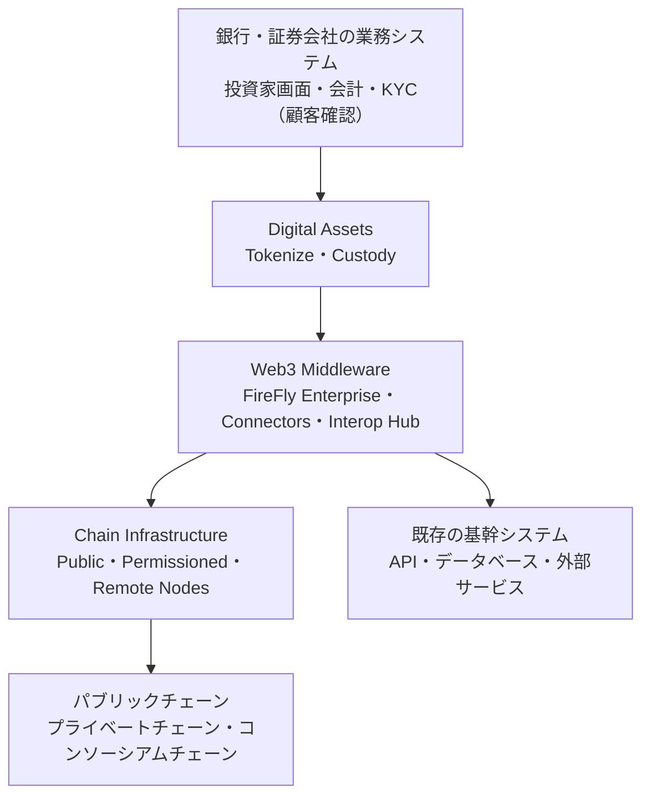
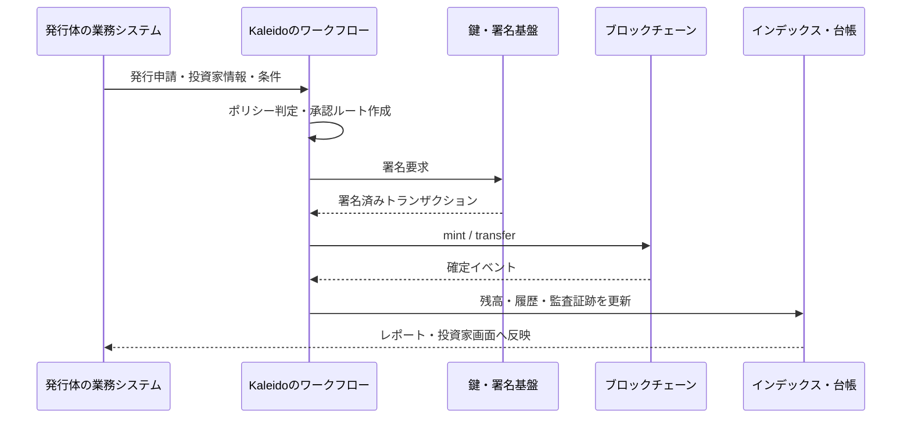

## トークンを発行できても、金融商品は完成しない

社債をトークン化するプロジェクトを考えてみます。

ERC-20（代替可能トークンの標準）やERC-1400（証券向けトークン標準）のコントラクトをデプロイし、発行（mint）を実行するだけなら、技術的にはそれほど難しくありません。

しかし、金融商品として運用するには、次の問いに答える必要があります。

- 誰が発行を承認するのか
- 投資家の適格性や移転制限を、どこで判定するのか
- 秘密鍵を誰が持ち、どの承認手順で署名するのか
- ブロックチェーンのイベントを、社内の台帳やレポートにどう反映するのか
- パブリックチェーンとプライベートチェーンをまたぐとき、どのAPIを使うのか

ここで必要になるのは、単体のスマートコントラクトではありません。

トークン、業務ワークフロー、鍵、ポリシー、チェーン、既存システムをつなぐプラットフォーム層です。

Kaleidoは、この層を提供する企業向けのブロックチェーン・デジタルアセット基盤です。この記事では、Kaleidoを「何のトークンを発行できるか」ではなく、「金融の運用をどこまでソフトウェアとして扱えるか」という視点で分解します。

## まず結論。Kaleidoはチェーンではなく、チェーンの上の運用基盤

Kaleidoの構造は、次のように見ると分かりやすくなります。

Kaleido公式のプラットフォーム紹介では、製品群を**Digital Assets、Web3 Middleware、Chain Infrastructure**の3系統に分けています。[Kaleido公式のプラットフォーム概要](https://www.kaleido.io/blockchain-blog/getting-started-with-the-kaleido-platform)

つまり、Kaleido自体が1本のブロックチェーンというわけではありません。自社で用意したスマートコントラクトや、外部のパブリックチェーンも含めて、デジタルアセットの業務フローを運用するための基盤です。

この位置づけを理解すると、Kaleidoの機能一覧が「なぜトークン発行だけで終わらないのか」という問いへの答えになっていきます。

## 1. Digital Assets。トークンのライフサイクルを業務にする

KaleidoのTokenizeは、トークンを作るボタンだけを提供する製品ではありません。

公式説明では、資産の定義、コントラクトのデプロイ、発行、移転、償還、残高管理まで、トークンのライフサイクル全体を扱うエンジンとされています。標準的なトークン規格だけでなく、独自のスマートコントラクトにも対応します。[Kaleido Tokenize公式ページ](https://www.kaleido.io/product/tokenize)

ここで重要なのは、発行や移転が単なる関数呼び出しではなく、**ルール付きの業務処理**として扱われることです。

例えば社債の移転なら、次のような処理が一続きになります。

1. 売り手と買い手の情報を受け取る
2. 移転制限や承認条件を確認する
3. 必要な担当者の承認を集める
4. 署名基盤へトランザクションを渡す
5. ブロックチェーン上の確定を待つ
6. 社内台帳と投資家向け残高を更新する

Tokenizeのワークフローエンジンは、公式説明によれば、チェーンからのイベントを受け取り、設定したガバナンスルールに沿って複数のステップへ処理を振り分けます。内蔵インデックスにより、残高や資産データをリアルタイムに追跡する設計です。

これは、スマートコントラクトの中にすべての業務ルールを詰め込む設計とは違います。

オンチェーンで確定させるロジックと、社内システム・承認者・外部サービスを含むオフチェーンの手続きを分け、ワークフローとして接続します。

## 2. Web3 Middleware。業務システムとチェーンの翻訳層

スマートコントラクトを直接呼び出すだけでは、金融機関の既存システムと接続しにくい問題があります。

RPC（ノードに命令を送る通信口）、ABI（コントラクトの関数仕様）、イベント、ガス（実行手数料）、再送、ファイナリティ（取引が覆らないとみなせる確定状態）。チェーンごとに異なる仕組みを、業務アプリケーションがすべて理解する必要が出てくるからです。

そこで登場するのがWeb3 Middlewareです。

Kaleidoは、この領域にHyperledger FireFlyを基盤とするFireFly Enterprise、複数チェーンをつなぐFireFly Connectors、外部ネットワークや基幹システムとの接続を担うInterop Hubを置いています。[Kaleido公式のWeb3 Middleware説明](https://www.kaleido.io/blockchain-blog/getting-started-with-the-kaleido-platform)

FireFlyは、Hyperledgerのオープンソースプロジェクトです。公式リポジトリでは、デジタルアセット、データフロー、ブロックチェーン取引のためのAPIを持つ、企業向けのオープンソースSupernode（アプリケーションとチェーンの間をつなぐまとまり）と説明されています。また、ブロックチェーン技術、トークン規格、スマートコントラクト、イベント配信層などを差し替えられる、プラガブルなマイクロサービス構成を採用しています。[Hyperledger FireFly公式リポジトリ](https://github.com/hyperledger-firefly/firefly)

エンジニアの感覚に寄せるなら、Web3 Middlewareは「チェーン用のAPIクライアント」よりも、次の部品を組み合わせたものに近いです。

- チェーンごとの差分を隠すAPIゲートウェイ
- 再送や確定待ちを管理するトランザクションマネージャー
- オンチェーンイベントを配信するイベントバス
- 既存システムとつなぐコネクタ
- 取引履歴と残高を検索しやすく蓄積するインデクサー

たとえば、アプリケーションが「社債を100口移転する」と要求したとします。アプリケーション側は、対象チェーンの低レベルなRPCやイベントの再取得を毎回実装するのではなく、ミドルウェアに業務要求を渡します。ミドルウェアが署名、送信、確定確認、イベント反映までを引き受ける、という分担です。

もちろん、実際の挙動や保証水準は接続するチェーンと設定に依存します。ここでのポイントは、金融業務とチェーン固有の実装を分離するための境界を用意することです。

## 3. Chain Infrastructure。自社チェーンを持たなくてもよい

トークン化金融では、すべてをパブリックチェーンに置くとも、すべてをプライベートチェーンに閉じるとも限りません。

決済資産はパブリックチェーン、機密性の高い取引は許可型ネットワーク、既存のコンソーシアムは外部運営、といった組み合わせも考えられます。

KaleidoのChain Infrastructureは、ノードのデプロイ、パブリックネットワークへの接続、プライベート／許可型ネットワークの運用を担当します。公式のアーキテクチャ説明では、Ethereum、Bitcoin、Polygon、Cantonなどのパブリックネットワークと、Hyperledger Besu、Hyperledger Fabric、Cordaなどの許可型プロトコルを挙げています。[Kaleido公式のChain Infrastructure説明](https://www.kaleido.io/blockchain-blog/getting-started-with-the-kaleido-platform)

ここで大事なのは、Kaleidoが特定のチェーンだけを前提にしていない点です。

チェーンを変更するたびに、業務アプリケーションから作り直すのではなく、ミドルウェアとコネクタの境界で差分を吸収する。そのための運用面をKaleidoが提供します。

## 4. 共有ツール。金融システムらしい「制御面」

3つの製品系統を横断して、Kaleidoには共通の制御機能があります。公式のアーキテクチャ説明では、主に次の4つが挙げられています。

| 制御機能 | 役割 |
| --- | --- |
| Workflow Engine | 申請から決済までの処理を、条件付きのステップとして実行する |
| Smart Contract Manager | コントラクトの登録、デプロイ、バージョン管理、API・リスナー設定を扱う |
| Key Manager | 鍵の生成・バックアップ・ローテーション・破棄と署名権限を管理する |
| Policy Manager | 金額、資産種別、相手先、権限などに応じて承認・移転ルールを適用する |

この表は、金融システムの「制御面」を考えるうえで役に立ちます。

スマートコントラクトが資産の状態遷移を記録するデータプレーンだとすれば、承認、署名、権限、バージョン、監査証跡は制御プレーンです。Kaleidoは両者を、業務システムから利用できる運用基盤としてまとめようとしています。

ただし、これは「Kaleidoに任せれば規制対応が完了する」という意味ではありません。投資家の適格性確認、法的な権利関係、会計処理、各国のライセンスや報告義務は、利用する金融機関とサービス設計の責任として残ります。

## 1本のトークン化債券を、最初から最後まで追う

ここまでのレイヤーを、トークン化債券の発行フローに当てはめます。

この流れで、ブロックチェーンが担うのは、最終的な状態と取引履歴の共有です。

一方で、誰が申請できるか、どの承認が必要か、どの鍵で署名するか、社内の残高画面にどう表示するかは、周辺の運用システムが担います。

トークン化の難しさは、mint関数を書くことよりも、この状態遷移を業務・法務・セキュリティの条件付きで再現可能にすることにあります。

## Kaleidoをソフトウェアの部品に置き換えてみる

Kaleido全体を、既存のソフトウェア部品に完全に対応づけることはできません。それでも、理解のための近似はできます。

- Digital Assetsは、資産モデルと業務ワークフローのアプリケーション層
- Web3 Middlewareは、チェーン接続・イベント・トランザクションを扱うミドルウェア層
- Chain Infrastructureは、ノードやネットワークを管理するインフラ層
- Workflow／Key／Policy Managerは、全体を横断する制御プレーン

この見方をすると、Kaleidoは「ERC-20を発行するSaaS」ではなく、金融機関が複数のデジタルアセットネットワークを運用するための、クラウドのコントロールプレーンに近い存在だと分かります。

ただし、クラウドの比喩をそのまま当てはめるのは危険です。チェーン上の最終確定、秘密鍵の保管、資産の法的性質は、一般的なクラウドリソースとは違う制約を持ちます。比喩はレイヤーを捉えるために使い、保証内容は必ず各製品の仕様と契約で確認すべきです。

## Kaleidoが提供するもの、提供しないもの

ここまでを、責任の境界で整理します。

| Kaleidoが提供する基盤 | 利用者側に残る設計・責任 |
| --- | --- |
| トークンのライフサイクル管理 | そのトークンが表す法的権利の設計 |
| ワークフロー・ポリシー・承認 | KYCや投資家適格性確認の業務設計 |
| 鍵・署名・チェーン接続 | 誰がどの条件で署名できるかのガバナンス |
| インデックス・監査データ | 会計、規制報告、投資家への説明 |
| パブリック／許可型ネットワークの運用部品 | どのネットワークを採用し、誰と共有するかの判断 |

この区別がないと、「オンチェーンだから透明」「プラットフォームだからコンプライアンス済み」といった誤解につながります。

Kaleidoの価値は、法的・業務的な要件を消すことではありません。要件をポリシー、ワークフロー、署名、イベント、監査データというソフトウェアの構成要素に落とし込み、繰り返し実行できる形にすることです。

## まとめ。トークン化金融の主戦場は、発行ボタンの外側にある

Kaleidoを理解するとき、最初に見るべきなのは対応トークン規格の数ではありません。

次の4つの層が、どのようにつながっているかです。

1. **Digital Assets**：資産の定義とライフサイクル
2. **Web3 Middleware**：業務システムとチェーンの接続
3. **Chain Infrastructure**：ネットワークとノードの運用
4. **共有ツール**：ワークフロー、鍵、ポリシー、コントラクトの制御

この構造から見ると、トークン化金融は「資産をブロックチェーンに載せる」だけではありません。

**金融商品の状態遷移を、法務・承認・署名・決済・監査まで含めて、複数のシステム上で再現可能にする仕事です。**

Kaleidoは、その仕事を支えるプラットフォーム層の一つです。FireblocksやQuantなど比較対象となるサービスと比べると、Kaleidoがどこを自社製品で持ち、どこをオープンソースや外部ネットワークに委ねているかが、よりはっきり見えてきます。

次回以降は、KaleidoのTokenize、FireFly、Custodyをさらに分解し、トークン化プラットフォームを比較するときの軸を整理します。

---

## 参考資料

- [Kaleido公式：プラットフォームのアーキテクチャ](https://www.kaleido.io/blockchain-blog/getting-started-with-the-kaleido-platform)
- [Kaleido公式：Tokenize](https://www.kaleido.io/product/tokenize)
- [Kaleido公式：Enterprise Blockchain, Tokenization, and Digital Asset Platform](https://www.kaleido.io/)
- [Hyperledger FireFly公式リポジトリ](https://github.com/hyperledger-firefly/firefly)
