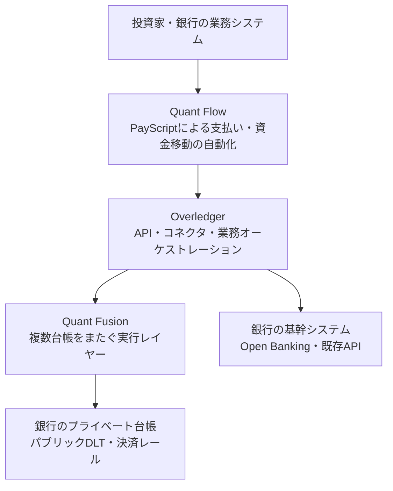
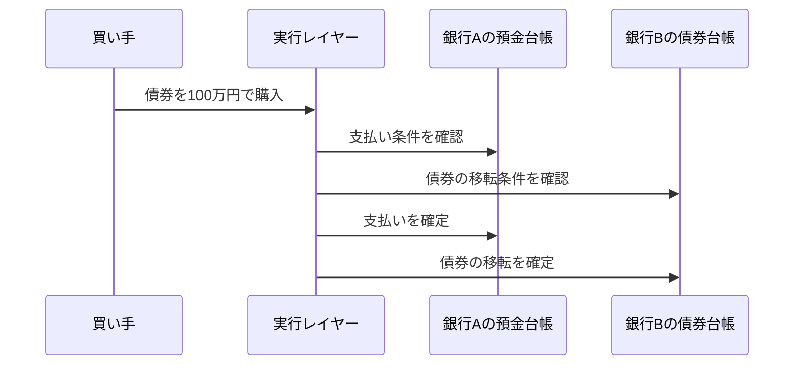

## トークンを発行しても、決済は始まらない

銀行Aが、預金をブロックチェーン上のトークンとして発行したとします。

一方、銀行Bは別の台帳で債券トークンを管理しています。ここでいう台帳は、残高や権利の状態を記録するシステムです。投資家が「銀行Aのトークン化預金で、銀行Bの債券を買う」には、少なくとも次の処理が必要です。

1. 銀行Aの預金残高を確認する
2. 銀行Bの債券の移転条件を確認する
3. 両方の台帳に同じ取引の結果を反映する
4. 片方だけ成功して、もう片方だけ失敗する状態を避ける
5. 銀行の基幹システム、規制対応、顧客画面にも結果を戻す

この例で、トークンを「作る」ことは入口にすぎません。金融商品として使うには、異なる台帳と既存の銀行システムを、ひとつの業務フローとして動かす必要があります。

Quantを調べると、ここで混同しやすいものが4つ出てきます。Overledger、Quant Fusion、Quant Flow、そして過去に発表されたOverledger Tokeniseです。

先に結論を言うと、Quantの現在の重心は「トークンを発行する会社」よりも、**既存の台帳・銀行システム・決済レールを接続し、そこで金融処理を実行する相互運用（異なるシステムを連携させること）レイヤー**にあります。

この記事では、Quant自身の公式説明をもとに、製品の役割と、そこから先も金融機関が引き受ける責任を分けて整理します。製品ページの表現はベンダーの主張であり、すべてが独立検証された事実ではない点にも注意してください。

## まず地図を見る。4つの名前は同じ層にいない

Quantの製品を、役割で並べると次のようになります。

これは、Quantの各ページにある説明を、記事用に「接続」「複数台帳の実行」「プログラム可能なお金」という3つの仕事へ整理した図です。図にあるオーケストレーションは、複数システムの呼び出し順序と結果をまとめる役割を指します。製品同士の境界や提供形態は契約・導入案件によって変わり得るため、厳密な内部アーキテクチャを示す図ではありません。

| 層 | 製品 | 主な仕事 | 金融機関に残るもの |
| --- | --- | --- | --- |
| 接続・統合 | Overledger | DLTや既存システムを共通APIでつなぐ | 業務ルール、権限、顧客・資産データ |
| 複数台帳の実行 | Quant Fusion | 複数ネットワークをまたぐ取引の実行基盤 | ネットワークの選択、ガバナンス、規制責任 |
| プログラマブルマネー | Quant Flow / PayScript | 口座・トークン・決済を条件付きで自動化 | 口座、資金、承認、コンプライアンス |
| トークン発行（過去の発表） | Overledger Tokenise | QRC20トークンを作成・展開するAPI | トークンの権利、発行体、運用責任 |

## Overledger。チェーンを増やすのではなく、接続方法を減らす

DLT（分散型台帳技術）を使う金融機関が増えると、接続先も増えます。銀行Aの台帳、銀行Bの台帳、パブリックチェーン、決済システム、社内の勘定系（残高や取引を管理する基幹システム）。それぞれが別々のAPIやデータ形式を持つと、システム間の組み合わせは急速に増えます。

2つのシステムを直接つなぐだけなら、専用の連携を1本書けば済みます。しかし5つの台帳をすべて相互接続するなら、単純化しても10組の連携が必要です。システムが増えるたびに、認証、エラー処理、監査ログ、再実行の設計も増えます。

QuantはOverledgerを、異なるDLTへ共通のAPI（ソフトウェア同士が機能を呼び出す窓口）でアクセスするための企業向けレイヤーとして説明しています。[Overledgerに関するQuantの説明](https://quant.network/perspectives/how-overledger-delivers-enterprise-grade-dlt-interoperability-for-financial-services/)

ここでの価値は、Overledgerが新しいチェーンを作ることではありません。アプリケーション側から見ると、チェーン固有の呼び出しを毎回書く代わりに、接続・認証・メッセージ変換・処理の流れを共通化しやすくすることです。

ただし、共通APIを置いたからといって、台帳の意味が同じになるわけではありません。銀行Aの「確定済み」と、銀行Bの「承認待ち」が同じ状態だとは限りません。最終的な業務ルール、資産の法的な性質、誰が署名できるかは、導入側が定義して検証する必要があります。

## Quant Fusion。複数台帳をまたぐ実行をどう扱うか

Overledgerが「接続の共通化」だとすれば、Quant Fusionはその上で、複数台帳にまたがる処理を実行するためのレイヤーとして位置づけられています。

QuantはFusionを、複数のパブリック・プライベート台帳をひとつの実行環境へ接続する「マルチ台帳ロールアップ」や、Layer 2.5（既存の台帳をまたぐ中間層）と説明しています。ロールアップは、複数の取引をまとめて処理し、元の台帳へ結果を反映する方式です。[Quant Fusionの製品ページ](https://quant.network/quant-fusion/) [仕組みの解説](https://quant.network/perspectives/how-quant-fusion-works-the-multi-ledger-rollup-explained/)

ここで期待されるのは、例えば次のような処理です。

重要なのは、片方だけを先に確定させないことです。お金を払ったのに債券が届かない、または債券を渡したのにお金が届かない状態は、金融取引では受け入れにくいからです。こうした考え方は、Delivery versus Payment（DvP、受渡しと支払いの同時交換）や、Payment versus Payment（PvP、通貨同士の同時交換）として知られています。

Quantの公式説明では、Fusionはラップドトークン（別のチェーン上で元の資産を表す代替トークン）やブリッジ（チェーン間で資産を移す仕組み）に頼らず、台帳をまたいだ原子性（途中状態を残さず、両方成功か両方未確定にする性質）を目指す設計とされています。[Fusionの説明](https://quant.network/quant-fusion/) ただし、「原子性を実現できる」と「特定の導入案件で、法務・運用を含めて安全に決済できる」は同じ意味ではありません。どの台帳を接続し、どの条件を成功とし、障害時に誰が再実行を承認するかは、案件ごとの設計です。

この区別をしないと、Fusionを「すべてのチェーンを自動的に安全にする魔法のブリッジ」と誤解してしまいます。実際には、接続先の権限管理、ノードの可用性、台帳の確定性、規制上の最終責任が残ります。

## Quant Flow。資金を動かす業務フローをプログラムする

Fusionが複数台帳の実行を扱う一方、Quant Flowは、銀行口座やデジタルマネーを使った支払い・資金管理の自動化に近い製品です。

QuantはFlowを、Overledgerを基盤にしたAPI駆動のプログラマブルなデジタルマネー基盤と説明しています。PayScriptという独自のスクリプト（支払いルールを書くための記述方式）で、条件付きの支払い、承認、資金移動、リスクやコンプライアンスの制御を組み立てる設計です。[Quant Flow公式ページ](https://quant.network/quant-flow/) [利用規約](https://quant.network/quant-flow-terms-and-conditions/)

例えば、次のようなルールを考えられます。

> 債券の受渡しが確認され、買い手の適格性チェックが通り、営業日の決済時間内であれば、銀行口座から指定額を支払う。

これは「新しい通貨を発行する」話とは限りません。既存の銀行口座、トークン化預金、ステーブルコイン、決済レールを、条件と承認フローに従って動かす話です。Flowの資料には、銀行の口座・基幹システム、実行エンジン、Overledger、プライベートDLTやパブリックDLTを組み合わせる構成が示されています。[Quant Flow factsheet](https://quant.network/assets/uploads/2025/05/QuantFlow_factsheet_May2025.pdf)

したがって、FlowとFusionは競合する同じ製品として見るより、次のように分けると理解しやすくなります。

- Fusion：どの台帳をまたいで、どの取引をひとつの処理として実行するか
- Flow：どの条件で、誰の資金を、どの決済手段で動かすか

実際の導入では両方が連携する可能性がありますが、金融機関の口座管理や顧客確認をQuantが丸ごと代替するわけではありません。Flowの利用規約でも、ソフトウェアの利用と顧客側の責任は分けて扱われています。

## Tokenise。現在の製品地図に過去の名前を重ねない

Quantを検索すると、Overledger Tokeniseという名前にも行き当たります。Quantの2022年ごろの発表では、Overledger 2.2.9のベータ機能として、Ethereum、Polygon、XDC上でQRC20（ERC20互換）トークンを作成・展開するAPIや、Quant Connectからの操作が紹介されていました。[当時のリリース発表](https://quant.network/news/overledger-2-2-9-introduces-tokenise-beta/) [リリースノート](https://quant.network/assets/uploads/2023/04/Quant_ReleaseNotes_OVL_V2.2.9.pdf)

これは、トークン発行APIとしては重要な過去の製品情報です。ただし、過去のベータ発表を、そのまま現在の製品ラインナップや最新の提供条件だと扱うのは危険です。

現在のQuantの製品ページで前面に出ているのは、Overledger、Fusion、Flowです。そこから読み取れる方向性は、発行機能だけを売ることではなく、既存の台帳と金融業務を接続し、取引を運用できる状態へ持っていくことです。

この違いは、トークン化金融の設計でよくある誤解にもつながります。

> トークンを発行できる ＝ 金融商品を販売・決済・償還できる

ではありません。発行体、カストディ、適格性判定、移転制限、償還、会計、監査、障害時の復旧が揃って初めて、商品として運用できます。Tokeniseの過去情報は発行の一部を示しますが、現在のQuantの説明は、より広い接続・実行・資金移動へ重心を置いています。

## GBTD / RLN。実証案件から見える「接続」の仕事

Quantの役割を、製品ページだけでなく公開案件から見ることもできます。

GBTD（英国のトークン化ポンド預金プロジェクト）とRLN（Regulated Liability Network）の実験では、QuantとR3が技術パートナーとして選ばれました。Quantの発表では、異なる台帳やOpen Banking（銀行API）、RTGS（即時グロス決済システム）、Faster Payments（英国の即時送金網）を結ぶAPI・オーケストレーション層を担当したと説明されています。[GBTDプロジェクトの発表](https://quant.network/press-releases/quant-selected-to-deliver-infrastructure-for-uks-tokenised-sterling-deposits-project/) [実験フェーズの報告](https://quant.network/news/uk-finances-uk-regulated-liability-network-experimentation-phase-report/)

この事例から読み取れるのは、「Quantが銀行の代わりに預金を持つ」ということではありません。銀行ごとの台帳や既存の決済インフラを残したまま、取引の流れを横断的に組み立てる役割です。

一方で、これは実験・選定・発表の資料です。すべての参加銀行で同じ仕組みが本番商用化され、あらゆる資産の決済に使われていることを意味しません。記事では、公開資料から確認できる範囲を「技術パートナーとして選定された」「実験で接続・検証された」と表現し、本番稼働の事実とは分けて扱います。

## Quantが解決しないこと

相互運用レイヤーは便利ですが、金融システム全体の責任を消してくれるわけではありません。少なくとも、次の責任は導入側に残ります。

### 1. 資産の法的な権利

ブロックチェーン上の残高が、法律上どの権利を表すのかは、コントラクトやAPIでは決まりません。預金なのか、債権なのか、ファンド持分なのか。発行体と法域ごとの契約・規制整理が必要です。

### 2. カストディと鍵

誰が秘密鍵を保管し、どの操作に何人の承認が必要かは、金融機関の統制設計です。カストディ（資産と鍵の保管・管理）を接続レイヤーが自動的に引き受けるわけではありません。顧客資産の分別管理責任も同様です。

### 3. 台帳の最終性と障害対応

台帳ごとに、確定までの時間、巻き戻しの考え方、ノード障害時の復旧方法が違います。2つの処理を一緒に見せるには、どの時点を決済完了とするか、タイムアウト時にどの状態へ戻すかを決めなければなりません。

### 4. コンプライアンスと運用

KYC（顧客確認）、AML（マネーロンダリング対策）、移転制限、報告、監査証跡は、ソフトウェアの外側にある業務責任とも結びつきます。自動化できる部分が増えても、規制上の最終責任者が消えるわけではありません。

## まとめ。Quantは「チェーンの代替」ではなく「既存金融の接続面」

Quantの名前を、単なるトークン発行サービスとして理解すると、製品群の関係が見えにくくなります。

- Overledgerは、異なるDLTや既存システムへ共通化した接続面を提供する
- Fusionは、複数台帳にまたがる処理を実行するレイヤーとして説明されている
- Flowは、PayScriptを使って口座・トークン・決済の業務フローをプログラムする
- Overledger Tokeniseは、過去に発表されたトークン発行機能であり、現在の製品説明とは日付を分けて読む

この整理から見えるのは、金融機関がすべての台帳を捨てて、ひとつの新しいチェーンへ移行する未来ではありません。既存の勘定系、銀行ごとの台帳、パブリックDLT、決済レールを残したまま、その間に接続と実行の層を追加する未来です。

トークン化金融の難しさは、トークンの形を作ることより、**異なる所有権・残高・決済条件を、ひとつの取引として矛盾なく動かすこと**にあります。Quantを読むときは、「何を発行できるか」だけでなく、「どのシステムを、どの条件で、誰の責任のもとにつなぐのか」を見ると、製品の位置づけがはっきりします。
