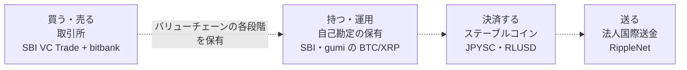

## 2026年、SBIが静かに国内クリプトを「面」で押さえた

2026年6月25日、SBIホールディングスが暗号資産取引所 bitbank を総額467億円で完全子会社化する契約を締結したと発表した。廣末紀之CEOやMIXI・Ceresなど既存株主からの株式取得と増資引受けを合わせた金額で、公正取引委員会の企業結合審査などを経て、2026年10月頃の完了を予定している（[日本経済新聞](https://www.nikkei.com/article/DGXZQOUB253VH0V20C26A6000000/)）。

タイミングが目を引く。この6月、ビットコインは約1年8か月ぶりに6万ドルを割り込み、一時5万9,100ドルまで下げた。2025年10月の最高値12万6,000ドル台から半値以下だ（[日本経済新聞](https://www.nikkei.com/article/DGXZQOGN05CNJ0V00C26A6000000/)）。市場への警戒感が強まるなか、SBIは収益が悪化していた国内大手取引所の取得に踏み切った。

単発の逆張り買収に見える。だが並べてみると、これは数年がかりで進めてきた垂直統合戦略を一段進める一手だと分かる。この記事では、SBIの取り組みを取引所・デジタル資産・ステーブルコイン・送金インフラの4領域で整理し、「なぜ相場低迷期に買うのか」「統合で何が可能になるのか」を読み解く。

## SBIが持っているクリプトの駒

SBIの動きが一貫して見えるのは、レイヤーごとに駒を揃えているからだ。まず全体像を4層で並べる。

| レイヤー | 駒 | 役割 |
| --- | --- | --- |
| 取引所 | SBI VC Trade（ビットポイント統合）＋ bitbank | ユーザーと資金の入口 |
| デジタル資産 | BTC・XRP など（gumi等の自己勘定保有を含む） | 保有・運用対象 |
| ステーブルコイン | JPYSC（円・信託型）／USDC・RLUSD（ドル） | オンチェーン決済手段 |
| 送金インフラ | SBI Ripple Asia（RippleNet） | 法人向け国際送金 |

### 取引所レイヤー：買収で国内首位へ

見落とせないのは、SBIが2026年に取引所の統合を立て続けに進めている点だ。まず4月1日、もともとグループ内にあったビットポイントジャパンをSBI VC Tradeに吸収合併している（両ブランドは当面維持し、将来の一本化を予定）。そのうえで6月、グループ外の大手だったbitbankの取得に動いた（[あたらしい経済](https://www.neweconomy.jp/posts/543194)）。内側の統合と外側の買収を並行して進めたわけだ。

bitbank の預り資産は約5,700億円、口座数は約96万。SBI VC Trade と統合すると、2026年4月末時点の両社の数字を単純合算して預り資産は約1.1兆円、口座数は約292万に達し、完了すれば預り資産で国内首位、口座数でも最上位級となる見込みだ（[ビットタイムズ](https://bittimes.net/news/224929.html)）。日本暗号資産取引業協会の会員預り資産（約3.5兆円）と比べるとおおむね3割前後に相当するが、集計時点や対象事業者が異なる点には留意したい。

### デジタル資産レイヤー：周辺で進むXRP集積

ここは他の3つより関係が緩いので、傍証として置いておく。SBIが筆頭株主であるgumiは、2026年4月末時点で約140億円の暗号資産を保有し、これを原則XRPへ一本化する予定を示している。2026年6月12日の決算説明資料で「日本国内最大のXRP保有・運用事業者を目指す」と公表し、XRPを現物保有したままカバードコール戦略でプレミアム収入を得る方針を掲げた（[ビットタイムズ](https://bittimes.net/news/224312.html)）。

ただしgumiはSBIの子会社ではなく投資先であり、この方針はgumi自身の判断だ。SBIが直接指揮しているわけではない。それでも、SBIが筆頭株主の会社がXRPに寄せているという事実は、後述するRipple社との関係の深さと同じ方向を指している。

### ステーブルコインレイヤー：円のJPYSCとドル建て

決済通貨の駒は、円とドルの2枚ある。

円建ては JPYSC だ。SBIホールディングスと Startale Group（Astar Network 創業者の渡辺創太が率いる）が組んで発行する、日本初の信託型（3号電子決済手段）の円建てステーブルコインで、法的な発行体は新生信託銀行にあたる。2026年6月24日に提供が始まったが、当初はSBI VC Trade内での利用に限定されており、外部ウォレットへの出庫やパブリックチェーン上での流通には対応していない。関係法令や税務実務の整理、監督当局の確認を経てから、パブリックチェーンでの流通へ移行する方針だ（[あたらしい経済](https://www.neweconomy.jp/posts/586241)）。

信託型を選んだ意味は小さくない。資金移動業型のステーブルコインには1回あたり100万円の送金上限があるが、信託型はこの制約を受けない。高額のB2B決済まで視野に入る設計だ（この発行スキームの違い自体が一つのテーマなので、別記事で掘り下げる）。

ドル建ての備えもある。SBI VC Trade はすでにUSDCを取り扱っており、加えてRipple社と組み、Ripple発行の米ドルステーブルコイン RLUSD を日本で発行・流通させる基本合意を2025年8月に結んでいる（[SBIホールディングス](https://www.sbigroup.co.jp/news/2025/0822_15680.html)）。円のJPYSC、ドルのUSDCとRLUSD。複数のステーブルコインを押さえにいっている。

### 送金インフラレイヤー：RippleNet

送金網の駒はさらに古い。SBIは2016年5月、Ripple社との合弁で SBI Ripple Asia を設立している（SBI60%・Ripple40%）。この会社が担うのは、RippleNet を使った金融機関向けの国際送金ソリューションで、XRPそのものの取り扱いはしない。XRPの現物取引はSBI VC Tradeが担当する、という役割分担だ（[SBIホールディングス](https://www.sbigroup.co.jp/company/group/sbirippleasia.html)）。

送金網は2016年、通貨は2025〜2026年、取引所は2026年。こうして並べると、SBIが10年がかりで各レイヤーに一つずつ駒を置いてきたことが見えてくる。

## SBIの布石を時系列で見る

「数年がかり」という主張は、時系列に並べると腑に落ちる。

| 時期 | 動き | レイヤー |
| --- | --- | --- |
| 2016年5月 | Ripple社と合弁で SBI Ripple Asia を設立（SBI60%/Ripple40%） | 送金インフラ |
| 2025年8月 | Rippleと組み、ドルステーブルコイン RLUSD の日本発行で基本合意 | ステーブルコイン |
| 2026年2月 | SBI×Startaleで信託型ステーブルコイン JPYSC を発表 | ステーブルコイン |
| 2026年4月 | SBI VC Trade がビットポイントジャパンを吸収合併 | 取引所 |
| 2026年6月24日 | JPYSC の提供開始（当初はSBI VC Trade内に限定） | ステーブルコイン |
| 2026年6月25日 | bitbank完全子会社化の契約を締結（完了は10月頃予定） | 取引所 |

とくに2026年は再編が立て続けに並ぶ。6月の買収は、取引所レイヤーの規模を一気に押さえる、現時点での大きな節目にあたる。

## なぜ「弱気相場」で買うのか

ここで最初の問いに戻る。なぜ地合いが悪い局面で、しかも赤字の取引所に467億円も払うのか。

bitbank は2025年度に営業赤字で、売上高は27%減。それでもSBIは売上高の約8倍で買った。米調査会社Architect Partnersは、この価格は「目先の収益性ではなく、規制対応済みの市場ポジションを買ったもの」と分析する（[CoinDesk](https://www.coindesk.com/business/2026/06/28/sbi-s-usd289-million-bitbank-deal-is-symptomatic-of-japan-s-crypto-consolidation-architect-partners)）。

ここで疑問が湧く。SBIは既にSBI VC Trade（4月に統合したビットポイント含む）という金融庁ライセンス済みの取引所を持っている。ゼロから作る話ではない。ではbitbankの何が欲しかったのか。答えは「流動性と取引高」だ。bitbank自身は、JVCEA統計（2024年11月〜2025年10月）を基に国内アルトコイン現物取引高でシェア1位と示しており、板取引と高い現物シェアを強みとしてきた。SBI VC Tradeが手薄だった「厚い板と取引高」を、bitbankはすでに持っていた。同規模の顧客基盤と流動性を自前で育てるには何年もかかる。金額自体は安くないが、時間と規制対応、顧客基盤を含めれば合理的、という判断だろう。

背景には業界再編の波がある。Architect Partnersは、新しい規制が資本とカストディの要件を厳しくして統合を加速させており、免許を持つ交換業者の多くが赤字であることから、業界の大幅な集約が進む可能性を指摘している。同社は、淘汰が進めば大手独立系のbitFlyerが次の焦点になり得るとも述べている（[CoinDesk](https://www.coindesk.com/business/2026/06/28/sbi-s-usd289-million-bitbank-deal-is-symptomatic-of-japan-s-crypto-consolidation-architect-partners)）。

ここで言う要件強化は、日本では制度の作り替えとして具体化している。2025年12月の金融審議会ワーキング・グループ報告を受け、2026年4月には暗号資産の規制を資金決済法から金融商品取引法へ移す改正法案が国会に提出された（[金融審議会WG報告](https://www.fsa.go.jp/singi/singi_kinyu/tosin/20251210/01.pdf)）。移行後は、顧客資産の分別管理（金銭は信託等で管理）といったカストディ面に加え、第一種金融商品取引業に準じた財務・体制の要件が求められる方向で、参入と事業維持のハードルは上がっていく。

規制強化と弱気相場は、体力のない事業者には二重の退場圧力になるが、キャッシュを持つ側にとっては買い場になる。SBIの逆張りは、この非対称性を突いている。

## 垂直統合が進むと何が起きるか

ここで注意したいのは、「垂直統合」といっても、預かった顧客資産をグループがぐるぐる運用に回す、という話ではない点だ。日本の暗号資産交換業者には、顧客資産の分別管理と、原則としてコールドウォレット等での管理が求められる。業務上必要なホットウォレット管理分についても、同種・同量の履行保証暗号資産を自己資産として保有しなければならない。取引所の預かり資産を勝手に運用することはできない（[金融庁](https://www.fsa.go.jp/policy/virtual_currency/20210407_seidogaiyou.pdf)）。資産レイヤーで運用しているBTCやXRPは、SBIやgumiが自己勘定で持つ資産であって、ユーザーの預かり資産ではない。

では何が「統合」されるのか。SBIが押さえているのは、ユーザーがクリプトに触れる一連の段階（買う・持つ・送る・決済する）の、それぞれの入口だ。

点線にしたのは、これらが「お金が循環する1本のパイプ」ではなく、それぞれ独立した規制事業だからだ。取引所は取引所、ステーブルコインは信託型の発行体、法人送金はRippleNetと、別々に成立している。SBIの狙いは、この各段階に自社の駒を置き、手数料とユーザーとの接点をチェーン全体で取り切ることにある。「面で押さえる」とはこの意味だ。

競合と比べると狙いの違いが際立つ。マネックス系のコインチェックやGMOも取引所を持つが、取引・自己勘定の運用・ステーブルコイン・法人送金までを1グループで縦に揃えにいっている点で、SBIの垂直統合は国内でも際立つ。取引所は入口の一枚にすぎず、SBIが取りにいっているのは「バリューチェーン全体の面」だ。

## 論点とリスク

強気一辺倒で読むのは危うい。少なくとも4つの論点がある。

1つ目は独占の是非だ。統合後のSBIは業界全体の預り資産の約3割を握る。だからこそ公正取引委員会の審査が入っており、ここを通らなければ絵は完成しない。一極集中がユーザーにとって良いことなのかも、別途問われる。

2つ目はRipple社への依存度だ。gumiのXRP集中、SBI Ripple Asia、RLUSDの国内展開と、Ripple社との関係に寄った駒が目立つ。ただし通貨レイヤーはXRP単一ではなく、JPYSCやUSDCなどRipple系でない取り組みも並行している。それでもXRPの価格や規制が動けば影響を受ける範囲は広く、集中はそのままリスクにもなる。

3つ目は相場前提だ。本記事の「相場低迷期の逆張り」という読み筋自体が、2026年6月時点の地合いに紐づく。相場が長期低迷を続ければ、取得した資産や事業の評価も重くのしかかる。逆張りは、当たれば大きいが外れれば傷も深い。

4つ目は実行リスクだ。買収と統合は別物で、システム・顧客資産・組織の統合には時間と摩擦が伴う。SBI VC Trade はビットポイントの統合も並行して進めており、消化すべき案件は少なくない。

## まとめ

- SBIは2026年6月、bitbankを総額467億円で完全子会社化する契約を締結（完了は10月頃予定）。完了すれば預り資産約1.1兆円で国内首位、業界のおおむね3割前後に相当する見込み
- これは単発の買収ではなく、取引所・デジタル資産・ステーブルコイン・送金インフラを1グループで縦に揃える垂直統合戦略を一段進める一手
- 相場低迷期の取得は、再編局面で規制対応済みの規模と流動性を、時間をかけずに手に入れる狙い
- 押さえているのは「買う・持つ・送る・決済する」というバリューチェーンの各段階で、閉じた資金ループではなく、各段階で手数料と顧客接点を取り切る設計。独占審査・Ripple依存・相場前提・統合実行という4つのリスクは残る

2026年のSBIの動きは、「点の買収」として見るとバラバラに映る。だが「経済圏の設計」という補助線を引くと、数年がかりの一貫した戦略として読めてくる。次にどのレイヤーの駒が動くのか、あるいは公取委がどう判断するのかが、当面の見どころになる。

## 参考リンク

- [SBI、仮想通貨交換ビットバンクの買収発表 預かり残高1兆円超に（日本経済新聞）](https://www.nikkei.com/article/DGXZQOUB253VH0V20C26A6000000/)
- [Why SBI paid $289 million for an unprofitable crypto exchange（CoinDesk）](https://www.coindesk.com/business/2026/06/28/sbi-s-usd289-million-bitbank-deal-is-symptomatic-of-japan-s-crypto-consolidation-architect-partners)
- [SBIグループ、ビットバンクを完全子会社化｜暗号資産預り額で国内首位へ（ビットタイムズ）](https://bittimes.net/news/224929.html)
- [gumi、約140億円の保有暗号資産をXRPへ一本化（ビットタイムズ）](https://bittimes.net/news/224312.html)
- [SBIとStartale、日本初の信託型円ステーブルコイン「JPYSC」を発表（SBIホールディングス）](https://www.sbigroup.co.jp/news/2026/0227_16153.html)
- [SBI VCトレード、ビットポイントを4月に吸収合併へ（あたらしい経済）](https://www.neweconomy.jp/posts/543194)
- [SBIグループとRipple、RLUSDを日本で発行・流通させる基本合意（SBIホールディングス）](https://www.sbigroup.co.jp/news/2025/0822_15680.html)
- [SBI Ripple Asia 会社情報（SBIホールディングス）](https://www.sbigroup.co.jp/company/group/sbirippleasia.html)
- [bitbankの特徴・国内アルトコイン取引高首位（ダイヤモンド・ザイ）](https://diamond.jp/crypto/exchange/bitbank/)
- [暗号資産制度に関するWG報告（金融審議会、2025年12月10日）](https://www.fsa.go.jp/singi/singi_kinyu/tosin/20251210/01.pdf)
- [ビットコイン急落、1年8カ月ぶり6万ドル割れ（日本経済新聞）](https://www.nikkei.com/article/DGXZQOGN05CNJ0V00C26A6000000/)
